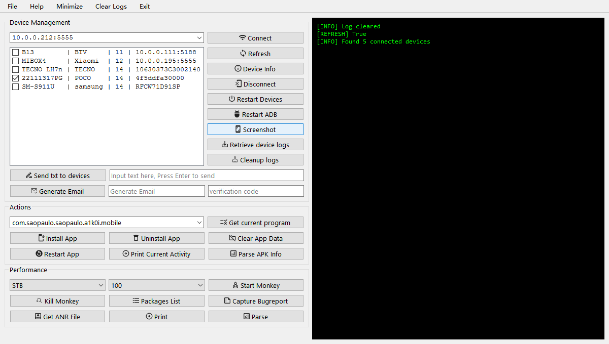

# 📱 多设备管理与自动化测试工具功能文档

本工具基于 PySide6 框架开发，集成了 ADB 接口，支持设备连接、调试、应用操作与性能测试等功能，提升 TV App 与 Mobile App 测试效率。

---

## 🧩 模块一：设备连接与基础操作（Device Group）

### 🔌 IP输入与设备连接
| 功能 | 说明 |
|------|------|
| **IP 输入框** | 支持手动输入和自动补全，记录历史连接记录，便于快速连接常用设备。 |
| **Connect 按钮** | 连接所输入 IP 的设备（通过 ADB connect）。 |

### 📋 设备列表与操作按钮
| 功能 | 说明 |
|------|------|
| **设备列表** | 多选支持，可管理当前已连接的设备。 |
| **Refresh** | 刷新设备连接状态。 |
| **Device Info** | 显示设备型号、系统版本、分辨率等信息。 |
| **Disconnect** | 断开设备连接（ADB disconnect）。 |
| **Restart Devices** | 重启所选设备（ADB reboot）。 |
| **Restart ADB** | 重启本地 ADB 服务，避免连接异常（双击触发）。 |
| **Screenshot** | 获取设备截图并保存至本地。 |
| **Retrieve device logs** | 从设备拉取 logcat 日志，供调试使用。 |
| **Cleanup logs** | 清理本地生成的日志缓存文件。 |

### ✉️ 文本与邮箱辅助功能
| 功能 | 说明 |
|------|------|
| **Send txt to devices** | 将指定文本发送至设备（通过 ADB input text）。 |
| **Generate Email** | 自动生成邮箱地址用于测试注册。 |
| **验证码输入框** | 用于输入或填充验证码。 |

---

## 🔧 模块二：应用操作（Action Group）

### 🧭 应用获取与输入
| 功能 | 说明 |
|------|------|
| **包名输入框** | 可编辑历史记录，自动补全常用包名。 |
| **Get current program** | 获取当前运行的应用包名（top activity）。 |

### 📦 应用管理功能
| 功能 | 说明 |
|------|------|
| **Install App** | 安装 APK 到选中设备。 |
| **Uninstall App** | 卸载指定应用。 |
| **Clear App Data** | 清除应用缓存与数据（恢复初始状态）。 |

### 🛠 调试辅助功能
| 功能 | 说明 |
|------|------|
| **Restart App** | 强制停止并重启目标应用。 |
| **Print Current Activity** | 打印当前 Activity（方便定位页面路径）。 |
| **Parse APK Info** | 解析 APK 包名、版本号、权限等信息。 |

---

## 📊 模块三：性能与压力测试（Performance Group）

### 🐒 Monkey 压测控制
| 功能 | 说明 |
|------|------|
| **Device Type** | 选择设备类型（STB / Mobile）。 |
| **Select Times** | 设置 Monkey 执行次数（如：10000）。 |
| **Start Monkey** | 执行 Monkey 测试，用于发现随机异常。 |

### 🪵 日志与包管理
| 功能 | 说明 |
|------|------|
| **Kill Monkey** | 停止当前 Monkey 测试进程。 |
| **Packages List** | 列出所有安装的应用包名。 |
| **Capture Bugreport** | 获取完整系统 bugreport 报告。 |

### 🧠 ANR & 其它操作
| 功能 | 说明 |
|------|------|
| **Get ANR File** | 拉取设备 ANR 日志，定位无响应问题。 |
| **Print** | （预留）建议用于打印日志或执行结果。 |
| **Parse** | （预留）建议用于日志分析或报告解析。 |

---

## ✅ 总结

本工具集成了多端设备管理、自动化操作、日志提取与压测能力，适用于 Android 平台上的 TV 与 Mobile 测试场景，批量测试与自动化辅助。
