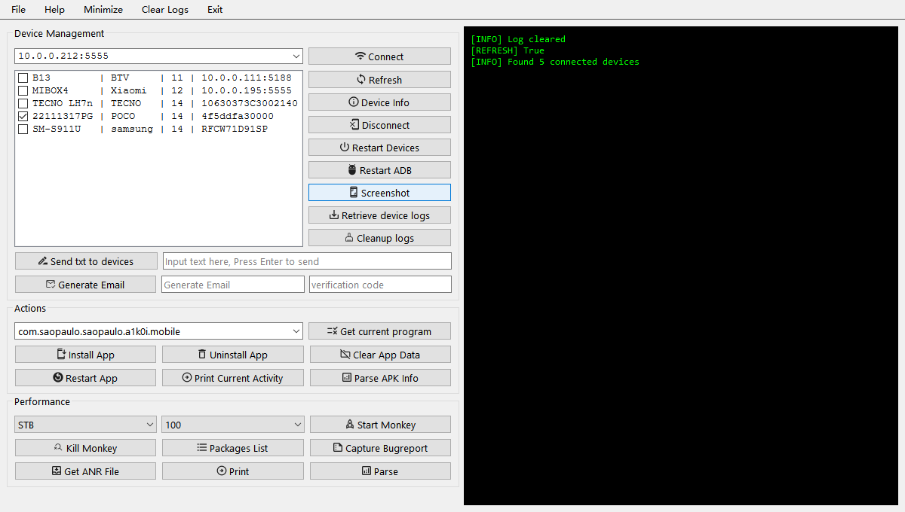

# ADBLab — 项目文档

## 概述

**ADBLab** 是一个基于 PySide6 的桌面 GUI 工具，用于 Android 设备的批量管理与自动化测试。通过图形界面封装 ADB 命令，支持设备连接、应用管理、Monkey 压力测试、Bugreport 抓取与解析等功能。


- **语言**: Python 3
- **GUI 框架**: PySide6 (Qt 6)
- **作者**: Frankie Hu (Copyright (c) 2025.4)
- **版本**: 2.4.0

---

## 目录结构

```
ADBLab/
├── main.py                          # 入口：创建 QApplication → MainFrame → 事件循环
├── requirements.txt                 # Python 依赖
├── README.md                        # 中文功能说明文档
├── icon.ico                         # 应用图标 (用于 Windows EXE)
├── .gitignore
├── .github/workflows/
│   ├── Build-exe.yaml               # PyInstaller 打包 EXE + GitHub Release
│   └── Auto-Clean.yaml              # 定时清理旧构建产物与旧 Release
│
├── common/                          # 公共层
│   ├── log_service.py               # 线程安全单例日志服务 (QTimer 缓冲 → signal → GUI)
│   ├── pathTool.py                  # 项目路径工具 (根目录、桌面路径等)
│   ├── yamlTool.py                  # ruamel.yaml 封装 (保留注释的 YAML 读写)
│   ├── logger/                      # loguru 日志方案
│   │   ├── log.ini                  #   日志配置 (文件/控制台开关)
│   │   └── logTool.py              #   loguru 单例封装
│   └── mail/                        # 临时邮箱服务
│       ├── tempEmailService.py      #   AMZ123 临时邮箱 API 客户端
│       ├── email_task.py            #   QRunnable 异步获取邮箱+验证码
│       └── mail.yaml                #   邮箱账号/验证码持久化
│
├── controllers/                     # 控制器层 (业务逻辑 + 信号绑定)
│   ├── adb_controller.py            # 核心 ADB 控制器 (~1120行)
│   ├── email_controller.py          # 邮箱控制器 (存根)
│   └── log_controller.py            # 日志清理/关闭控制器
│
├── models/                          # 模型层 (数据 + ADB 命令执行)
│   ├── adb_model.py                 # ADB 命令执行模型 (~805行)
│   ├── device_store.py              # 线程安全 YAML 设备信息存储
│   └── email_model.py               # 邮箱模型 (存根)
│
├── gui/                             # 视图层
│   ├── main_frame.py                # 主窗口：布局 + 信号/槽全量绑定
│   └── widgets/
│       ├── py_panel/
│       │   ├── left_panel.py        #   左侧控制面板 (~455行)
│       │   ├── left_panel_signals.py #   LeftPanel 信号定义
│       │   ├── adb_contral_signals.py#   ADBController 信号定义
│       │   └── log_panel.py         #   右侧日志面板 (彩色、自动滚动)
│       ├── py_menu_bar/
│       │   ├── custom_menu_bar.py   #   无边框窗口菜单栏 (可拖拽)
│       │   └── about_dialog.py      #   关于对话框
│       ├── py_screenshot/
│       │   └── screenshot_viewer.py #   截图查看器 (无边框、置顶、可缩放)
│       └── style/
│           ├── base_styles.py       #   颜色/字体常量 + QSS 样式
│           └── menubar_styles.py    #   菜单栏 QSS
│
├── utils/                           # 工具层
│   ├── adb_utils.py                 # 通用 subprocess ADB 执行器
│   ├── yaml_tool.py                 # 线程安全 YAML 工具 (原子写入)
│   ├── double_click_button.py       # 带双击信号的 QPushButton
│   ├── log_tool.py                  # 日志格式化 → QTextEdit HTML
│   └── email_utils.py               # 邮件工具 (存根)
│
└── resources/                       # 静态资源
    ├── connected_devices.yaml       # 设备连接历史持久化
    ├── chkbugreport-0.5-215.jar    # Bugreport txt→html 转换工具
    ├── app.log                      # 应用日志
    └── icons/                       # 25 个 SVG 矢量图标
```

---

## 架构设计

### 整体模式：MVC + 信号/槽

```
用户点击按钮 (LeftPanel)
  → LeftPanel 发射信号 (如 connect_requested)
  → ADBController 接收，分发到 ADBModel
  → ADBModel 在后台线程执行 ADB 命令
  → ADBModel 发射 command_finished 信号
  → ADBController 处理结果，更新 DeviceStore，发射 UI 信号
  → LogPanel / LeftPanel 更新显示
```

### 关键设计模式

| 模式 | 位置 | 说明 |
|------|------|------|
| **单例** | `LogService` | `__new__` + `QMutex` 线程安全单例 |
| **观察者** | 全局 | Qt 信号/槽解耦 UI 与业务逻辑 |
| **异步命令** | `ADBModel.async_command` | 装饰器将同步方法转为 QRunnable 异步执行 |
| **处理器映射** | `ADBController._handle_async_response` | 字典分发 ~20 种操作结果 |
| **原子写入** | `yaml_tool.py` | 先写 .tmp 再 os.replace 防数据损坏 |

### 线程模型

- **主线程**: Qt 事件循环 + UI 渲染
- **工作线程**: `QThreadPool` + `ThreadPoolExecutor`，所有 ADB 命令在后台执行
- **线程通信**: Qt 跨线程信号/槽 (自动队列化)
- **日志缓冲**: `LogService` 用 QTimer 每 200ms 批量刷新到 GUI

---

## 功能模块

### 模块一：设备连接与基础操作

| 功能 | 实现位置 | ADB 命令 |
|------|----------|----------|
| IP 连接设备 | `adb_controller.py` → `adb_model.py` | `adb connect {ip}` |
| 刷新设备列表 | 同上 | `adb devices` |
| 查看设备信息 | 同上 | `adb shell getprop` 系列 |
| 断开连接 | 同上 | `adb disconnect {ip}` |
| 重启设备 | 同上 | `adb reboot` |
| 重启 ADB 服务 | 同上 | `adb kill-server && adb start-server` |
| 截图 | 同上 | `adb exec-out screencap -p` |
| 抓取日志 | 同上 | `adb logcat -d` |
| 发送文本 | 同上 | `adb input text` |
| 临时邮箱 | `common/mail/` | HTTP API (AMZ123) |

### 模块二：应用操作

| 功能 | ADB 命令 |
|------|----------|
| 获取前台应用 | `adb shell dumpsys activity | grep mResumedActivity` |
| 安装 APK | `adb install -r -t` |
| 卸载应用 | `adb uninstall` |
| 清除数据 | `adb shell pm clear` |
| 重启应用 | `am force-stop` → `am start` (查 monkey 启动命令) |
| 打印当前 Activity | `dumpsys activity | grep mCurrentFocus/mResumedActivity` |
| 解析 APK 信息 | `aapt dump badging` (外部工具) |

### 模块三：性能与压力测试

| 功能 | 实现 |
|------|------|
| Monkey 测试 | `adb shell monkey` + 同步抓取 logcat |
| 停止 Monkey | `adb shell pkill monkey` |
| 包列表 | `adb shell pm list packages` |
| Bugreport | `adb bugreport` → ZIP 解压 → Java JAR 转 HTML |
| ANR 文件 | `adb pull /data/anr` |

---

## 依赖

### Python (requirements.txt)

| 包 | 版本 | 用途 |
|----|------|------|
| PySide6 / PySide6_Essentials / PySide6_Addons | 6.8.1.1 | Qt 6 GUI |
| loguru | 0.7.3 | 高级日志 |
| PyYAML | 6.0.2 | YAML 解析 |
| ruamel.yaml | latest | YAML 读写 (保留注释) |
| Requests | 2.32.5 | HTTP 客户端 |
| pyinstaller | latest | EXE 打包 |
| Pillow | latest | 图片处理 |

### 系统依赖

- **ADB** — 需在 PATH 中
- **aapt** — APK 解析
- **Java JRE** — `chkbugreport-0.5-215.jar` 运行

---

## CI/CD

### Build-exe.yaml
- **触发**: `workflow_dispatch` 手动触发 或 push `main` 分支
- **环境**: `windows-latest`, Python 3.11 x64
- **构建**: PyInstaller `--onefile --windowed` 单文件 EXE
- **产物**: `ADBLab-x64-v2.0.{run_id}.exe` → GitHub Release

### Auto-Clean.yaml
- **触发**: 每月 1 号 18:00 UTC 或手动
- **动作**: 删除 2 天前的运行记录，保留最新 8 个 Release

---

## 开发指南

### 启动项目
```bash
pip install -r requirements.txt
python main.py
```

### 代码约定
- Python 文件使用英文命名，文档/注释使用中文
- UI 与逻辑严格分离：GUI 类不包含业务逻辑
- 所有 ADB 操作必须异步执行，禁止阻塞主线程
- 信号定义集中在 `*_signals.py` 文件中
- YAML 持久化使用 `utils/yaml_tool.py` 的原子写入
- 日志使用 `LogService` 单例，通过 `emit_log()` 输出到 GUI
