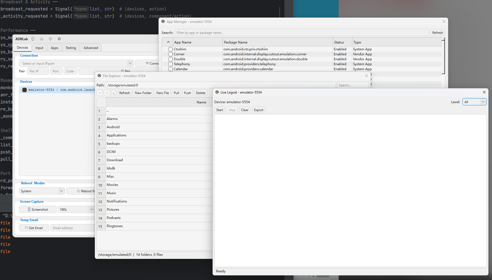

# ADBLab — 项目文档

## 概述

**ADBLab** 是一个基于 PySide6 的桌面 GUI 工具，用于 Android 设备的批量管理与自动化测试。通过图形界面封装 ADB 命令，支持设备连接、应用管理、文件浏览、实时日志、Monkey 压力测试、Bugreport 抓取与解析等功能。


- **语言**: Python 3
- **GUI 框架**: PySide6 (Qt 6)
- **作者**: Frankie Hu (Copyright (c) 2025.4)
- **版本**: 2.7.0

---

## 目录结构

```
ADBLab/
├── main.py                          # 入口：创建 QApplication → MainFrame → 事件循环
├── requirements.txt                 # Python 依赖
├── README.md                        # 中文功能说明文档
├── icon.ico                         # 应用图标 (用于 Windows EXE)
├── .gitignore
├── .github/workflows/
│   ├── Build-exe.yaml               # PyInstaller 打包 EXE + GitHub Release
│   └── Auto-Clean.yaml              # 定时清理旧构建产物与旧 Release
│
├── core/                            # 核心基础设施
│   ├── log_service.py               # 线程安全单例日志服务 (QTimer 缓冲 → signal → GUI)
│   ├── settings_manager.py         # 应用设置持久化 (JSON 单例)
│   ├── logger/                      # loguru 日志方案
│   │   ├── log.ini                  #   日志配置 (文件/控制台开关)
│   │   └── log_tool.py             #   loguru 单例封装
│   └── mail/                        # 临时邮箱服务
│       ├── email_service.py         #   AMZ123 临时邮箱 API 客户端
│       ├── email_task.py           #   QRunnable 异步获取邮箱+验证码
│       └── mail.yaml               #   邮箱账号/验证码持久化
│
├── controllers/                     # 控制器层 (业务逻辑 + 信号绑定)
│   └── adb_controller.py           # 核心 ADB 控制器 (~1500行)
│
├── models/                          # 模型层 (数据 + ADB 命令执行)
│   ├── adb_model.py                 # 核心基础设施：@async_command 装饰器 + ADBModelCore 基类
│   ├── adb_device.py               # 设备管理：连接、断开、重启、设备信息查询
│   ├── adb_app.py                  # 应用管理：安装、卸载、清除数据、获取包名/Activity
│   ├── adb_testing.py             # 测试诊断：截图、Monkey、Bugreport、ANR、日志
│   ├── adb_advanced.py            # 高级操作：录屏、输入事件、性能诊断、端口转发、Settings、Shell、文件管理、权限、广播、无线配对、进程管理、Content Provider、电池模拟、CMD工具、模拟器、IME
│   └── device_store.py            # 线程安全 YAML 设备信息存储
│
├── gui/                             # 视图层
│   ├── main_frame.py               # 主窗口：无边框+工具栏+面板布局+信号全量绑定
│   ├── panels/
│   │   ├── left_panel.py           #   左侧标签页控制面板 (5个标签页)
│   │   ├── left_panel_signals.py  #   LeftPanel 信号定义
│   │   ├── adb_control_signals.py  #   ADBController 信号定义
│   │   └── log_panel.py           #   右侧日志面板 (6色日志、自动滚动)
│   ├── dialogs/
│   │   ├── about_dialog.py         #   关于对话框
│   │   ├── screenshot_viewer.py   #   截图查看器 (无边框、置顶、缩放)
│   │   ├── app_manager.py         #   应用管理器 (列表、备份、权限、预设)
│   │   ├── file_explorer.py       #   文件浏览器 (浏览、拉取、推送、编辑、权限)
│   │   ├── live_logcat.py        #   实时日志查看器 (流式、过滤、顏色高亮、导出)
│   │   └── settings_dialog.py    #   设置对话框 (字体、路径、行为参数)
│   ├── styles/
│   │   └── base_styles.py         #   主题系统 (明/暗双主题、字体、QSS)
│   └── widgets/
│       └── double_click_button.py  #   双击安全按钮 (防误触)
│
├── utils/                           # 工具层
│   └── batch_tracker.py            # 批量操作进度追踪 (N/Total)
│
└── resources/                       # 静态资源
    ├── connected_devices.yaml       # 设备连接历史持久化
    ├── package_info.yaml            # 包名历史记录
    ├── chkbugreport-0.5-215.jar    # Bugreport txt→html 转换工具
    ├── app_settings.json             # 应用设置持久化
    ├── app.log                      # 应用日志
    └── icons/                       # 28 个 SVG 矢量图标
```

---

## 架构设计

### 整体模式：MVC + 信号/槽

```
用户点击按钮 (LeftPanel)
  → LeftPanel 发射信号 (如 connect_requested)
  → ADBController 接收，分发到对应 Model
  → Model 在后台线程执行 ADB 命令
  → Model 发射 command_finished 信号
  → ADBController 处理结果，通过 handler_map 分发到对应处理器
  → 发射 UI 信号 → LogPanel / LeftPanel 更新显示
```

### 关键设计模式

| 模式 | 位置 | 说明 |
|------|------|------|
| **单例** | `LogService` | `__new__` + `QMutex` 线程安全单例 |
| **观察者** | 全局 | Qt 信号/槽解耦 UI 与业务逻辑 |
| **异步命令** | `adb_model.async_command` | 装饰器将同步方法转为 QRunnable 异步执行 |
| **处理器映射** | `ADBController._handle_async_response` | 字典分发 70+ 种操作结果 |
| **批量追踪** | `batch_tracker.py` | 多设备操作进度 (N / Total) 及最终汇总 |

### 线程模型

- **主线程**: Qt 事件循环 + UI 渲染
- **工作线程**: `QThreadPool` (QRunnable) + `ThreadPoolExecutor`，所有 ADB 命令在后台执行
- **线程通信**: Qt 跨线程信号/槽 (自动队列化)
- **日志缓冲**: `LogService` 用 QTimer 每 200ms 批量刷新到 GUI

---

## 功能模块

### GUI 布局

主窗口采用顶部工具栏 + 左右分栏布局（4 个标签页）：

- **顶栏**: ADBLab | App Manager | File Explorer | Live Logcat | Settings ——— Clear Log | About | 主题 | 最小化 | 关闭
- **左侧**: 4 标签页 (Devices / Apps / Input & Diag / Advanced)，每个标签页内含滚动区
- **右侧**: 6 级彩色日志面板 (DEBUG/INFO/SUCCESS/WARNING/ERROR/CRITICAL)，支持自动滚动和行数裁切

### 标签页一：Devices（设备管理）

| 功能 | ADB 命令 |
|------|----------|
| IP 连接设备 | `adb connect` |
| 无线配对 (Android 11+) | `adb pair` |
| 刷新设备列表 | `adb devices` |
| 设备信息 (14项) | `getprop` + `df` + `wm size/density` + `cat /proc/meminfo` |
| 断开连接 | `adb disconnect` |
| 重启设备 | `adb reboot` |
| 重启模式 (System/Bootloader/Recovery/Fastboot) | `adb reboot <mode>` |
| 重启 ADB 服务 | `adb kill-server && adb start-server` |
| ADB over TCP/IP | `adb tcpip` |
| 截图 | `adb shell screencap` → `adb pull` |
| 屏幕录制 | `adb shell screenrecord` → `adb pull` |
| 临时邮箱 | HTTP API (AMZ123) |

### 标签页二：Apps（应用管理）

| 功能 | ADB 命令 |
|------|----------|
| 获取前台应用 | `adb shell dumpsys window` |
| 安装 APK | `adb install -r` |
| 卸载应用 | `adb uninstall` |
| 清除数据 | `adb shell pm clear` |
| 重启应用 | `am force-stop` → `monkey -p <pkg> 1` |
| 打印当前 Activity | `dumpsys window` + `dumpsys activity activities` |
| 强制停止 | `am force-stop` |
| 解析 APK 信息 | `aapt dump badging` (外部工具) |
| PM Path | `pm path <pkg>` 查询 APK 安装路径 |
| PM Dump | `pm dump <pkg>` 查询完整包信息 |
| 3rd Party 包列表 | `pm list packages -3` |
| 系统包列表 | `pm list packages -s` |
| 权限授予/撤销 | `pm grant / pm revoke` |
| 权限列表 | `pm dump <pkg>` |
| 禁用/启用应用 | `pm disable / pm enable / pm disable-user` |
| 发送广播 | `am broadcast -a <action>` |
| 启动 Activity | `am start -n <component>` |
| 打开 Deep Link | `am start -d <uri>` |

### 标签页三：Input & Diag（输入控制 & 诊断）

| 功能 | ADB 命令 |
|------|----------|
| 重启模式 | `adb reboot <mode>` |
| TCP/IP 模式 | `adb tcpip <port>` |
| 点击/长按/滑动/拖放 | `input tap/swipe/draganddrop` |
| 快速按键 (15键) | HOME/BACK/POWER/APP SWITCH/VOL±/ENTER/DEL/DPAD |
| 高级按键 (27种) | SLEEP/WAKEUP/BRIGHTNESS/CHANNEL 等 |
| Monkey 测试 | `adb shell monkey` + 同步 logcat + 自动切回前台 |
| 停止 Monkey | `ps \| grep monkey` → `kill <pid>` |
| 包列表 | `pm list packages` |
| Bugreport / ANR | `adb bugreport / pull /data/anr` |
| 日志获取/清理 | `adb logcat -d / -c` |
| 性能诊断 | `dumpsys meminfo/cpuinfo/battery` + `uptime` + `top` |
| GFX/Wakelocks/Net | `dumpsys gfxinfo / cat /proc/wakelocks / dumpsys netstats` |
| Logcat 过滤 | `adb logcat -d -b <buf> *:<prio> -e <regex>` |

### 标签页四：Advanced（高级操作）

| 功能 | ADB 命令 |
|------|----------|
| 自定义 Shell | `adb shell <任意命令>` |
| 文件列表 | `adb shell ls -la` |
| 文件 Push/Pull | `adb push / adb pull` |
| 端口转发 (Forward/Reverse) | `adb forward / reverse / --list / --remove-all` |
| SVC 服务开关 | `svc wifi/data/bluetooth/nfc enable/disable` |
| Android Settings 读写 | `adb shell settings list/get/put` (system/global/secure) |
| Content Provider 查询 | `adb shell content query --uri` |
| 进程管理 | `ps -A` / `kill <pid>` |
| Dumpsys 服务查询 | 17 种常用服务下拉 + 自定义输入 |
| 内核版本 | `cat /proc/version` |
| CPU 硬件信息 | `cat /proc/cpuinfo` |
| PM Features | `adb shell pm list features` |
| 电池模拟 | `dumpsys battery set level/status / reset` |
| 快捷设置 | 动画开关 / 充电常亮 |
| IME 管理 | `adb shell ime list / set` |
| 模拟器 SMS/来电/GPS | `adb emu sms send / call / geo fix` |

### 独立弹窗

| 弹窗 | 说明 |
|------|------|
| **App Manager** | 应用列表 (用户/系统/供应商)、批量卸载/禁用/启用、APK 备份(ZIP)/恢复、权限管理 (授予/撤销)、预设 (JSON 导入/导出) |
| **File Explorer** | 设备文件浏览器：目录导航 (前进/后退/上级)、Pull/Push、新建文件夹/文件、删除/重命名、文本查看编辑、图片预览、复制/剪切/粘贴、chmod 权限管理、安装 APK、执行 Shell 脚本、Root 支持、排序/搜索 |
| **Live Logcat** | 实时日志流 (`-v threadtime`)、组合过滤 Level+Package+Tag、颜色高亮 (QSyntaxHighlighter)、8000 行缓冲区、导出 txt、一键获取当前前台应用包名 |
| **Screenshot Viewer** | 截图查看器：缩放 (Ctrl+滚轮)、多图导航、复制到剪贴板、另存为、打开文件夹、置顶切换 |

---

## 主题系统

支持明/暗双主题一键切换，通过 `BaseStyles` 类管理：

- 27 种颜色键值 (WINDOW_BG, PANEL_BG, INPUT_BG, BUTTON_BG, TEXT_PRIMARY 等)
- 统一字体方案：`Segoe UI 12px` (按钮12px)，等宽 `Courier New 10px`
- 所有组件 (面板、对话框、弹窗) 通过 `BaseStyles.theme_changed` 信号自动响应主题切换
- QSS 模板方法：`BUTTON_STYLE()`, `INPUT_STYLE()`, `GROUP_BOX_STYLE()`, `TOOLBAR_STYLE()` 等
- 全局 8px 圆角滚动条，三态 (normal/hover/pressed)

## 关键特性

- **USB 自动检测**: 3 秒轮询 `adb devices`，设备数变化自动刷新列表
- **批量安装 APK**: 设备列表右侧按钮，多文件 × 多设备排队安装
- **App Manager 双视图**: 列表视图 + 图标视图切换；后台加载应用中文名称和版本信息
- **Live Logcat 组合过滤**: Level + Package (pidof 查询 PID) + Tag 三条件同时生效
- **多设备弹窗**: App Manager / File Explorer / Live Logcat 支持每台选中设备打开独立窗口

## 设置系统

通过 `AppSettings` 单例管理持久化配置 (`resources/app_settings.json`)：

| 设置项 | 默认值 | 说明 |
|--------|--------|------|
| `font_base_size` | 12 | 基础字体大小 |
| `font_small_size` | 12 | 按钮/输入框字体 |
| `font_tab_size` | 12 | 标签页字体 |
| `font_mono_size` | 10 | 等宽字体 |
| `save_directory` | `~/ADBLab` | 默认文件保存位置 |
| `log_max_lines` | 2000 | 日志面板最大行数 |
| `monkey_default_count` | 10000 | Monkey 测试默认事件数 |
| `screen_record_duration` | 180 | 录屏默认时长(秒) |
| `confirm_dangerous_ops` | true | 危险操作前确认 |
| `auto_refresh_on_connect` | true | 连接后自动刷新设备列表 |
| `theme` | Light | 当前主题 |

设置对话框通过顶栏齿轮图标打开，单页展示所有配置，修改后即时生效。

---

## 依赖

### Python (requirements.txt)

| 包 | 版本 | 用途 |
|-------|------|------|
| PySide6 / PySide6_Essentials / PySide6_Addons | 6.8.1.1 | Qt 6 GUI |
| loguru | 0.7.3 | 高级日志 |
| PyYAML | 6.0.2 | YAML 解析 |
| ruamel.yaml | latest | YAML 读写 (保留注释) |
| Requests | 2.32.5 | HTTP 客户端 |
| pyinstaller | latest | EXE 打包 |
| Pillow | latest | 图片处理 |

### 系统依赖

- **ADB** — 需在 PATH 中
- **aapt** — APK 解析
- **Java JRE** — `chkbugreport-0.5-215.jar` 运行

---

## CI/CD

### Build-exe.yaml
- **触发**: `workflow_dispatch` 手动触发 或 push `main` 分支
- **环境**: `windows-latest`, Python 3.11 x64
- **构建**: PyInstaller `--onefile --windowed` 单文件 EXE
- **产物**: `ADBLab-x64-v2.0.{run_id}.exe` → GitHub Release

### Auto-Clean.yaml
- **触发**: 每月 1 号 18:00 UTC 或手动
- **动作**: 删除 2 天前的运行记录，保留最新 8 个 Release

---

## 开发指南

### 启动项目
```bash
pip install -r requirements.txt
python main.py
```

### 代码约定
- UI 与逻辑严格分离：GUI 类不包含业务逻辑
- 所有 ADB 操作必须异步执行，禁止阻塞主线程
- 信号定义集中在 `*_signals.py` 文件中
- 新增 Model 方法遵循 `@async_command` 装饰器模式
- 新增 Controller 方法遵循 `handler_map` 字典分发模式
- 所有弹窗继承 ADBLab 主题系统 (`BaseStyles`)
- YAML 持久化使用 `DeviceStore` 类
- 日志使用 `LogService` 单例
