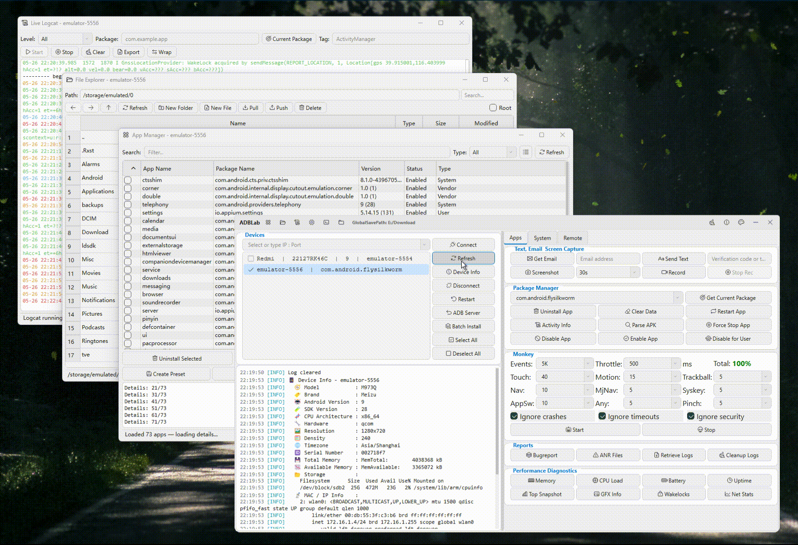

# ADBLab

## 项目概览

**ADBLab** 是一款基于 PySide6 的 Android 设备管理、自动化测试与性能诊断桌面工具。项目把常用 ADB、scrcpy、logcat、dumpsys、gfxinfo、meminfo 等能力封装为图形界面，适合日常设备调试、应用管理、投屏控制、Monkey 压测、文件操作和性能巡检。



| 项目 | 当前状态 |
|------|----------|
| 应用版本 | 以 `utils/app_metadata.py` 中的 `APP_VERSION` 为准 |
| 开发语言 | Python，建议使用 Python 3.11 |
| GUI 框架 | PySide6 / Qt 6 |
| 主要平台 | Windows 10/11 |
| 内置工具 | `scrcpy-win64-v3.3.1/`，包含 `adb.exe` 与 `scrcpy.exe` |
| 作者 | Frankie Hu (Copyright (c) 2026) |

---

## 快速启动

```bash
py -3.11 -m pip install -r requirements.txt
py -3.11 main.py
```

常用验证命令：

```bash
py -3.11 -m pytest -q
py -3.11 main.py --self-check packaging
```

---

## 当前功能

### 设备与基础操作

- IP/USB 设备连接、断开、刷新、重启和多选批量操作。
- IP 连接输入框支持 Enter 触发连接，并在执行前校验 `ip:port` 完整性。
- 设备信息读取：品牌、型号、Android 版本、SDK、CPU、分辨率、内存、存储、网络信息等。
- ADB Server 重启、TCP/IP 模式、端口 forward/reverse、系统 reboot 模式切换。
- 左侧设备列表支持持续扫描 USB 设备；扫描会避让正在执行的 ADB 命令，并在退出时做阻塞清理，降低 exe 关闭时的线程残留风险。

### 应用管理与测试

- 获取当前前台包名，支持 focus 优先检测和 activity/window 回退。
- 安装、卸载、清数据、强停、重启、禁用、启用、disable-user。
- 本地 APK 解析，读取包名、版本、权限、架构等信息；会校验 APK 路径和 `aapt` 可用性。
- Monkey 压力测试：事件占比、事件数、throttle、flags、随机种子、按设备中止；非 0 退出、设备连续超时和恢复失败会返回失败状态。
- Bugreport、ANR 拉取、logcat 导出/清理、meminfo、cpuinfo、gfxinfo、top、wakelock、netstats 等诊断入口；Bugreport ZIP 使用安全解压并通过 `resource_path()` 定位转换器。

### Remote 投屏控制

- 内置 scrcpy v3.3.1，支持流畅/均衡/画质/低延迟预设。
- 自定义分辨率、FPS、码率、codec、buffer、方向锁定、录制文件。
- 支持全屏、置顶、显示触摸、保持唤醒、关闭设备屏幕、无窗口、无音频。
- `services/remote/` 提供原生无界面服务层：
  - `ScrcpyService`：scrcpy 路径解析、版本检测、预检、编码器检测、启动/停止、FPS 解析。
  - `RemoteControlService`：按键、D-Pad、滑动、通知栏、旋转等 ADB 控制。
  - `control_mapping.py`：keycode 和手势坐标计算。
  - `scrcpy_args.py`：集中构建 scrcpy 参数。
- Remote 保留 ADBLab 自有 PySide6 UI，不嵌入 guiscrcpy 的 Qt UI/launcher 栈。

### 文件浏览器

- 浏览设备文件系统，支持路径栏、后退/前进/上级导航、搜索过滤。
- 拉取、推送、删除、重命名、新建文件/文件夹、复制/剪切/粘贴。
- 文件操作失败时不会再显示成功文案或无条件刷新；粘贴按每个任务的实际结果反馈。
- 文本和图片查看，脚本执行，APK 直接安装，文件属性查看。
- chmod 权限弹窗与 root 模式。
- `services/file_explorer.py` 是无 Qt 依赖的纯逻辑层，负责路径处理、shell quoting、`ls -la` 解析、权限模式和文件名安全校验。

### 性能监控

- 工具栏提供 `Performance` 入口，必须先选中设备；弹窗标题会带上当前设备名称。
- `gui/dialogs/performance_launcher.py` 提供 MobilePerf 启动弹窗，支持获取当前前台包名、配置采样频率/时长/Monkey/dumpheap/异常关键字、启动/停止采集、打开结果目录和跳转 Perfetto。
- MobilePerf 结果目录会追加设备名称，方便区分多设备保存文件。
- MobilePerf 日志使用纯文本批量追加，保留工具原始输出，不再额外叠加 ADBLab 时间和等级前缀，避免长时间运行导致主界面卡顿。
- `mobileperf/` 保持独立移植目录；ADBLab 通过 `services/mobileperf_runner.py` 生成临时配置并启动子进程，不直接修改 `mobileperf/config.conf`。
- 打包后 MobilePerf 通过 `ADBLab.exe --mobileperf-worker` 进入采集子进程，不再依赖 `python -m mobileperf.android.startup`。
- MobilePerf 子进程通过 `ADB_PATH` 使用 ADBLab 解析出的内置 ADB，并把日志写入用户可写目录，避免安装目录或 PyInstaller 临时目录写入失败。
- 原 Perfetto 跳转已移动到 Performance 弹窗内的 `Open Perfetto` 按钮。

### 弹窗与工具

- 主窗口工具栏提供置顶按钮，状态保存到 `AppSettings["always_on_top"]`；Windows 运行时切换使用原生窗口置顶，不重建主界面。
- 应用管理器：表格/网格视图、搜索过滤、批量操作、备份/恢复、权限管理、JSON 预设。
- 实时 Logcat：等级、包名、Tag 过滤，语法高亮，导出文本。
- 截图查看器：多图导航、缩放、复制、另存为、打开目录、删除。
- Monkey、Remote、MobilePerf 弹窗和面板响应全局主题、字体、图标刷新和深浅色切换。
- 设置弹窗：主题、字体、窗口尺寸、面板宽度、保存目录、日志行数、危险操作确认、持续扫描等。

---

## 项目结构

```text
ADBLab/
├── main.py                         # 程序入口，支持 GUI、--self-check、--mobileperf-worker
├── requirements.txt                # 运行与打包依赖
├── pyproject.toml                  # black / ruff / pytest 配置，目标语法 py310
├── ADBLab.spec                     # PyInstaller 打包配置
├── README.md
├── icon.ico
├── mobileperf/                     # MobilePerf 移植内核，保持独立目录
├── .github/workflows/
│   ├── Build-exe.yaml              # 构建 exe 并发布 GitHub Release（发布后保留最新 5 个版本 tag）
│   └── Auto-Clean.yaml             # 手动只读 Retention Audit（不自动删除）
│
├── core/                           # 核心基础设施
│   ├── adb_bridge.py               # 轻量 ADB 桥接与持久输入会话
│   ├── log_service.py              # 线程安全日志服务，跨线程 flush 回到 owner thread
│   ├── settings_manager.py         # 应用设置单例，JSON 原子写入
│   └── process_utils.py            # psutil 端口查找与进程树终止
│
├── controllers/                    # Controller 层，多个 mixin 组合成 ADBController
│   ├── __init__.py
│   ├── _base.py                    # model、signals、handler_map 分发
│   ├── _device.py                  # 设备连接与设备信息
│   ├── _app.py                     # 应用管理、Monkey、日志、Bugreport
│   ├── _system.py                  # 系统命令、广播、Activity、输入法、模拟器
│   ├── _media.py                   # 截图、录屏、性能基础项、电池
│   ├── _input.py                   # 文本输入、点击、滑动、keyevent、settings
│   └── _file.py                    # 文件、端口、content query
│
├── models/                         # Model 与 Worker 层
│   ├── adb_model.py                # @async_command 与 ADBModelCore
│   ├── adb_device.py               # 设备操作
│   ├── adb_app.py                  # 应用操作
│   ├── adb_testing.py              # Monkey、Bugreport、ANR、日志
│   ├── adb_advanced.py             # 录屏、输入、性能基础项、logcat
│   ├── adb_network.py              # 网络 ADB mixin
│   ├── adb_system.py               # 系统 ADB mixin
│   ├── app_manager_worker.py       # 应用管理器 worker
│   ├── file_explorer_worker.py     # 文件浏览器 QThread worker
│   ├── device_store.py             # YAML 设备信息持久化
│   └── base/
│       ├── command_runner.py       # 短生命周期命令统一入口
│       ├── process_runner.py       # 长生命周期进程统一管理
│       └── focus_detector.py       # 前台包名检测
│
├── services/                       # 纯服务层（低 Qt 耦合，ADR-0004）
│   ├── file_explorer.py            # 文件浏览器纯逻辑服务
│   ├── mobileperf_runner.py        # MobilePerf 子进程适配层
│   └── remote/                     # Remote / scrcpy 无界面服务层
│
├── adblab/                         # vNext 应用内核（新代码落位，ADR-0001/0003）
│   ├── application/                # OperationManager、InstallBatch/DeviceBatch/ScreenRecord 用例
│   └── presentation/               # QtTaskSupervisor 等 Qt 适配
│
├── gui/                            # PySide6 视图层
│   ├── main_frame.py               # 主窗口组合根（工具栏/二级窗口/关闭控制器已拆出）
│   ├── panels/                     # 右侧 Apps/System/Remote 面板与左侧设备/日志面板
│   ├── dialogs/                    # About、App Manager、File Explorer、Logcat、Performance、Screenshot、Settings
│   ├── styles/                     # 主题、QSS、字体、图标加载
│   └── widgets/                    # 自定义控件
│
├── utils/
│   ├── app_metadata.py             # 应用版本单一事实来源
│   ├── resource_path.py            # 开发/打包资源路径解析
│   ├── adb_resolver.py             # 内置 ADB 路径解析
│   ├── adb_targets.py              # ADB 连接目标 ip:port 规范化与校验
│   ├── archive.py                  # ZIP 安全解压工具
│   ├── runtime_tools.py            # 打包后外部工具路径与运行时缓存
│   └── user_data.py                # 用户可写配置/运行时目录
│
├── tests/
│   ├── test_model_*.py              # 由 test_model_execution.py 拆出的主题回归（10 个文件）
│   ├── test_remote_services.py
│   └── test_file_explorer_service.py
│
├── resources/                      # 设置、历史、预览图、二维码、图标、Bugreport 转换器
└── scrcpy-win64-v3.3.1/            # Windows 版 adb/scrcpy 运行时
```

---

## 架构说明

### MVC + 信号/槽

```text
用户操作 Panel/Dialog
  → 发出 Qt signal
  → ADBController 或弹窗本地 worker 接收
  → Model / Service 通过 CommandRunner 或 ProcessRunner 执行
  → Worker / Model 发回结果
  → Controller / Dialog 更新日志、状态和界面
```

核心原则：

- UI 只负责交互、状态展示和信号连接。
- 短命令统一走 `CommandRunner.run()`。
- 长生命周期任务统一走 `ProcessRunner.start()` / `ProcessRunner.spawn()`。
- UI 层不能直接调用 `subprocess.run()`、`subprocess.Popen()` 或 `os.startfile()`。
- Remote、File Explorer、Performance 的复杂逻辑都放入无 Qt 或低 Qt 耦合的服务层，便于单测和复用。

### 线程模型

- 主线程：Qt 事件循环和 UI 渲染。
- 普通异步 ADB 命令：`@async_command` 包装成 QRunnable，交给 `QThreadPool`。
- 弹窗级任务：App Manager、File Explorer、Performance 使用专用 QThread/worker。
- 长进程：Monkey、Logcat、scrcpy、性能采样等由 `ProcessRunner` 管理进程生命周期。
- 主窗口关闭时会统一停止扫描线程、Remote tab、controller model、线程池和被追踪的长进程。
- 日志：`LogService` 批量缓冲刷新，并通过 Qt 信号把跨线程 flush 调回 owner thread。

### 当前服务拆分

| 服务层 | 文件 | 说明 |
|--------|------|------|
| 命令执行 | `models/base/command_runner.py` | ADB 与短命令统一执行入口，规范输出与 timeout |
| 进程执行 | `models/base/process_runner.py` | 管理长生命周期进程，支持 stop、spawn、stop_all |
| Remote | `services/remote/` | scrcpy 参数、预检、启动、FPS、按键与手势控制 |
| File Explorer | `services/file_explorer.py` | shell quoting、路径、权限、文件列表解析 |
| MobilePerf | `services/mobileperf_runner.py` + `mobileperf/` | 临时 config、子进程启动/停止、日志批量回传、结果目录定位 |
| 设置 | `core/settings_manager.py` | 应用配置 JSON 原子写入和自动保存 |
| 日志 | `core/log_service.py` | 线程安全日志缓冲与 UI 刷新 |
| 运行时工具 | `utils/runtime_tools.py` / `utils/user_data.py` | 打包后工具路径、用户可写目录和运行时缓存 |
| 安全解压 | `utils/archive.py` | 防止 ZIP 条目写出目标目录 |

---

## 依赖

`requirements.txt` 当前内容：

| 包 | 版本 | 用途 |
|----|------|------|
| PySide6 / PySide6_Addons / PySide6_Essentials | 6.8.1.1 | Qt 6 GUI |
| PyYAML | 6.0.2 | YAML 解析 |
| ruamel.yaml / ruamel.yaml.clib / ruamel.base | latest / 1.0.0 | YAML 读写 |
| Requests | 2.32.5 | HTTP 请求，临时邮箱 API |
| Pillow | 未固定 | 图片相关处理 |
| pyinstaller | 未固定 | Windows exe 打包 |

系统侧依赖：

- Windows 10/11。
- ADB：已内置在 `scrcpy-win64-v3.3.1/`。
- scrcpy：已内置 Windows 版 `scrcpy.exe`。
- aapt：用于本地 APK 解析，需要外部提供。
- Java JRE：用于运行 `resources/chkbugreport-0.5-215.jar`。

---

## 测试与验证

当前测试目录覆盖：

- `tests/test_model_*.py`（10 个主题文件，原 `test_model_execution.py` 拆分）：命令/进程执行层、ADB model、GUI 生命周期、MobilePerf 等行为。
- `tests/test_remote_services.py`：Remote scrcpy 参数、预检、按键/手势映射。
- `tests/test_file_explorer_service.py`：文件浏览器路径、quoting、`ls` 解析、权限模式。
- MobilePerf/Performance 入口、置顶切换、Monkey/Remote 字体主题刷新等 UI 行为集中在 `tests/test_model_*.py` 中做轻量回归。

建议改动后至少执行：

```bash
py -3.11 -m compileall -q main.py utils models mobileperf gui controllers core
py -3.11 -m pytest -q
py -3.11 main.py --self-check packaging
git diff --check
```

打包验证：

```bash
py -3.11 -m PyInstaller ADBLab.spec --noconfirm --clean
.\dist\ADBLab\ADBLab.exe --self-check packaging
```

`--self-check packaging` 会检查 PySide6、Requests、MobilePerf 子入口、图标/resources、Windows 内置 adb/scrcpy 和用户可写目录。该命令不会启动主界面。

文档或中文内容改动后，建议使用 UTF-8 读回确认，避免 Windows 终端编码显示误判：

```bash
python -c "from pathlib import Path; print(Path('README.md').read_text(encoding='utf-8')[:120])"
```

---

## CI/CD 与版本

`utils/app_metadata.py` 是应用版本单一事实来源：

```python
APP_NAME = "ADBLab"
APP_VERSION = "<major.minor.patch>"
APP_RELEASE_TAG = f"v{APP_VERSION}"
```

该版本号用于：

- About 弹窗版本显示。
- Windows `AppUserModelID`。
- GitHub Actions 构建产物名称。
- GitHub Release tag 和 release title。

每次创建 Git 提交都必须在同一提交中更新一次 `APP_VERSION`，并且不得复用历史版本。
默认只递增补丁版本；主版本或次版本由明确的发布计划决定。发布时再从 `main` 构建或手动
运行 `Build-exe.yaml`。

GitHub Actions 构建流程：

- 安装依赖后先运行 `python -m pytest -q`。
- Windows 使用 onedir 产物并打包成 zip，避免 onefile 临时目录被 adb/scrcpy 长进程锁住。
- PyInstaller 显式收集 `mobileperf` 子模块和资源。
- Windows 产物上传前执行 `--self-check packaging`。
- Release 只在 build job 成功后创建。

---

## 代码约定

- 保持 PySide6 作为唯一应用 UI 栈，不把 PyQt5/PySide2 UI 代码引入主应用路径。
- ADB 短命令走 `CommandRunner.run()`，长进程走 `ProcessRunner`。
- UI 文件不要拼接复杂 shell 命令；优先放到 service 层集中处理和单测。
- 涉及中文 Windows 的 subprocess 文本输出时，使用 `encoding="utf-8", errors="ignore"`。
- 弹窗生命周期要显式停止后台 worker 或长进程。
- 打包后不能假设当前目录可写；配置、日志、缓存等运行时数据应写入 `utils/user_data.py` 提供的用户目录。
- 解压外部 ZIP 必须使用 `utils/archive.py::safe_extract_zip()`，不要直接调用 `ZipFile.extractall()`。
- Windows exe 内的长生命周期外部工具优先使用 onedir 资源路径；onefile 场景需先复制到稳定运行时缓存。
- 所有弹窗应响应 `BaseStyles.theme_changed`。
- 图标使用 `get_themed_icon("name.svg")`，不要直接使用原始 `QIcon`。
- 应用版本只改 `utils/app_metadata.py`。
- 每个 Git 提交必须包含一次 `APP_VERSION` 递增，默认递增补丁版本。
- 新增功能优先补充对应服务层测试，而不是只测 UI。
