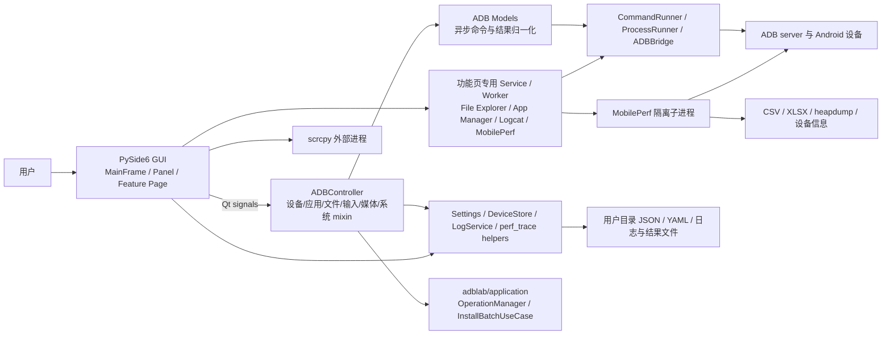
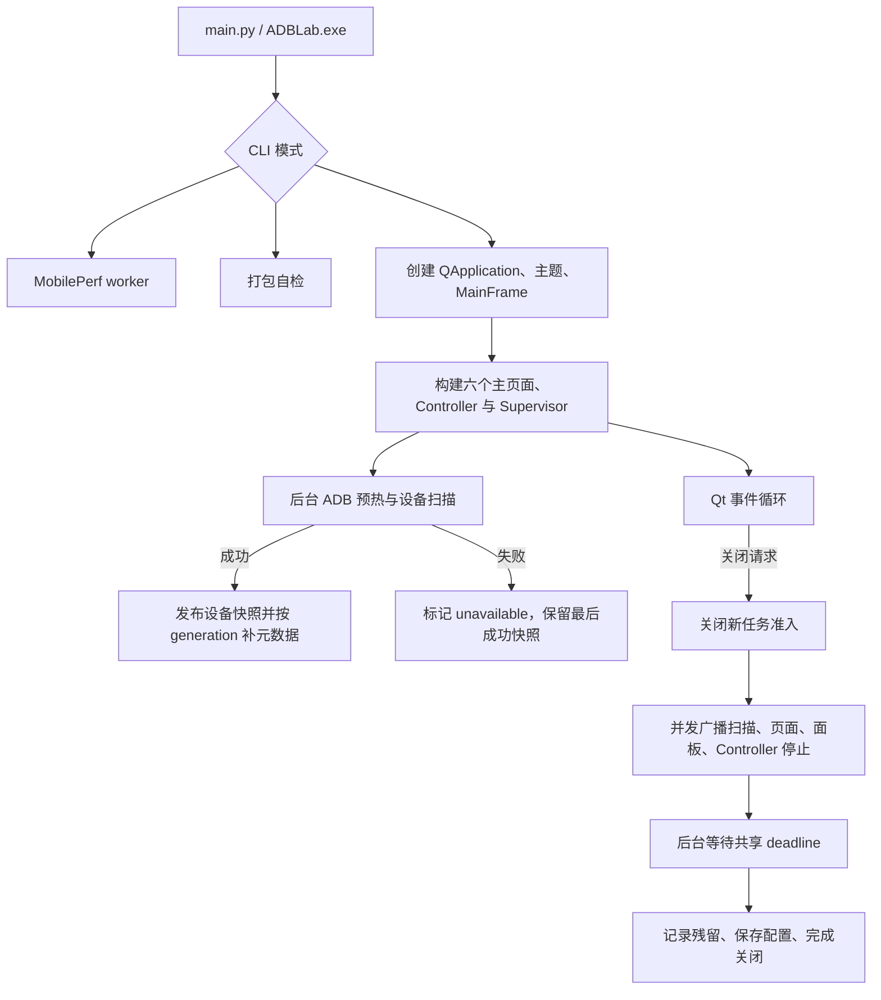

# 架构说明

## 总体架构

ADBLab 是以 Qt Signal/Slot 为连接机制的桌面分层应用。主路径近似 MVC，但独立主页面中的复杂
功能页也会直接使用 service/worker，因此不是严格的单一 Controller 架构。

## 分层设计

### 1. 启动与应用壳

- `main.py::_dispatch_cli()` 先处理 CLI 子模式；无已知子模式时进入 `_run_gui()`。
- `_run_gui()` 设置 Windows AppUserModelID、创建 QApplication、初始化资源路径，并在任何设置
  读取之前创建 LogService 并调用 `set_error_sink` 注入设置层错误接收器，随后加载主题并显示
  `gui.main_frame.MainFrame`。
- MobilePerf worker 不创建 GUI：打包后复用主可执行文件的 worker 入口，源码运行时由 runner 使用
  当前 Python 解释器调用 `mobileperf.android.startup` 模块。

### 2. 视图与交互层

- `MainFrame` 是组合根：创建 `LogService`、`SidePanel`、`ADBController` 和应用自有
  `QtTaskSupervisor`，连接全部 GUI 信号并管理内嵌功能会话。`SidePanel` 不进入可见导航树，只作为
  Devices/Apps/System/Remote 面板所有权、共享设备选择/发现状态和旧信号接口的兼容门面。
- `MainFrame` 构建 Home、三个业务宿主页、Tasks、Settings 六个物理页面，以保留已有资源
  所有权。主左栏用 qfluentwidgets 原生一级导航直接选择九个业务功能，并统一提交 `WorkspaceRoute`；
  加上首页、任务和设置共十二项。MainFrame 中宿主的 Pivot/ComboBox 隐藏。`WorkspaceAreaPage` 为三个
  业务宿主页提供紧凑页头和功能宿主，页头右侧统一承载会话状态与主题动作；屏幕镜像和按键手势
  在同一 Remote 分类页中呈现。Apps 和 System 按任务把相关卡片放入同一滚动页面。
- `gui/widgets/content_section.py::ContentSection` 保留原生 HeaderCardWidget 的标题、内容布局与控件
  所有权，只移除结构分区底板、外边框和标题分隔线。截图与诊断、系统工具、远程控制、性能采集和
  任务中心通过标题与留白分区；按钮、输入、日志、图表和预览继续保留各自的交互及内容边界。
  性能采集嵌入时隐藏内部重复标题，启动与停止操作仍放在配置上方。
- `MainFrame` 自有的语义导航历史同时记录独立物理页面和 Workspace 功能入口，不依赖物理
  `QStackedWidget` 页面历史推断功能切换。缺少设备时保留目标功能空态，并从顶部设备栏选择；
  打开选择弹层不切换物理页面或添加导航历史。具体用户流程见
  [BUSINESS_FLOW](BUSINESS_FLOW.md#1-启动导航与设备发现)。
- `gui/widgets/device_context_bar.py::DeviceContextBar` 位于主窗口内容布局中、页面堆叠外，功能页滚动时
  持续可见；首页、设置和设备概览隐藏并释放占用空间。多选弹层把目标集合提交给 DeviceManager；连接弹层只使用已经加载的
  地址历史并复用目标校验。固定设备功能的“当前查看”和关闭动作投影当前可见宿主控件状态，
  不接管会话、运行锁或后台资源。设备栏在主题变化时同步自身及普通容器色板，避免浅色残留；
  背景与页面一致，按可用宽度将操作设备、当前查看、连接动作重排，弹层根据按钮位置约束在窗口范围内。
  “更多”使用原生 Action 菜单项，由菜单统一度量文字、图标和行高；设备信息与断开操作随选择状态启用。
  DeviceHubPage 呈现发现与缓存元数据快照，页内保留连接和刷新，卡片的选择提交原 DeviceManager，
  针对单台设备的工具入口不重定向批量目标。外置设备控件时，概览页头不再重复显示目标数量徽章。
- `gui/pages/workspace_features.py::WorkspaceFeatureHost` 在业务宿主页内承载路由、会话设备、
  无设备空态和异步关闭屏障；在 MainFrame 内隐藏本地会话工具栏并通知全局栏更新，独立宿主仍可
  使用原工具栏与功能选择器。`WorkspaceRoute` 是首页快捷入口和左侧功能导航
  共用的深层路由。完整路由目录与设备上下文规则见 [BUSINESS_FLOW](BUSINESS_FLOW.md#workspace-路由目录)。
  深层功能页共用宿主滚动容器，当内容超出短屏时
  保留页面的完整布局并提供双向滚动；Performance 嵌入工作区后移除配置区内部滚动，避免出现
  两层可见滚动条。返回概览或空态后不保留隐藏页面的滚动范围。
  延迟尺寸刷新使用宿主拥有的单次 QTimer，宿主销毁时自动取消回调。
- AppPanel 的应用包管理卡保留在 `daily` 页面顶部并常显，与截图、Monkey 和诊断共用唯一包名输入。
  应用管理宿主只承载单设备应用列表会话；关闭列表会话不释放 AppPanel 的控件、包名历史或批量目标。
- 全局设备栏复选项组成多设备批量操作目标；需要一台设备的深层功能和 Remote 使用宿主中独立的
  会话设备。候选列表包含全部在线设备并保留已有的离线会话；恰好一个批量目标，或没有批量目标
  且仅一台在线设备时可自动选定；多个批量目标或无批量目标且多台在线时必须显式选择，不能静默取第一台。
  后台宿主只更新候选和等待态，不提前消费待打开路由；首次进入前台后才恢复唯一候选对应的会话。
- `gui/features/base.py::FeatureSessionRegistry` 以 `(feature, device_id, generation)` 为稳定键懒
  创建页面。切换独立主页面只调用 `deactivate()` 暂停瞬态绘制，不销毁页面或中止仍需继续的
  后台任务；再次进入调用 `activate()` 恢复。后台页收到深层路由时先暂存目标，进入前台后通过
  `activate_route()` 原子提交，不会先恢复上一个会话。设备离线时保留对应缓存会话并禁止新的设备操作，
  用户显式关闭会话才调用 `request_dispose()`；异步资源归零前显示关闭屏障，旧代次不可重激活。
- App Manager、File Explorer、Live Logcat、Performance 和 Screenshot 均为 MainFrame 子树中的
  `QWidget` 功能页，不再创建独立顶层业务窗口。About 由 `AboutPanel` 直接嵌入 Settings。功能页
  的规范公开入口位于 `gui/features/`；部分组合控制器仍保留在 `gui/dialogs/` 文件名下，但其页面
  类型不再提供 QDialog 语义。
- `gui/dialogs/fluent_dialog.py` 只负责功能页内部的瞬态消息、单行文本输入和少量短生命周期操作
  表单，并保留 QDialog 的 `exec/accept/reject/modal` 契约。`QFileDialog` 仍作为绑定当前页面 owner
  的系统原生文件/目录选择器；两者均不承担长期任务会话，不属于旧功能窗口回退。

Settings 中的 `AboutPanel` 不属于 Workspace 路由；它随 SettingsPage 创建并销毁。未知
section/feature 会在切换主页面前被拒绝，不能意外改变当前页面。

- `MainFrame` 保持无边框外观，但通过 `FramelessResizeController` 在四边和四角建立八个透明
  热区，并将按压交给 `QWindow.startSystemResize()`。最大化或全屏时缩放热区隐藏，恢复普通状态后重新启用。
- 主窗口尺寸由 `gui/window_layout.py` 统一校验，普通窗口缩放防抖写入设置；不再存在主内容
  splitter、常驻日志区或旧工具栏。Settings 的“恢复默认设置”直接恢复系统主题、强调色、Mica、
  字体、窗口尺寸、日志和扫描选项，并同步全部 SettingCard。
- Tasks 由 `TaskCenterPage` 展示 `OperationManager` 的活动快照和 `TaskHistoryStore` 的有界内存历史；
  页面可见时轮询差异，隐藏时停止计时器。取消总是写入 Operation 取消意图；MainFrame 当前只为
  安装批次和截图补充资源停止调用，不能把任务中心视为所有后台任务的统一停止器。
- 视图通常不直接阻塞执行命令，但 AppManagerPage、FileExplorerPage、LiveLogcatPage 和
  PerformancePage 各自持有 QThread/worker 或 runner，并通过会话生命周期和 TaskSupervisor 收口。
- Remote 表单控制器以实际表单根控件为 QObject 父对象，其全局主题通知使用 Qt Slot；根视图
  销毁时自动断连，隐藏协调面板或 Python 引用的存活不能延长旧视图的样式回调生命周期。
- SidePanel 拥有并隐藏设备与懒加载面板控制器，可见根控件仍交给工作区持有；销毁共享状态
  协调器时同时销毁控制器，避免其全局主题回调继续读取已经释放的设备列表。
  MainFrame 将隐藏 SidePanel 归为自身 QObject 子对象，使协调器与工作区视图共享窗口寿命；
  保留 Python 引用也不能让协调器在窗口销毁后继续处理主题或字体通知。
  DeviceManager 的原可见根在主窗口组装后也隐藏并归属于 SidePanel，保留仍被响应式绑定引用的
  控件，避免搬运个别按钮后又被旧布局重新接管。迁移后的入口转发原信号，选择无新增持久存储。

### 3. 协调层

- `controllers.ADBController` 由 `ADBDeviceMixin`、`ADBInputMixin`、`ADBMediaMixin`、`ADBAppMixin`、`ADBFileMixin`、`ADBSystemControllerMixin` 和 `_ADBControllerBase` 组合。
- `_ADBControllerBase` 根据 MRO 合并各 mixin 的 `_handlers` 注册表，按 model 返回的 method 名称分派到相应 `_process_*_result` 方法。
- Controller 聚合多设备批次、录屏和保存路径，再将结果转换为 GUI 信号；截图批次由
  OperationManager 跟踪，安装批次由 `InstallBatchUseCase` 编排。`ADBControllerSignals` 提供
  `record_target_finished(str, str)` 与 `monkey_target_finished(str, str)` 批次终态信号（参数为批次标识、设备），
  `SidePanelSignals` 提供 `screen_record_batch_requested`、`start_monkey_batch_requested`、
  `stop_screen_record_batch_requested`、`kill_monkey_batch_requested` 与 `batch_install_requested` 等批次入口。

### 4. Model 与 Service 层

- `models/adb_model.py::async_command` 把方法放入 QThreadPool——普通命令走全局池，`@async_command(long_running=True)`（install/bugreport/pull/push 等长任务）走每模型的 `long_pool`，避免长任务占满全局池；结果通过 `command_finished(method, result)` 回到 Controller。Controller 关闭时先永久关闭四个 model 的新任务准入；已经排队但尚未执行的方法体会返回取消结果，并保留原有 metadata/perf 信封。
  operation 相关的 `_operation_id/_operation_owner_token/_operation_generation_token` 等关键字参数
  只用于构造 `OperationMetadata` 信封（`adblab/application/envelope.py`），不会转发给底层 model 方法。
- `models/adb_device.py`、`adb_app.py`、`adb_advanced.py`、`adb_testing.py` 提供主要 ADB 能力；`adb_network.py` 和 `adb_system.py` 作为 mixin 复用。
- `services/remote/` 与 `services/file_explorer.py` 尽量保持无 Qt 或低 Qt 耦合，便于单测。
- `services/mobileperf_runner.py` 是主应用和移植内核之间的进程隔离适配层。

### 5. 基础设施与外部边界

- `CommandRunner`：短命令、超时、UTF-8 解码、活跃计数、慢命令摘要。
- `ProcessRunner`：长进程注册、替换、停止、带 deadline 的强停、进程树终止和全局兜底；
  未确认退出的进程继续保留 tracking。同键替换必须确认旧进程已退出；并发启动失败方
  通过内部残留键保留未退出进程并报告冲突，全局登记只接受仍属于当前键的句柄。
- `ADBBridge`：普通 shell 以及每设备一个持久 `adb shell` 输入会话。
- `AppSettings`：使用可重入锁保护数据、保存计时器和快照，另以写锁串行保存回调；
  `update()`/`set_many()` 在一个锁域内批量更新，并只安排一次 500 毫秒防抖保存。写盘在取得
  写锁后生成最新快照，再使用独立临时文件和 `os.replace`，避免旧快照晚完成后覆盖新设置。
  错误日志经可注入的 `set_error_sink` 接收器输出（MainFrame 组合根注入 LogService），
  使 `core` 除 `log_service.py` 外不依赖 Qt。
- `DeviceStore`：按 alias 保存设备元数据，提供本地 YAML 持久化、旧资源文件迁移、损坏文件备份
  和原子替换；在线拓扑与批量复选属于 SidePanel/DeviceManager 的进程内状态，不能由历史 YAML 推断。
- `LogService`：跨线程缓冲用户日志并通过 Qt 批量发信号；开发 DEBUG 与用户界面严格分流。

### 字体与响应式布局通道

- `gui/styles/typography.py` 定义不可变 `FontConfig` 和五种稳定角色：`UI`、`UI_SMALL`、
  `MONO`、`LOG`、`TITLE`。用户字体不可用时回退到 Qt 系统界面字体，等宽角色使用 Qt
  系统等宽字体；界面字号限制为 8–22，日志字号限制为 7–16。
- `TypographyManager` 是应用级字体状态源。`ui_font_changed` 只在界面字体族或界面字号变化时
  发送，`log_font_changed` 只在等宽字体族或日志字号变化时发送，`fonts_changed` 表示任一字体
  配置变化；字体变化不再借用 `theme_changed`。`BaseStyles` 保留兼容属性和字体工厂，但其值
  由同一 `FontConfig` 投影。
- 普通标签、按钮、输入框、下拉框、复选框和页签统一使用 `UI`；`UI_SMALL` 只用于提示、元数据和
  次要状态，设备标识、包名、命令及路径使用同字号的 `MONO`，日志使用独立 `LOG`。日志面板只订阅
  `log_font_changed`，主窗口只订阅
  `ui_font_changed`，需要同时刷新多种角色的面板、功能页和瞬态对话框订阅 `fonts_changed`。控件最小高度
  通过字体度量计算；通用分组框也按当前标题字体高度计算顶部净空，并在字号变化后刷新样式，
  避免放大字号后文字被固定高度裁切或被首行按钮覆盖。
- `gui/widgets/responsive_layout.py` 以 420/560 逻辑像素为默认断点返回紧凑、中等和宽布局列数，
  `reflow_widgets()` 仅从 QGridLayout 取出并重新放置现有控件。Settings 使用 qfluentwidgets 的纵向
  `SettingCardGroup`；首页 `FlowLayout`、各业务主页面滚动视口和面板实际可用宽度共同驱动重排。
  设备上下文卡在窄屏隐藏次要刷新/计数信息，但保留当前目标语义与主操作。
- 功能切换由 `FluentWindow.navigationInterface` 的一级入口承担。展开模式显示图标与文字；
  窄窗折叠模式显示图标和提示，汉堡按钮打开覆盖式完整菜单。
  Apps、System、Remote 原有的 `AdaptiveCategoryStack` 仅作为面板内部内容栈，其 `Pivot`/`ComboBox`
  在主页面组装时隐藏，由工作区的 `WorkspaceRoute` 驱动。`gui/widgets/adaptive_navigation.py`
  的 `AdaptiveNavigation` 由独立宿主和分类栈复用，在 MainFrame 中隐藏；独立使用时根据实际内容宽度、
  字体和页签最小尺寸切换 Pivot/ComboBox，模式切换保留选择与键盘焦点，不承担会话或返回历史。
  AdaptiveCategoryStack 和工作区宿主支持到已登记正式入口的兼容别名；别名不创建页面或导航项，
  不支持别名链。同页别名切换保持原卡片、控件与响应式绑定。
  分类内容使用只度量当前页的 QStackedLayout，宽度相关高度也委托当前页，避免隐藏长分类撑出页尾空白。
  主窗口宽度达到 1120 逻辑像素时常驻
  220 像素左栏，低于该阈值时使用不挤压内容的覆盖菜单；短窗口会把当前一级入口滚入视口。
  已打开的 MENU 跨过 1120 断点时先归位到折叠态，再进入无动画的常驻 EXPAND，避免覆盖层父级或
  模式状态滞留。导航宽度动画结束后以最终 viewport 触发响应式重排，避免内容布局停留在过渡尺寸。
  宽窗手动收起后保持紧凑状态；模式变化本身不触发按窗口宽度重新展开。上游折叠动画重新应用
  样式后，再恢复项目导航背景的调色板与填充。内容栈和非覆盖模式的导航面板同时通过主题 QSS
  绘制与页面一致的不透明底色，取消边框与圆角，保证切页位移、设备栏显隐及导航重新挂回父级的
  中间帧也不会暴露半透明浅色底板；覆盖菜单保留原组件样式和动画。
- 页面标题、首页横幅与操作卡片跟随应用字体。页头空间不足时将状态动作换行；首页卡片
  按可用宽度均分一至三列，文字按当前卡片宽度测高，滚动范围跟随实际内容收缩。
- BasePanel 的响应式行布局按计划限定的最小/最大宽度计算换行高度，避免父布局用更宽的
  临时尺寸低估高度并压缩相邻行。只读 ComboBox 使用实际按钮样式盒模型度量所有闭合选项，
  测量不切换当前选项或发送业务信号；字体与样式变化后沿用响应式刷新路径重新测量。
- App Manager 的行底色和交替底色在页面范围内跟随当前主题，避免 Qt AlternateBase 残留上一主题；
  中文筛选显示与原始业务值通过 userData 分离，操作记录可折叠且保留内容。列表视口按字体保留
  至少三条完整表格行；嵌入工作区时收起内部重复标题，并将原状态徽标移入筛选工具栏。
- Performance 使用顶部运行卡、四组配置卡和结果卡，Monkey 参数按启用状态展开；独立页面只有
  一个主滚动区，嵌入后由工作区承接滚动。日志与图表按各自字体测高，图表坐标轴和图例跟随主题。
- Logcat 嵌入工作区时通过 `prepare_for_workspace()` 隐藏内部重复标题；中文工具条按可用宽度重排。
  输出使用 QPlainTextEdit 的有界批量追加，主题背景独立，历史阅读位置保持不变；用户回到底部后跟随。
- File Explorer 嵌入工作区时隐藏内部重复标题。类型列只绘制图标，类型数据继续支持目录判断、排序和辅助信息。
  页内按钮和类型行使用 Qt 原生 SVG 图标，并由主题回调重新绑定颜色，避免重复创建、释放文件页后
  在解释器退出阶段触发 Python QIconEngine 堆损坏；对应测试同时检查独立进程退出码。
- 操作图标由 `gui/styles/icon_loader.py` 将兼容语义键映射到原生 FluentIcon，不再运行旧 SVG 渲染器。
  组件库缺少的手机轮廓通过 `DeviceIcon(FluentIconBase)` 复用已授权 SVG，绘制由 Fluent 图标引擎完成。
  Fluent 按钮直接接收图标对象以保留强调/禁用绘制；Qt API 使用相同图标的主题 QIcon。
- TaskCenterPage 通过 CollapsibleTools 收纳唯一运行记录控件，保持 LogService 连接与原有界缓存；
  MainFrame 不再创建独立操作日志页。
- Settings 使用参考 Gallery 的透明滚动背景和无边框视口；关于信息和原二维码组成原生 SettingCardGroup。
  `gui/widgets/setting_card_layout.py` 提供 Settings/About 共用的卡片布局。Settings 保留现有 SettingCard 与操作控件，按当前字号重排卡片内容；窄卡片将操作置于说明
  下方，缩小字号后重新收缩高度。超长输出路径在展示时中间省略，完整文本保留在提示和无障碍
  描述中，配置值及保存、恢复默认信号不经过展示文本转换。
- `gui/widgets/responsive_coordinator.py` 的 `ResponsiveCoordinator` 是响应式重排的单一协调入口：
  用一次度量生成布局计划（内部为 `ReflowTarget`/`_plan_history`），在实际尺寸不足以容纳内容时触发“溢出 → 收缩/换行 → 再度量”
  的收敛循环（`MAX_APPLY_ROUNDS = 3`），窗口尺寸变化经 40 毫秒防抖（`RESIZE_DEBOUNCE_MS = 40`）
  批量触发重排；`gui/widgets/preset_spin_box.py` 提供严格整数预设输入（`StrictIntComboBox`），
  保证 Monkey 事件数、throttle 等业务值始终是合法整数。
- `gui/screen_adapter.py` 定义 `ScreenAdapter` 协议和 `QtScreenAdapter` 实现（从 `main_frame.py`
  抽出）：统一封装窗口所在屏幕、可用几何、逻辑 DPI 与屏幕/DPI 变更订阅，供主窗口尺寸约束和
  仍存在的瞬态操作表单屏幕适配复用；内嵌功能页直接受主窗口内容区约束，不再单独适配
  顶层窗口。GUI 依赖协议而不是直接调用 QScreen，便于测试注入与几何探针。

### 日志通道

- 用户日志仅接收 `INFO/SUCCESS/WARNING/ERROR/CRITICAL`，由 `LogService` 缓冲后发送到
  `LogPanel`；时间戳在日志产生时由 LogService 生成，批次信号携带 `(时间戳, 级别, 消息)`
  三元组；DEBUG 拦截只在服务层发生（单一职责），面板渲染收到的记录原样显示。
  `LogPanel` 每条记录渲染为独立块（逐条 `insertBlock` + 显式 `QTextBlockFormat` 悬挂缩进，避免 `insertHtml` 把连续记录合并进同一块）：级别列固定宽度（级别标签 + 单空格对齐）、ERROR/CRITICAL 加粗、多行消息悬挂缩进；时间戳保留在记录中但
  不渲染；条目 HTML 按 (级别, 消息) 缓存，主题切换重建缓存并整份重绘；
  超限裁剪按块从文档头部删除（O(裁剪行)），避免持续日志流下每 50 行整份重绘。
- DEBUG 只在源码、非 frozen 模式写入线程安全的 `stderr`，用于 IDE 或源码终端诊断；
  不进入 Qt 信号、界面缓存。windowed 环境没有 `stderr` 时静默丢弃。
- 主窗口动作、主题、保存目录和功能页资源生命周期只记录结构化 DEBUG 摘要；字段限于动作、阶段、
  组件类型、布尔状态和数量，不记录设备标识、包名或真实路径。旧独立业务窗口的
  创建/复用/事件过滤器日志不再属于当前运行路径。
- MobilePerf 子进程使用 stdout 传递 INFO 和功能 RAW 数据，源码 DEBUG 单独写 stderr；
  父进程按运行代次固化回调和脱敏值，分别排空两个流并在双管道收口后通知完成，DEBUG
  不进入 PerformancePage。动态设备、包、邮箱和本地路径在输出前脱敏。
- `LogService.shutdown()` 保持同一停止态单例并拒绝晚到日志，防止后台线程在错误的 Qt
  线程重新创建 QObject/QTimer。

## 初始化与关闭流程

## 运行时并发模型

| 执行单元 | 用途 | 生命周期管理 |
| --- | --- | --- |
| Qt 主线程 | UI、信号槽、定时器、日志呈现 | QApplication 事件循环 |
| 全局 QThreadPool/QRunnable | 普通 `*_async` ADB 命令 | Controller 先关闭 model 终态栅栏；未开始的 QRunnable 在执行入口取消，已运行任务仍不统一等待 |
| 每模型 `long_pool`（QThreadPool） | 长任务 `*_async`（install/bugreport/pull/push）| 与全局池隔离并受同一 model 终态栅栏约束；已运行任务仍按各命令超时收口 |
| `_ScanThread` | 经 ProcessRunner 轮询设备列表；结果在 MainFrame 防抖后发布，不重复查询 ADB | MainFrame 显式停止/等待；轮询中的子进程可响应停止请求，失败保留上次成功快照 |
| 功能页 QThread | App Manager、File Explorer、Live Logcat、当前包名查询 | 会话关闭前向 TaskSupervisor 登记；页面 `request_dispose()` 发出停止请求，资源归零后才能从 registry 移除 |
| Logcat 延迟关闭 | 在资源归零后的事件循环边界关闭页面 | QTimer 回调绑定页面上下文；宿主先销毁页面时自动取消 |
| 应用自有 cleanup QThreadPool | Live Logcat 等资源停止、等待和强停 | MainFrame 创建 QtTaskSupervisor 并注入页面；不使用 global pool |
| Controller ThreadPoolExecutor | 并行设备信息等 Python 任务 | `_ADBControllerBase.shutdown()` |
| Remote ThreadPoolExecutor(1) | 串行发送 Remote 输入 | Remote 自有关闭路径先关闭输入准入，再在后台等待 executor 与全部 warmup，最后关闭持久输入会话；TaskSupervisor 观察完成/错误 |
| 外部进程 | adb、scrcpy、logcat、Monkey、终端 | CommandRunner/ProcessRunner；部分例外见风险 |
| MobilePerf 子进程与内部线程 | 指标采集和报告 | stop 文件、最长等待、必要时强制终止；采集线程 daemon 化，stop 完成后结构化收口（ADR-0004） |

## 关键架构决策

1. **GUI 与设备命令解耦**：Qt 信号和异步 model 避免常规 ADB 调用阻塞 UI。证据：`gui/main_frame.py`、`models/adb_model.py::async_command`。
2. **短命令/长进程分流**：短命令返回统一 `CommandResult`，长进程可被全局停止。当前实现和导出
   均位于 `core/exec.py`（ADR-0005）；旧 `models/base/*runner*` 路径已删除。
3. **复杂交互使用专用服务**：Remote、File Explorer 和 MobilePerf 把命令构建与生命周期从普通 panel 中拆出。
4. **MobilePerf 进程隔离**：移植内核按 ADR-0004 改为每运行一份的 RuntimeData 实例上下文（元类代理兼容既有调用点）、daemon 采集线程、无 `os.chdir`/`os._exit` 的结构化收口，继续通过独立子进程限制对 GUI 的影响。证据：`services/mobileperf_runner.py`、`mobileperf/android/globaldata.py`、`startup.py`。
5. **运行时数据进入平台可写目录**：设置和设备列表写入 `utils/user_data.py` 定义的配置目录；
   运行时工具缓存由 `utils/runtime_tools.py` 写入 Windows LocalAppData 或非 Windows 的 XDG/用户
   cache 目录，均避免写入只读安装目录。
6. **Windows onedir 优先**：内置 adb/scrcpy 是长生命周期进程，CI 和 spec 的 Windows 产物采用 onedir，避免 onefile 临时目录锁定。
7. **物理宿主与可见功能分离、会话懒创建**：Home、三个业务宿主页、Tasks、Settings
   在启动时完成实例化；左栏直接选择具体功能，内部 section 仅确定资源归属。
   复杂功能页按 `(feature, device_id, generation)` 首次访问时创建，
   返回时复用同一会话。高频 logcat/MobilePerf 在 producer 侧批量化，降低 UI 事件循环压力。
8. **长期任务内嵌、瞬态交互弹出**：App Manager、File Explorer、Live Logcat、Performance、
    Screenshot 和 About 均属于主窗口页面树；仅消息、文本输入、短生命周期操作表单及系统文件
    选择器使用模态/瞬态窗口。
9. **Operation 与资源监督分离**：OperationManager 管业务身份、状态、结果和取消意图；
   TaskSupervisor 管线程、执行器和外部进程的停止/等待。兼容 Qt signals 仍是 GUI 边界，决策缘由见
   [ADR-0001](../architecture/adr/0001-incremental-vnext.md) 和
   [ADR-0002](../architecture/adr/0002-operation-contract.md)。
10. **字体角色和布局状态集中管理**：主题、UI 字体和日志字体使用独立信号；窗口尺寸使用纯函数
   校验和公开恢复接口；面板通过断点重排既有控件，避免为缩放复制业务控件和信号接线。旧
   splitter 配置键只为 schema 兼容保留，运行时不读取或写入分栏状态。

## Operation 与资源生命周期边界

- **OperationManager** 管业务 operation 身份、终态、进度、结果汇总和取消意图，不拥有线程或进程。
  metadata 的 owner/generation 用于拒绝晚到或错代结果。
- **TaskSupervisor** 管 QThread、执行器和外部进程的登记、停止、等待与残留快照，不判断业务成功。
- `WorkspaceFeatureHost` 功能会话在释放前先停用界面回调，再等待其 worker 与 supervisor owner 同时归零；
  超时资源保留到后续复核，不因页面隐藏而伪装成已释放。
- MainFrame 关闭采用两阶段流程：先并发广播停止，再在共享 deadline 内后台等待，最终保存配置并
  重新触发关闭；GUI 线程不串行等待各资源。
- GUI 通过 Controller 或专用 model/worker/service 提交任务，结果经 Qt signals 返回主线程更新控件。历史迁移阶段和 Gate
  结论只在 ADR 与 [archive](../archive/README.md) 中追溯。

## 活动风险

未闭环的架构限制和验证缺口统一维护在 [RISKS_AND_DEBT](RISKS_AND_DEBT.md)，本页不重复风险清单。
