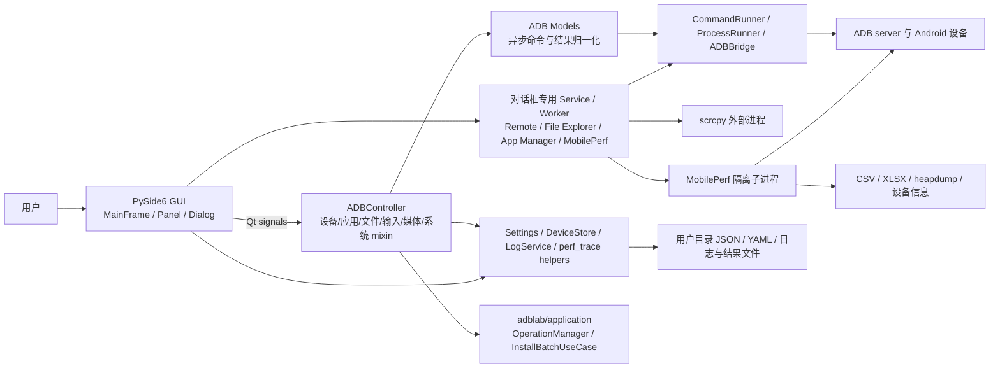
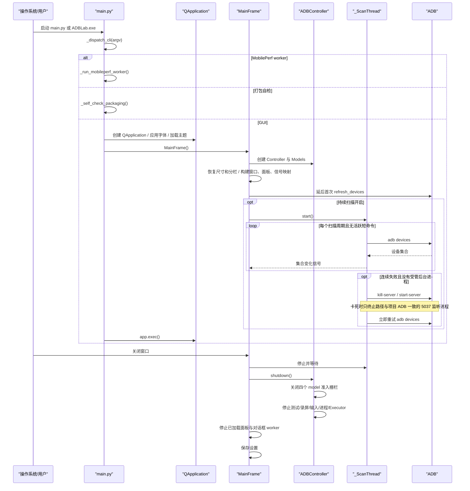

# 架构说明

## 总体架构

ADBLab 是以 Qt Signal/Slot 为连接机制的桌面分层应用。主路径近似 MVC，但对话框中的复杂功能也会直接使用 service/worker，因此不是严格的单一 Controller 架构。

## 分层设计

### 1. 启动与应用壳

- `main.py::_dispatch_cli()` 先处理 CLI 子模式；无已知子模式时进入 `_run_gui()`。
- `_run_gui()` 设置 Windows AppUserModelID、创建 QApplication、初始化资源路径，并在任何设置
  读取之前创建 LogService 并调用 `set_error_sink` 注入设置层错误接收器，随后加载主题并显示
  `gui.main_frame.MainFrame`。
- MobilePerf worker 复用同一可执行入口，但不创建 GUI。

### 2. 视图与交互层

- `MainFrame` 是组合根：创建 `LogService`、`SidePanel`、`ADBController` 和应用自有
  `QtTaskSupervisor`，连接全部 GUI 信号并管理对话框。
- `MainFrame` 是所有二级窗口的生命周期根：设备类对话框、Performance Launcher 和
  ScreenshotViewer 作为无 Qt parent/transient owner 的独立非模态顶层窗口运行，由
  MainFrame/Controller 的强引用、事件过滤器和显式关闭流程托管。About 保持有意的模态交互，
  Settings 作为非模态独立窗口打开。关闭任一非模态二级窗口不得触发 MainFrame 的关闭状态机。
- `MainFrame` 保持无边框外观，但通过 `FramelessResizeController` 在四边和四角建立八个透明
  热区，并将按压交给 `QWindow.startSystemResize()`；工具栏拖动优先使用
  `QWindow.startSystemMove()`。最大化或全屏时缩放热区隐藏，恢复普通状态后重新启用。
- 主窗口尺寸和左右分栏比例由 `gui/window_layout.py` 统一校验。普通窗口缩放与分隔条拖动
  分别防抖写入设置；分隔条常驻线条不可见，但保留 8 像素透明拖动热区。设置页只通过
  `window_layout_snapshot()`、`restore_default_window_size()` 和 `reset_panel_split()` 公开接口
  展示或恢复布局，不直接访问 MainFrame 私有控件。顶部全局保存路径从最小窗口宽度起保持可见，
  窄窗口显示末级目录，宽窗口按字体度量从中间省略（按工具栏剩余宽度动态计算），避免与工具栏按钮重叠。
- `SidePanel` 首次只创建默认页签，Apps/System/Remote 在选择后懒加载；每个功能页放入 `QScrollArea`（横向滚动按需，极窄宽度下保留可访问的横向兜底）。左栏分割宽度和各功能页滚动视口宽度变化会触发响应式重排，Device、Apps、
  System、Remote 只移动既有控件，不重建控件或重新连接信号。
- `gui/panels/` 负责普通操作表单；`gui/dialogs/` 负责需要独立生命周期的复杂任务。
- 视图通常不直接阻塞执行命令，但 App Manager、File Explorer、Live Logcat、Performance Launcher 各自持有 QThread/worker 或 runner。

### 3. 协调层

- `controllers.ADBController` 由 `ADBDeviceMixin`、`ADBInputMixin`、`ADBMediaMixin`、`ADBAppMixin`、`ADBFileMixin`、`ADBSystemControllerMixin` 和 `_ADBControllerBase` 组合。
- `_ADBControllerBase` 根据 MRO 合并各 mixin 的 `_handlers` 注册表，按 model 返回的 method 名称分派到相应 `_process_*_result` 方法。
- Controller 聚合多设备批次、录屏和保存路径，再将结果转换为 GUI 信号；Screenshot 已作为
  vNext Gate A 迁入 OperationManager，不再使用 Controller 共享剩余计数/路径列表；安装批次已作为
  Gate C 迁入 `InstallBatchUseCase`。`ADBControllerSignals` 新增
  `record_target_finished(str, str)` 与 `monkey_target_finished(str, str)` 批次终态信号（参数为批次标识、设备），
  `SidePanelSignals` 提供 `screen_record_batch_requested`、`start_monkey_batch_requested`、
  `stop_screen_record_batch_requested`、`kill_monkey_batch_requested` 与 `batch_install_requested` 等批次入口。

### 4. Model 与 Service 层

- `models/adb_model.py::async_command` 把方法放入 QThreadPool——普通命令走全局池，`@async_command(long_running=True)`（install/bugreport/pull/push/backup 等长任务）走每模型的 `long_pool`，避免长任务占满全局池；结果通过 `command_finished(method, result)` 回到 Controller。Controller 关闭时先永久关闭四个 model 的新任务准入；已经排队但尚未执行的方法体会返回取消结果，并保留原有 metadata/perf 信封。
  operation 相关的 `_operation_id/_operation_owner_token/_operation_generation_token` 等关键字参数
  只用于构造 `OperationMetadata` 信封（`adblab/application/envelope.py`），不会转发给底层 model 方法。
- `models/adb_device.py`、`adb_app.py`、`adb_advanced.py`、`adb_testing.py` 提供主要 ADB 能力；`adb_network.py` 和 `adb_system.py` 作为 mixin 复用。
- `services/remote/` 与 `services/file_explorer.py` 尽量保持无 Qt 或低 Qt 耦合，便于单测。
- `services/mobileperf_runner.py` 是主应用和移植内核之间的进程隔离适配层。

### 5. 基础设施与外部边界

- `CommandRunner`：短命令、超时、UTF-8 解码、活跃计数、慢命令摘要。
- `ProcessRunner`：长进程注册、替换、停止、带 deadline 的强停、进程树终止和全局兜底；
  未确认退出的进程继续保留 tracking。
- `ADBBridge`：普通 shell 以及每设备一个持久 `adb shell` 输入会话。
- `AppSettings`：使用可重入锁保护数据、保存计时器和快照，另以写锁串行保存回调；
  `update()`/`set_many()` 在一个锁域内批量更新，并只安排一次 500 毫秒防抖保存。写盘在取得
  写锁后生成最新快照，再使用独立临时文件和 `os.replace`，避免旧快照晚完成后覆盖新设置。
  错误日志经可注入的 `set_error_sink` 接收器输出（MainFrame 组合根注入 LogService），
  使 `core` 除 `log_service.py` 外不依赖 Qt。
- `DeviceStore`：本地 YAML 持久化、旧资源文件迁移、损坏文件备份和原子替换。
- `LogService`：跨线程缓冲用户日志并通过 Qt 批量发信号；开发 DEBUG 与用户界面严格分流。

### 字体与响应式布局通道

- `gui/styles/typography.py` 定义不可变 `FontConfig` 和五种稳定角色：`UI`、`UI_SMALL`、
  `MONO`、`LOG`、`TITLE`。用户字体不可用时回退到 Qt 系统界面字体，等宽角色使用 Qt
  系统等宽字体；界面字号限制为 8–22，日志字号限制为 7–16。
- `TypographyManager` 是应用级字体状态源。`ui_font_changed` 只在界面字体族或界面字号变化时
  发送，`log_font_changed` 只在等宽字体族或日志字号变化时发送，`fonts_changed` 表示任一字体
  配置变化；字体变化不再借用 `theme_changed`。`BaseStyles` 保留兼容属性和字体工厂，但其值
  由同一 `FontConfig` 投影。
- 普通标签、按钮、输入框、下拉框、复选框和页签统一使用 `UI`；`UI_SMALL` 只用于提示、元数据和
  次要状态，设备标识、包名、命令及路径使用同字号的 `MONO`，日志使用独立 `LOG`。日志面板只订阅
  `log_font_changed`，主窗口只订阅
  `ui_font_changed`，需要同时刷新多种角色的面板和对话框订阅 `fonts_changed`。控件最小高度
  通过字体度量计算；通用分组框也按当前标题字体高度计算顶部净空，并在字号变化后刷新样式，
  避免放大字号后文字被固定高度裁切或被首行按钮覆盖。
- `gui/widgets/responsive_layout.py` 以 420/560 逻辑像素为默认断点返回紧凑、中等和宽布局列数，
  `reflow_widgets()` 仅从 QGridLayout 取出并重新放置现有控件。Settings 使用可纵向滚动的内容区，
  以滚动视口实际宽度及当前 UI 字号调整 Appearance、Window、Storage 与操作按钮的排列；
  主面板在实际分栏或滚动视口宽度变化时重排。
- `gui/widgets/responsive_coordinator.py` 的 `ResponsiveCoordinator` 是响应式重排的单一协调入口：
  用一次度量生成布局计划（内部为 `ReflowTarget`/`_plan_history`），在实际尺寸不足以容纳内容时触发“溢出 → 收缩/换行 → 再度量”
  的收敛循环（`MAX_APPLY_ROUNDS = 3`），窗口尺寸变化经 40 毫秒防抖（`RESIZE_DEBOUNCE_MS = 40`）
  批量触发重排；`gui/widgets/preset_spin_box.py` 提供严格整数预设输入（`StrictIntComboBox`），
  保证 Monkey 事件数、throttle 等业务值始终是合法整数。
- `gui/screen_adapter.py` 定义 `ScreenAdapter` 协议和 `QtScreenAdapter` 实现（从 `main_frame.py`
  抽出）：统一封装窗口所在屏幕、可用几何、逻辑 DPI 与屏幕/DPI 变更订阅，供主窗口尺寸约束、
  二级窗口适配（`gui/dialogs/lifecycle.py::fit_secondary_window_to_owner_screen`）和工具栏保存路径
  显示宽度计算复用；GUI 依赖协议而不是直接调用 QScreen，便于测试注入与几何探针。

### 日志通道

- 用户日志仅接收 `INFO/SUCCESS/WARNING/ERROR/CRITICAL`，由 `LogService` 缓冲后发送到
  `LogPanel`；时间戳在日志产生时由 LogService 生成，批次信号携带 `(时间戳, 级别, 消息)`
  三元组；DEBUG 拦截只在服务层发生（单一职责），面板渲染收到的记录原样显示。
  `LogPanel` 每条记录渲染为独立块（逐条 `insertBlock` + 显式 `QTextBlockFormat` 悬挂缩进，避免 `insertHtml` 把连续记录合并进同一块）：级别列固定宽度（级别标签 + 单空格对齐）、ERROR/CRITICAL 加粗、多行消息悬挂缩进；时间戳保留在记录中但
  不渲染；条目 HTML 按 (级别, 消息) 缓存，主题切换重建缓存并整份重绘；
  超限裁剪按块从文档头部删除（O(裁剪行)），避免持续日志流下每 50 行整份重绘。
- DEBUG 只在源码、非 frozen 模式写入线程安全的 `stderr`，用于 IDE 或源码终端诊断；
  不进入 Qt 信号、界面缓存。windowed 环境没有 `stderr` 时静默丢弃。
- 顶部工具栏和二级窗口生命周期使用 `ui.toolbar`、`ui.secondary_window` 结构化 DEBUG
  事件，字段只包含动作、阶段、窗口类型、布尔状态和数量，不记录设备标识、包名或真实路径。
- MobilePerf 子进程使用 stdout 传递 INFO 和功能 RAW 数据，源码 DEBUG 单独写 stderr；
  父进程按运行代次固化回调和脱敏值，分别排空两个流并在双管道收口后通知完成，DEBUG
  不进入性能窗口。动态设备、包、邮箱和本地路径在输出前脱敏。
- `LogService.shutdown()` 保持同一停止态单例并拒绝晚到日志，防止后台线程在错误的 Qt
  线程重新创建 QObject/QTimer。

## 初始化与关闭流程

## 运行时并发模型

| 执行单元 | 用途 | 生命周期管理 |
| --- | --- | --- |
| Qt 主线程 | UI、信号槽、定时器、日志呈现 | QApplication 事件循环 |
| 全局 QThreadPool/QRunnable | 普通 `*_async` ADB 命令 | Controller 先关闭 model 终态栅栏；未开始的 QRunnable 在执行入口取消，已运行任务仍不统一等待 |
| 每模型 `long_pool`（QThreadPool） | 长任务 `*_async`（install/bugreport/pull/backup）| 与全局池隔离并受同一 model 终态栅栏约束；已运行任务仍按各命令超时收口 |
| `_ScanThread` | 设备列表轮询 | MainFrame 显式停止/等待 |
| 对话框 QThread | App Manager、File Explorer、Live Logcat、当前包名查询 | LiveLogcat 已由 TaskSupervisor 后台治理；其余仍由各 closeEvent abort/延后等待 |
| 应用自有 cleanup QThreadPool | LiveLogcat 资源停止、等待和强停 | MainFrame 创建 QtTaskSupervisor，dialog 注入；不使用 global pool |
| Controller ThreadPoolExecutor | 并行设备信息等 Python 任务 | `_ADBControllerBase.shutdown()` |
| Remote ThreadPoolExecutor(1) | 串行发送 Remote 输入 | Remote 自有关闭路径先关闭输入准入，再在后台等待 executor 与全部 warmup，最后关闭持久输入会话；TaskSupervisor 观察完成/错误 |
| 外部进程 | adb、scrcpy、logcat、Monkey、终端 | CommandRunner/ProcessRunner；部分例外见风险 |
| MobilePerf 子进程与内部线程 | 指标采集和报告 | stop 文件、最长等待、必要时强制终止；采集线程 daemon 化，stop 完成后结构化收口（ADR-0004） |

## 关键架构决策

1. **GUI 与设备命令解耦**：Qt 信号和异步 model 避免常规 ADB 调用阻塞 UI。证据：`gui/main_frame.py`、`models/adb_model.py::async_command`。
2. **短命令/长进程分流**：短命令返回统一 `CommandResult`，长进程可被全局停止。当前实现和导出
   均位于 `core/exec.py`（ADR-0005）；旧 `models/base/*runner*` 路径已删除。
3. **复杂交互使用专用服务**：Remote、File Explorer 和 MobilePerf 把命令构建与生命周期从普通 panel 中拆出。
4. **MobilePerf 进程隔离**：移植内核按 ADR-0004 改为每运行一份的 RuntimeData 实例上下文（元类代理兼容既有调用点）、daemon 采集线程、无 `os.chdir`/`os._exit` 的结构化收口，继续通过独立子进程限制对 GUI 的影响。证据：`services/mobileperf_runner.py`、`mobileperf/android/globaldata.py`、`startup.py`。
5. **运行时数据进入平台可写目录**：设置和设备列表写入 `utils/user_data.py` 定义的配置目录；
   运行时工具缓存由 `utils/runtime_tools.py` 写入 Windows LocalAppData 或非 Windows 的 XDG/用户
   cache 目录，均避免写入只读安装目录。
6. **Windows onedir 优先**：内置 adb/scrcpy 是长生命周期进程，CI 和 spec 的 Windows 产物采用 onedir，避免 onefile 临时目录锁定。
7. **视图懒加载和批量日志**：减少启动开销及高频 logcat/MobilePerf 对 UI 事件循环的压力。
8. **vNext 采用增量迁移**：保留 `ADBController` 与现有 Qt signals 作为兼容门面，先增加
   OperationManager/TaskSupervisor 能力，再按 Screenshot、LiveLogcat、Install batch 三个门逐项迁移；
   不先移动目录，也不引入 asyncio/qasync 或全局重型 EventBus。决策和阶段定义见
   `docs/architecture/adr/0001-incremental-vnext.md` 与
   `docs/archive/plans/IMPLEMENTATION_PLAN.md`。
9. **字体角色和布局状态集中管理**：主题、UI 字体和日志字体使用独立信号；窗口尺寸与分栏比例
   使用纯函数校验和公开恢复接口；面板通过断点重排既有控件，避免为缩放复制业务控件和信号接线。

## vNext 目标边界

- **OperationManager** 管理业务操作身份、状态机、进度、取消意图和结果汇总，不拥有线程或进程。
- Phase 1 实现位于 `adblab/application/`：active registry 在终态原子移除，fan-out 使用明确 unit
  结果汇总，metadata envelope 保持 `Signal(str, object)` 兼容。`OperationMetadata` 增加
  `owner_token`（结果响应所有权）与 `generation_token`（代次边界，用于丢弃晚到/错代结果）；
  `OperationManager` 提供 `cancel_pending_units`、`record_unit_result`、`finish_from_unit_results`
  等单元接口。详细决策见 `docs/architecture/adr/0002-operation-contract.md`。
- **TaskSupervisor** 管理 QThread/QRunnable/Executor/外部进程的注册、停止和等待，不判断业务成功。
  Remote/MobilePerf 重做后，超时或失败停止结果会携带 `completion_error`，避免把被强制停止的任务
  误报为成功。
- LiveLogcat Gate B1 已接入 TaskSupervisor：停止广播在 GUI 线程外执行，超时资源保留
  residual snapshot，日志在 producer 侧做有界 batch，工作线程信号通过对话框 QObject 槽
  校验发送者，避免匿名回调越过接收者生命周期。运行中关闭日志窗口时先隐藏并断开数据界面信号，
  但保留 `finished` 屏障；`owner_stopped` 只表示停止流程返回，窗口还必须确认 worker 引用和
  owner residual 均已清零后才允许销毁。超时或失败时隐藏窗口和 QObject 继续存活；
  GUI 定时器继续复核线程先结束但外部进程晚退出的路径，避免丢失最后一次唤醒。
  `WA_QuitOnClose` 明确关闭，二级日志窗口不参与应用级最后窗口退出判定。
  Gate B2 的 MainFrame 两阶段异步关闭已实施：`closeEvent` 首次事件只进入 closing 状态并广播停止
  （broadcast-first、共享 wall-clock deadline），所有资源归零或到达 deadline 后经后台 finalizer
  落盘配置并重新触发 close 完成销毁；`tests/test_phase2_mainframe_shutdown_gate.py` 11 项契约测试
  覆盖非阻塞、幂等、residual snapshot 与 finalizer 语义，Gate B 总体为 Go。
- GUI 只消费兼容 facade 或新端口，不直接依赖具体 worker；旧信号在迁移期保持名称、参数和线程语义。
- Phase 0 已先收紧安全与结果真实性：批次汇总线程安全、Monkey 前台探测
  fail-closed、App Manager 失败传播、Remote 输入锁定活动会话、MobilePerf 仅接受本次运行产物、
  DeviceStore 原子写。
- 三个架构门的状态：Screenshot（Gate A）已完成 operation 隔离；Install batch（Gate C）已完成
  批次部分失败语义（`adblab/application/install_batch.py::InstallBatchUseCase` 的
  start/complete/fail/cancel/retry、operation/unit 身份、协作取消、Controller 侧提交预留/所有权/
  generation 边界）；LiveLogcat（Gate B）B1（组件级资源托管）与 B2（MainFrame 两阶段异步关闭）
  均已完成，Gate B 总体为 Go。任一门回滚时只回滚该门，不拆除兼容 facade。

## 已知架构限制

- Controller 已删除通用 `_pending_ops` 死账本，Screenshot 走 OperationManager，安装批次走
  `InstallBatchUseCase`，卸载/清数据/重启/当前 Activity 走 `DeviceBatchUseCase`，录屏走
  `ScreenRecordUseCase`。Controller 仍保留 `_batch_starts` 兼容索引、安装所有权/generation 映射和
  Monkey 停止映射等编排状态，不能概括为“不再持有批次/单发共享状态”。
- 命令执行边界没有完全统一：MobilePerf 内核仍保留独立 Popen 生命周期（参数数组）；调用层
  已无 `shell=True`（API 参数 `shell` 默认 False 仍保留），`core/adb_bridge.py::ADBInputSession` 已纳入 ProcessRunner 跟踪。
- 应用级关闭会并发广播 Remote 与 Controller 任务；Controller 的全局 tracked-process 兜底可能在
  Remote producer 排空前终止底层输入 Shell。Remote 自有关闭仍会在 producer 结束后移除并关闭
  逻辑 session，避免晚到 producer 重建的会话残留；真实设备上的跨任务终止顺序仍待验证。
- 对话框与 Remote 面板均已接入 TaskSupervisor：App Manager、File Explorer、Performance Launcher
  与 RemotePanel 都实现 `register_shutdown_task(s)`（MainFrame 关闭时按 owner 广播停止）；
  LiveLogcat 直接连接 `task_supervisor.task_stopped/owner_stopped` 并调用 `stop_owner_async`。
  它们都不再各自在 closeEvent 里同步等待 worker。
- 本地配置已按 ADR-0006 引入由加载/保存流程托管的 `schema_version` 和 v1→v2→v3 迁移链：
  无版本文件按 v1 迁移，受支持版本迁移后剔除未知键。高于当前版本的文件在加载时
  只读取已知键且不立即改写；未知的未来字段经 `_future_extra` 缓存并在每次保存时
  合并回文件，保留较高 `schema_version`，避免降级安装破坏新版本数据。
  Remote 的 `scrcpy_*` 键通过 `SCRCPY_SETTING_DEFAULTS` 纳入 `DEFAULTS` 并可跨会话恢复；
  DeviceStore 仍是无 schema/version 的 YAML 存储，但已改为锁内快照和原子替换。
- 没有真正的鉴权/权限分层；危险入口不再弹窗确认（按产品决定全局移除，`confirm_dangerous_ops`
  键和设置控件仅兼容保留，不驱动弹窗），误操作防护依赖目标校验、失败结果传播与审计日志。
  本地用户通过目标校验后可直接执行 shell、文件删除、应用清除等高影响操作。
- 非 Windows 构建和真实 Android 版本矩阵缺少功能测试；CI 只在 Windows 运行完整 pytest。
- 邮件服务已整体移除（`core/mail/` 源码、邮件获取入口、邮件/验证码信号与顶层
  requests/ruamel 依赖均已删除，主应用运行时不再发起外部 HTTP 调用）；`mobileperf/setup.py`
  仍保留 `requests`/`urllib3` 的遗留工程声明，但不属于顶层运行依赖。仓库历史中曾跟踪的邮件配置仍需
  所有者轮换并审查 Git 历史，属保留的历史提醒而非当前代码风险。
- `gui/main_frame.py` 已按 ADR-0003 Phase 2 拆出 `gui/main_frame_toolbar.py`、
  `gui/secondary_windows.py`、`gui/close_controller.py` 三个组合控制器（MainFrame 保留同名
  委托 wrapper，约 1,700 行）；`controllers/_app.py` 拆出 `_app_install.py`/`_app_monkey.py`
  两个 mixin；`tests/test_model_execution.py` 拆为 10 个 `tests/test_model_*.py` 主题文件。
- 2026-08-21 全量 pytest 为 961 项、耗时 350.61 秒，响应式几何扫描测试是主要耗时来源之一
  （已通过 autouse 降防抖从 40ms 到 1ms 把单文件扫描从约 6 分钟降到约 1.5 分钟）。
