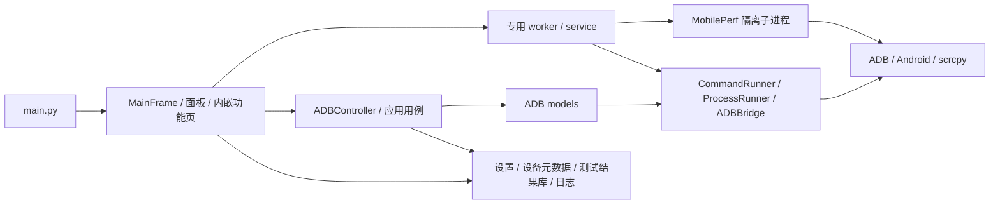
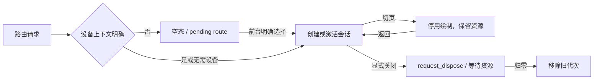

# 架构说明

本页维护分层、对象归属、线程和资源生命周期。功能入口与代表性测试见
[MODULE_MAP](MODULE_MAP.md)，设备选择和业务行为见 [BUSINESS_FLOW](BUSINESS_FLOW.md)，
持久化见 [DATA_FLOW](DATA_FLOW.md)。界面的具体尺寸、颜色和排版以组件实现及对应 Qt 测试为准。

## 总体架构

ADBLab 通过 Qt Signal/Slot 连接桌面界面与异步设备操作。普通面板走 Controller/model；
应用管理、文件、Logcat、性能和 Remote 等复杂功能也直接使用专用 worker/service，并非严格 MVC。

## 启动与组合根

- `main.py::_dispatch_cli()` 分派打包自检和 MobilePerf worker；普通启动进入 `_run_gui()`。
  GUI 在创建 QApplication 前加载设置、应用缩放并缓冲诊断；创建应用后安装翻译器，再导入页面、
  初始化 LogService、转交诊断和加载主题。翻译器保持到事件循环结束。
- `MainFrame` 组合 SidePanel、ADBController、QtTaskSupervisor、RunLibraryController 和页面树。
  六个物理页面为 Home、Devices/Apps/System 三个业务宿主、Tasks、Settings；可见左栏功能通过
  `WorkspaceRoute` 映射到宿主，具体目录只在 [路由表](BUSINESS_FLOW.md#workspace-路由目录)维护。
- `SidePanel` 是隐藏的兼容协调器，持有设备状态和业务面板控制器；可见内容由业务宿主持有。
  原 DeviceManager 列表仍是批量复选的兼容状态源，顶部栏与设备概览提交到同一状态源。
  协调器和 Remote 控制器按 QObject 父子关系随窗口/视图释放，不能仅靠 Python 引用管理寿命。
- `DeviceContextBar` 在页面堆叠外显示操作目标及当前会话状态，不拥有会话或运行锁。
  `DeviceHubPage` 消费主窗口缓存快照，不自行发起设备查询。
- 纯消息使用 `gui/notifications.py` 的窗口内 InfoBar，非阻塞返回；兼容
  `FluentMessageBox.information/warning/critical` 返回 `None`。文本输入、短表单及系统文件选择器
  保留确认/取消语义。同步输入读取结果后再 `deleteLater()`，不承担长期任务。

## 功能会话与路由

`WorkspaceFeatureHost` 承载路由、设备上下文、空态和关闭屏障；`FeatureSessionRegistry` 按
`(feature, device_id, generation)` 懒创建和复用 QWidget 页面。

- 导航历史保存 section/feature/device 的稳定位置；一次性 `payload` 不进入返回历史。
  等待设备时保留完整 pending route，后台宿主不能提前消费；前台激活后才交给页面。
- 切页调用 `deactivate()`，返回调用 `activate()`；切页不等于停止后台任务。设备离线或取消选择
  时保留缓存，新的设备操作由页面准入边界拒绝，停止仍绑定原任务。自动候选和准入条件见
  [设备目标规则](BUSINESS_FLOW.md#workspace-路由目录)。
- 显式关闭调用 `request_dispose()`；worker 与 supervisor owner 未归零前保留关闭屏障，旧代次
  不得重激活。宿主拥有延迟尺寸刷新 QTimer，页面销毁后不能再收到尺寸回调。
- App Manager、File Explorer、Live Logcat、Performance、Screenshot 为内嵌功能页，公开入口在
  `gui/features/`；部分实现仍在 `gui/dialogs/`，文件名不代表 QDialog 契约。
  Remote 复用 RemotePanel，不进入 registry；About 随 Settings 创建和销毁。
- AppPanel 持有共用包名及媒体工具，列表会话关闭不释放这些控件；截图页释放前将媒体工具归还
  AppPanel，重建时再挂载。宿主承接深层功能的滚动范围，隐藏会话不参与当前尺寸计算。

代码入口：`gui/pages/workspace_features.py`、`gui/features/base.py`、`gui/main_frame.py`。
验证入口：`test_workspace_feature_host.py`、`test_workspace_route_payload.py`、
`test_workspace_device_recovery.py`、`test_session_device_admission.py`（均在 `tests/`）。

## 协调与执行边界

- `controllers.ADBController` 组合设备、输入、媒体、应用、文件、系统 mixin 与 `_ADBControllerBase`。
  基类按 MRO 合并 `_handlers`，根据 `command_finished(method, result)` 分派结果处理器。
- `models/adb_model.py::async_command` 将普通命令放入全局 QThreadPool，长任务放入每模型
  `long_pool`。operation 关键字参数转成 `OperationMetadata`，不传入底层方法；owner/generation
  用来拒绝错代或晚到结果。关闭时先封闭新任务准入，尚未执行的方法体返回取消结果。
- `CommandRunner` 返回统一 `CommandResult`；超时转换成失败结果，不向调用者抛出
  `subprocess.TimeoutExpired`。`ProcessRunner` 管长进程、同键替换、停止和全局兜底；只有确认
  退出才移除 tracking，停止失败或并发启动冲突产生的残留仍需登记。
- `ADBBridge` 为每台设备维护持久输入 shell；成功写入不代表设备执行已确认。
  外部命令与参数校验边界见 [DEPENDENCY_MAP](DEPENDENCY_MAP.md#外部边界与命令接口)。
- OperationManager 管业务身份、进度、终态与取消意图，不拥有线程/进程；TaskSupervisor 管资源
  停止、等待及 residual，不判断业务成功。任务中心的取消覆盖见
  [任务中心](BUSINESS_FLOW.md#9-任务中心)。

## 运行时并发模型

| 执行单元 | 用途与收口 |
| --- | --- |
| Qt 主线程 | 控件、信号槽和渲染；后台结果经 Qt 信号回主线程 |
| 全局池与每模型 long_pool | 异步 ADB 命令；关闭栅栏拒绝新任务，已开始命令仍依赖各执行边界的超时/停止能力 |
| `_ScanThread` | ProcessRunner 轮询设备；单次调用超时 15 秒，100ms 检查停止；MainFrame 显式停止和等待 |
| 功能页 QThread/worker | 应用、文件、Logcat、包查询；由页面与 TaskSupervisor 管理释放屏障 |
| 应用自有 cleanup QThreadPool | 执行资源停止和等待，与普通命令全局池分离 |
| Controller ThreadPoolExecutor | 设备信息等后台查询；Controller.shutdown() 收口 |
| Remote executor / warmup / readers | 停止输入准入，再等待执行器及预热生产者，最后关闭持久输入会话和相关进程资源 |
| RunLibraryController 串行线程 | 文件读写及附件探测，空闲退出；关闭时排空最后提交记录 |
| MobilePerf 子进程与内部线程 | 每次运行独立配置与 RuntimeData 上下文；stop 文件、报告等待及必要时强停，双管道排空后通知完成 |

## 应用关闭

`gui/close_controller.py::CloseController` 实现两阶段关闭：

1. 拒绝新任务、停止界面定时器和晚到回调；向扫描、业务面板、会话及 Controller 广播停止。
2. TaskSupervisor 在共享 deadline 内后台等待，保留超时或失败资源快照；GUI 不串行阻塞等待。
3. 生产者停止后在 GUI 线程补交 Monkey/性能终态，后台 finalizer 排空结果库并保存应用设置。
   某页归档失败仍继续其他收尾，失败不能报告为成功。
4. 汇总收尾结果并完成关闭；超时返回不表示资源全部退出。

验证入口：`tests/test_phase2_mainframe_shutdown_gate.py`、`tests/test_window_lifecycle.py`、
`tests/test_model_shutdown_admission.py`、`tests/test_run_library_integration.py`。

## 主题、字体与日志

- `TypographyManager` 是字体状态源，使用 `UI/UI_SMALL/MONO/LOG/TITLE` 角色，界面字体与日志
  字体各有变更信号，不借用主题信号。响应式布局复用原控件，按字体和可用空间重排。
- `BaseStyles` 协调主题、强调色和应用色板；`gui/window_effects.py` 管 Windows 材质，
  `gui/window_layout.py` 与 ScreenAdapter 管窗口尺寸及屏幕变化。配置键见
  [设置字段](DATA_FLOW.md#设置字段)，显示效果由对应 Qt 测试和实机检查验证。
- `NavigationThemeToggle` 在侧栏设置入口上方投影当前明暗，复用 MainFrame 的主题动作与
  设置持久化；它不参与导航选中或历史。页面名称保留为可访问信息，不生成标题区。
  会话状态由 `WorkspaceFeatureHost` 提供，当前宿主的状态投影到顶部 `DeviceContextBar`。
- `LogService` 跨线程缓冲并批量发出用户日志；源码 DEBUG 单独进入 stderr，不进入 GUI，
  frozen 或无 stderr 时不输出该调试流。`shutdown()` 保留停止态单例并拒绝晚到日志。
- 任务中心复用唯一 LogPanel，折叠和切页不丢内容。MobilePerf 父进程分别排空 stdout/stderr，
  按代次接收、脱敏并隔离 DEBUG；这不等于整个项目的日志已完成脱敏。

架构决策缘由保留在 [ADR 目录](../README.md)，尚未闭环事项见
[RISKS_AND_DEBT](RISKS_AND_DEBT.md)。
