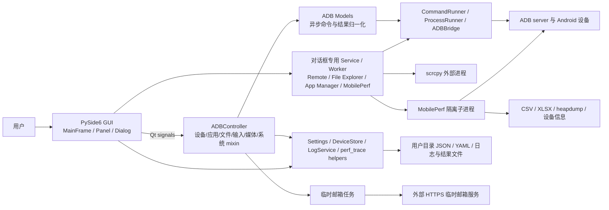
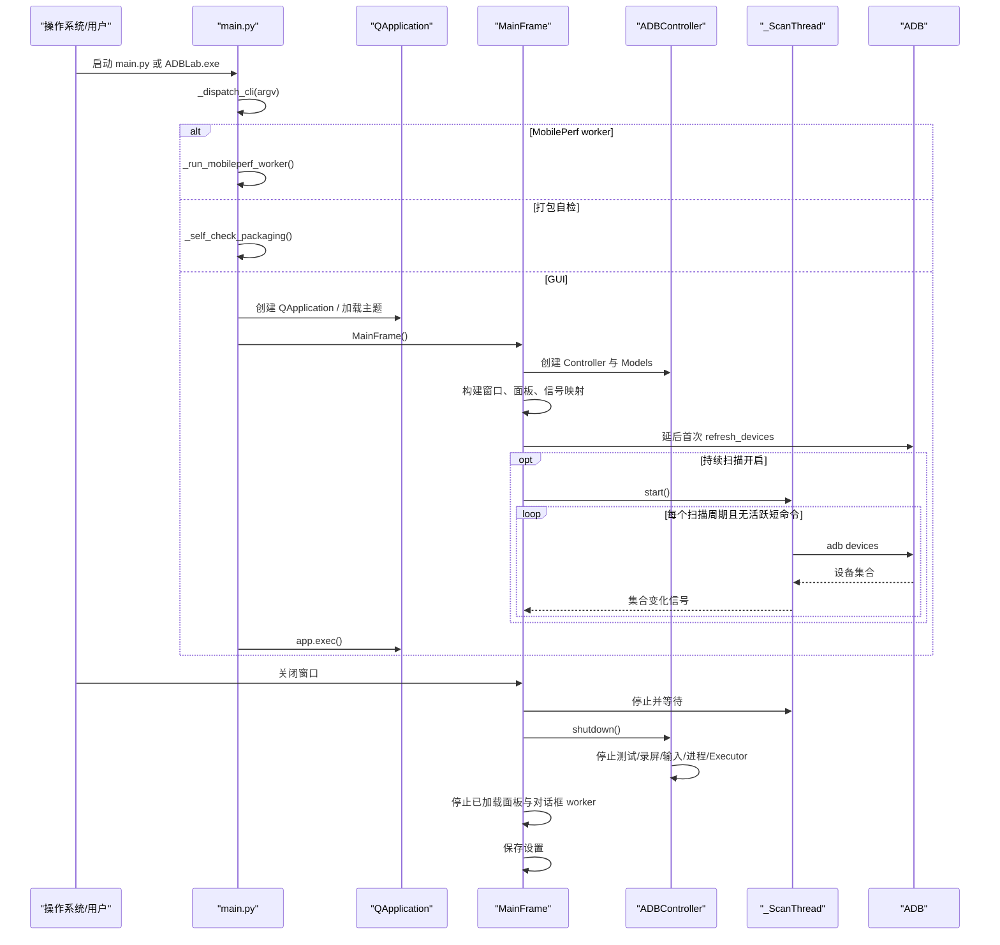

# 架构说明

## 总体架构

ADBLab 是以 Qt Signal/Slot 为连接机制的桌面分层应用。主路径近似 MVC，但对话框中的复杂功能也会直接使用 service/worker，因此不是严格的单一 Controller 架构。

## 分层设计

### 1. 启动与应用壳

- `main.py::_dispatch_cli()` 先处理 CLI 子模式；无已知子模式时进入 `_run_gui()`。
- `_run_gui()` 设置 Windows AppUserModelID、创建 QApplication、初始化资源路径/主题、显示 `gui.main_frame.MainFrame`。
- MobilePerf worker 复用同一可执行入口，但不创建 GUI。

### 2. 视图与交互层

- `MainFrame` 是组合根：创建 `LogService`、`SidePanel`、`ADBController`，连接全部 GUI 信号并管理对话框。
- `SidePanel` 首次只创建默认页签，Apps/System/Remote 在选择后懒加载。
- `gui/panels/` 负责普通操作表单；`gui/dialogs/` 负责需要独立生命周期的复杂任务。
- 视图通常不直接阻塞执行命令，但 App Manager、File Explorer、Live Logcat、Performance Launcher 各自持有 QThread/worker 或 runner。

### 3. 协调层

- `controllers.ADBController` 由 `ADBDeviceMixin`、`ADBInputMixin`、`ADBMediaMixin`、`ADBAppMixin`、`ADBFileMixin`、`ADBSystemControllerMixin` 和 `_ADBControllerBase` 组合。
- `_ADBControllerBase` 根据 MRO 合并各 mixin 的 `_handlers` 注册表，按 model 返回的 method 名称分派到相应 `_process_*_result` 方法。
- Controller 聚合多设备批次状态、截图、录屏和保存路径，再将结果转换为 GUI 信号。

### 4. Model 与 Service 层

- `models/adb_model.py::async_command` 把方法放入全局 QThreadPool；结果通过 `command_finished(method, result)` 回到 Controller。
- `models/adb_device.py`、`adb_app.py`、`adb_advanced.py`、`adb_testing.py` 提供主要 ADB 能力；`adb_network.py` 和 `adb_system.py` 作为 mixin 复用。
- `models/remote/` 与 `models/file_explorer_service.py` 尽量保持无 Qt 或低 Qt 耦合，便于单测。
- `models/mobileperf/runner.py` 是主应用和移植内核之间的进程隔离适配层。

### 5. 基础设施与外部边界

- `CommandRunner`：短命令、超时、UTF-8 解码、活跃计数、慢命令摘要。
- `ProcessRunner`：长进程注册、替换、停止、进程树终止和全局兜底。
- `ADBBridge`：普通 shell 以及每设备一个持久 `adb shell` 输入会话。
- `AppSettings`、`DeviceStore`：本地 JSON/YAML 持久化与旧资源文件迁移。
- `LogService`：跨线程日志缓冲和 Qt 批量发信号。

## 初始化与关闭流程

## 运行时并发模型

| 执行单元 | 用途 | 生命周期管理 |
| --- | --- | --- |
| Qt 主线程 | UI、信号槽、定时器、日志呈现 | QApplication 事件循环 |
| 全局 QThreadPool/QRunnable | 普通 `*_async` ADB 命令、邮件任务 | model 信号 + Controller shutdown；不统一等待所有 QRunnable |
| `_ScanThread` | 设备列表轮询 | MainFrame 显式停止/等待 |
| 对话框 QThread | App Manager、File Explorer、Live Logcat、当前包名查询 | 对话框 closeEvent 中 abort/断开/延后等待 |
| Controller ThreadPoolExecutor | 并行设备信息等 Python 任务 | `_ADBControllerBase.shutdown()` |
| Remote ThreadPoolExecutor(1) | 串行发送 Remote 输入 | `RemotePanel.shutdown()` |
| 外部进程 | adb、scrcpy、logcat、Monkey、终端 | CommandRunner/ProcessRunner；部分例外见风险 |
| MobilePerf 子进程与内部线程 | 指标采集和报告 | stop 文件、最长等待、必要时强制终止；内核最终 `os._exit(0)` |

## 关键架构决策

1. **GUI 与设备命令解耦**：Qt 信号和异步 model 避免常规 ADB 调用阻塞 UI。证据：`gui/main_frame.py`、`models/adb_model.py::async_command`。
2. **短命令/长进程分流**：短命令返回统一 `CommandResult`，长进程可被全局停止。证据：`models/base/command_runner.py`、`process_runner.py`。
3. **复杂交互使用专用服务**：Remote、File Explorer 和 MobilePerf 把命令构建与生命周期从普通 panel 中拆出。
4. **MobilePerf 进程隔离**：移植内核使用全局状态、`os.chdir` 和 `os._exit`，通过独立子进程限制对 GUI 的影响。证据：`models/mobileperf/runner.py`、`mobileperf/android/startup.py`。
5. **运行时数据进入用户目录**：设置、设备列表、运行时工具缓存写入 `utils/user_data.py` 定义的位置，避免安装目录只读。
6. **Windows onedir 优先**：内置 adb/scrcpy 是长生命周期进程，CI 和 spec 的 Windows 产物采用 onedir，避免 onefile 临时目录锁定。
7. **视图懒加载和批量日志**：减少启动开销及高频 logcat/MobilePerf 对 UI 事件循环的压力。

## 已知架构限制

- Controller 仍持有较多业务状态，且多设备批次、截图和录屏状态不是独立 operation context，并发隔离不足。
- 命令执行边界没有完全统一：`core/adb_bridge.py` 和 `mobileperf/android/tools/androiddevice.py` 直接创建 Popen，后者还使用 `shell=True`。
- 对话框各自实现 worker 生命周期，虽然有 `gui/dialogs/lifecycle.py` 辅助，但缺少统一任务注册/取消协议。
- 本地配置没有 schema/version；只有白名单键迁移，设备 YAML 没有原子写。
- 没有真正的鉴权/权限分层；能连接设备的本地用户可执行 shell、文件删除、应用清除等高影响操作。
- 非 Windows 构建和真实 Android 版本矩阵缺少功能测试；CI 只在 Windows 运行完整 pytest。
- 临时邮箱功能把配置放在源码目录并依赖外部未文档化服务，与用户目录/打包策略不一致。
- README 仍描述已删除的旧性能子系统，架构文档存在漂移历史。
