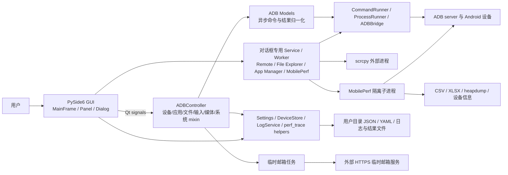
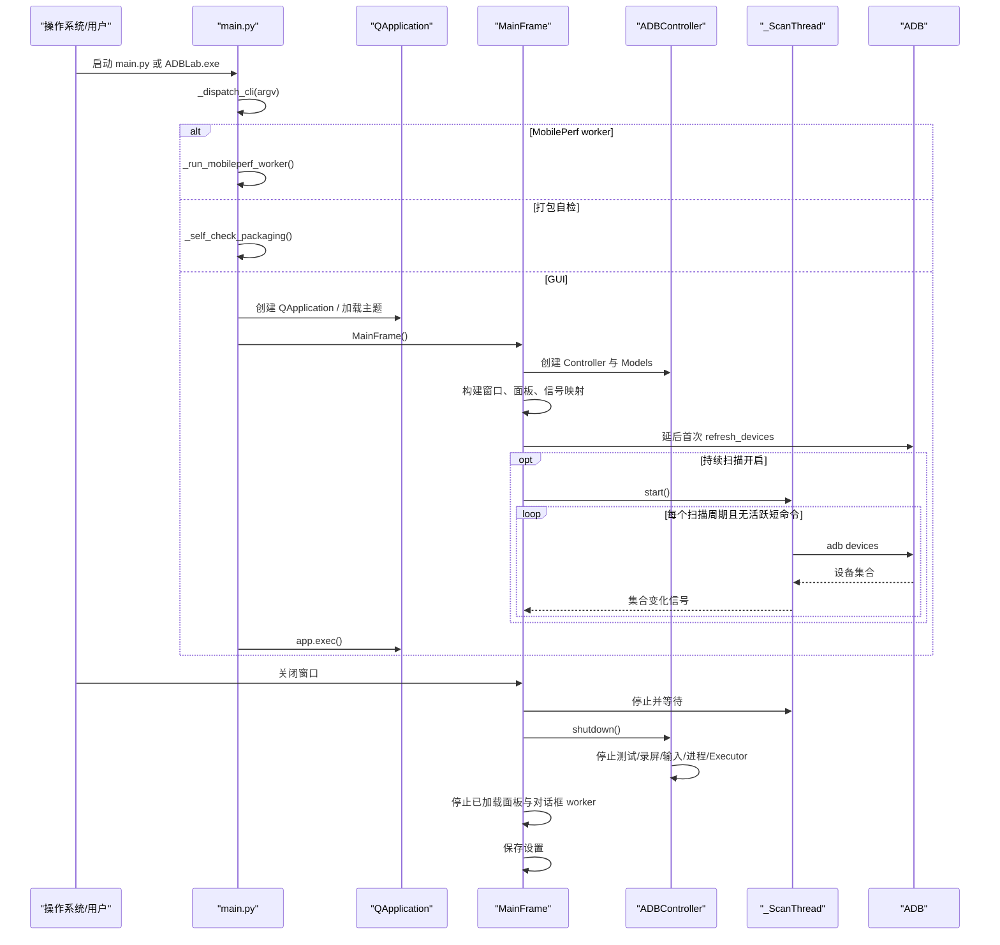

# 架构说明

## 总体架构

ADBLab 是以 Qt Signal/Slot 为连接机制的桌面分层应用。主路径近似 MVC，但对话框中的复杂功能也会直接使用 service/worker，因此不是严格的单一 Controller 架构。

## 分层设计

### 1. 启动与应用壳

- `main.py::_dispatch_cli()` 先处理 CLI 子模式；无已知子模式时进入 `_run_gui()`。
- `_run_gui()` 设置 Windows AppUserModelID、创建 QApplication、初始化资源路径/主题、显示 `gui.main_frame.MainFrame`。
- MobilePerf worker 复用同一可执行入口，但不创建 GUI。

### 2. 视图与交互层

- `MainFrame` 是组合根：创建 `LogService`、`SidePanel`、`ADBController` 和应用自有
  `QtTaskSupervisor`，连接全部 GUI 信号并管理对话框。
- `MainFrame` 是所有二级窗口的生命周期根：设备类对话框、Performance Launcher 和
  ScreenshotViewer 作为无 Qt parent/transient owner 的独立非模态顶层窗口运行，由
  MainFrame/Controller 的强引用、事件过滤器和显式关闭流程托管。About 与 Settings
  保持有意的模态交互。关闭任一非模态二级窗口不得触发 MainFrame 的关闭状态机。
- `SidePanel` 首次只创建默认页签，Apps/System/Remote 在选择后懒加载。
- `gui/panels/` 负责普通操作表单；`gui/dialogs/` 负责需要独立生命周期的复杂任务。
- 视图通常不直接阻塞执行命令，但 App Manager、File Explorer、Live Logcat、Performance Launcher 各自持有 QThread/worker 或 runner。

### 3. 协调层

- `controllers.ADBController` 由 `ADBDeviceMixin`、`ADBInputMixin`、`ADBMediaMixin`、`ADBAppMixin`、`ADBFileMixin`、`ADBSystemControllerMixin` 和 `_ADBControllerBase` 组合。
- `_ADBControllerBase` 根据 MRO 合并各 mixin 的 `_handlers` 注册表，按 model 返回的 method 名称分派到相应 `_process_*_result` 方法。
- Controller 聚合多设备批次、录屏和保存路径，再将结果转换为 GUI 信号；Screenshot 已作为
  vNext Gate A 迁入 OperationManager，不再使用 Controller 共享剩余计数/路径列表。

### 4. Model 与 Service 层

- `models/adb_model.py::async_command` 把方法放入全局 QThreadPool；结果通过 `command_finished(method, result)` 回到 Controller。
- `models/adb_device.py`、`adb_app.py`、`adb_advanced.py`、`adb_testing.py` 提供主要 ADB 能力；`adb_network.py` 和 `adb_system.py` 作为 mixin 复用。
- `models/remote/` 与 `models/file_explorer_service.py` 尽量保持无 Qt 或低 Qt 耦合，便于单测。
- `models/mobileperf/runner.py` 是主应用和移植内核之间的进程隔离适配层。

### 5. 基础设施与外部边界

- `CommandRunner`：短命令、超时、UTF-8 解码、活跃计数、慢命令摘要。
- `ProcessRunner`：长进程注册、替换、停止、带 deadline 的强停、进程树终止和全局兜底；
  未确认退出的进程继续保留 tracking。
- `ADBBridge`：普通 shell 以及每设备一个持久 `adb shell` 输入会话。
- `AppSettings`、`DeviceStore`：本地 JSON/YAML 持久化与旧资源文件迁移。
- `LogService`：跨线程缓冲用户日志并通过 Qt 批量发信号；开发 DEBUG 与用户界面严格分流。

### 日志通道

- 用户日志仅接收 `INFO/SUCCESS/WARNING/ERROR/CRITICAL`，由 `LogService` 缓冲后发送到
  `LogPanel`；`LogPanel` 在入口再次拒绝 DEBUG，避免旧信号绕过服务。
- DEBUG 只在源码、非 frozen 模式写入线程安全的 `stderr`，用于 IDE 或源码终端诊断；
  不进入 Qt 信号、界面缓存或文件日志。windowed 环境没有 `stderr` 时静默丢弃。
- 顶部工具栏和二级窗口生命周期使用 `ui.toolbar`、`ui.secondary_window` 结构化 DEBUG
  事件，字段只包含动作、阶段、窗口类型、布尔状态和数量，不记录设备标识、包名或真实路径。
- 可选文件日志只记录 INFO 及以上级别，写入 `user_data_root()/logs/app.log`；命名 logger
  仅管理自己的 handler，不修改 root logger。
- MobilePerf 子进程使用 stdout 传递 INFO 和功能 RAW 数据，源码 DEBUG 单独写 stderr；
  父进程按运行代次固化回调和脱敏值，分别排空两个流并在双管道收口后通知完成，DEBUG
  不进入性能窗口。动态设备、包、邮箱和本地路径在输出前脱敏。
- `LogService.shutdown()` 保持同一停止态单例并拒绝晚到日志，防止后台线程在错误的 Qt
  线程重新创建 QObject/QTimer。

## 初始化与关闭流程

## 运行时并发模型

| 执行单元 | 用途 | 生命周期管理 |
| --- | --- | --- |
| Qt 主线程 | UI、信号槽、定时器、日志呈现 | QApplication 事件循环 |
| 全局 QThreadPool/QRunnable | 普通 `*_async` ADB 命令、邮件任务 | model 信号 + Controller shutdown；不统一等待所有 QRunnable |
| `_ScanThread` | 设备列表轮询 | MainFrame 显式停止/等待 |
| 对话框 QThread | App Manager、File Explorer、Live Logcat、当前包名查询 | LiveLogcat 已由 TaskSupervisor 后台治理；其余仍由各 closeEvent abort/延后等待 |
| 应用自有 cleanup QThreadPool | LiveLogcat 资源停止、等待和强停 | MainFrame 创建 QtTaskSupervisor，dialog 注入；不使用 global pool |
| Controller ThreadPoolExecutor | 并行设备信息等 Python 任务 | `_ADBControllerBase.shutdown()` |
| Remote ThreadPoolExecutor(1) | 串行发送 Remote 输入 | `RemotePanel.shutdown()` |
| 外部进程 | adb、scrcpy、logcat、Monkey、终端 | CommandRunner/ProcessRunner；部分例外见风险 |
| MobilePerf 子进程与内部线程 | 指标采集和报告 | stop 文件、最长等待、必要时强制终止；内核最终 `os._exit(0)` |

## 关键架构决策

1. **GUI 与设备命令解耦**：Qt 信号和异步 model 避免常规 ADB 调用阻塞 UI。证据：`gui/main_frame.py`、`models/adb_model.py::async_command`。
2. **短命令/长进程分流**：短命令返回统一 `CommandResult`，长进程可被全局停止。证据：`models/base/command_runner.py`、`process_runner.py`。
3. **复杂交互使用专用服务**：Remote、File Explorer 和 MobilePerf 把命令构建与生命周期从普通 panel 中拆出。
4. **MobilePerf 进程隔离**：移植内核使用全局状态、`os.chdir` 和 `os._exit`，通过独立子进程限制对 GUI 的影响。证据：`models/mobileperf/runner.py`、`mobileperf/android/startup.py`。
5. **运行时数据进入用户目录**：设置、设备列表、运行时工具缓存写入 `utils/user_data.py` 定义的位置，避免安装目录只读。
6. **Windows onedir 优先**：内置 adb/scrcpy 是长生命周期进程，CI 和 spec 的 Windows 产物采用 onedir，避免 onefile 临时目录锁定。
7. **视图懒加载和批量日志**：减少启动开销及高频 logcat/MobilePerf 对 UI 事件循环的压力。
8. **vNext 采用增量迁移**：保留 `ADBController` 与现有 Qt signals 作为兼容门面，先增加
   OperationManager/TaskSupervisor 能力，再按 Screenshot、LiveLogcat、Install batch 三个门逐项迁移；
   不先移动目录，也不引入 asyncio/qasync 或全局重型 EventBus。决策和阶段定义见
   `docs/architecture/adr/0001-incremental-vnext.md` 与
   `docs/architecture/IMPLEMENTATION_PLAN.md`。

## vNext 目标边界

- **OperationManager** 管理业务操作身份、状态机、进度、取消意图和结果汇总，不拥有线程或进程。
- Phase 1 实现位于 `adblab/application/`：active registry 在终态原子移除，fan-out 使用明确 unit
  结果汇总，metadata envelope 保持 `Signal(str, object)` 兼容。详细决策见
  `docs/architecture/adr/0002-operation-contract.md`。
- **TaskSupervisor** 管理 QThread/QRunnable/Executor/外部进程的注册、停止和等待，不判断业务成功。
- LiveLogcat Gate B1 已接入 TaskSupervisor：停止广播在 GUI 线程外执行，超时资源保留
  residual snapshot，日志在 producer 侧做有界 batch，工作线程信号通过对话框 QObject 槽
  校验发送者，避免匿名回调越过接收者生命周期。运行中关闭日志窗口时先隐藏并断开数据界面信号，
  但保留 `finished` 屏障；`owner_stopped` 只表示停止流程返回，窗口还必须确认 worker 引用和
  owner residual 均已清零后才允许销毁。超时或失败时隐藏窗口和 QObject 继续存活；
  GUI 定时器继续复核线程先结束但外部进程晚退出的路径，避免丢失最后一次唤醒。
  `WA_QuitOnClose` 明确关闭，二级日志窗口不参与应用级最后窗口退出判定。
  Gate B2 的 MainFrame 整体异步关闭尚未实施，因此 Gate B 总体仍是 No-Go。
- GUI 只消费兼容 facade 或新端口，不直接依赖具体 worker；旧信号在迁移期保持名称、参数和线程语义。
- Phase 0 已先收紧安全与结果真实性：危险操作统一确认、批次汇总线程安全、Monkey 前台探测
  fail-closed、App Manager 失败传播、Remote 输入锁定活动会话、MobilePerf 仅接受本次运行产物、
  DeviceStore 原子写，以及邮件用户目录配置与日志脱敏。
- 三个架构门必须分别证明：Screenshot 的 operation 隔离、LiveLogcat 的资源托管、Install batch
  的批次部分失败语义；任一门失败时只回滚该门，不拆除兼容 facade。

## 已知架构限制

- Controller 仍持有较多业务状态；Screenshot 已完成 operation 隔离，但安装批次、录屏和其他
  `_pending_ops` 路径仍存在并发隔离不足。
- 命令执行边界没有完全统一：`core/adb_bridge.py` 和 `mobileperf/android/tools/androiddevice.py` 直接创建 Popen，后者还使用 `shell=True`。
- 除 LiveLogcat 外，对话框仍各自实现 worker 生命周期；统一任务注册/取消协议尚未扩展到
  App Manager、File Explorer、Remote 和 MobilePerf。
- 本地配置没有 schema/version；只有白名单键迁移。DeviceStore 已改为锁内快照和原子替换，
  但设置存储仍没有统一 schema/version。
- 没有真正的鉴权/权限分层；已知危险入口现在受 `confirm_dangerous_ops` 和统一策略保护，
  但本地用户仍可在确认后执行 shell、文件删除、应用清除等高影响操作。
- 非 Windows 构建和真实 Android 版本矩阵缺少功能测试；CI 只在 Windows 运行完整 pytest。
- 临时邮箱运行时已只读取用户配置目录或显式环境注入；外部服务授权、稳定性和数据处理条款仍待确认，
  仓库中历史跟踪配置仍需所有者轮换并清理历史。
- README 仍描述已删除的旧性能子系统，架构文档存在漂移历史。
