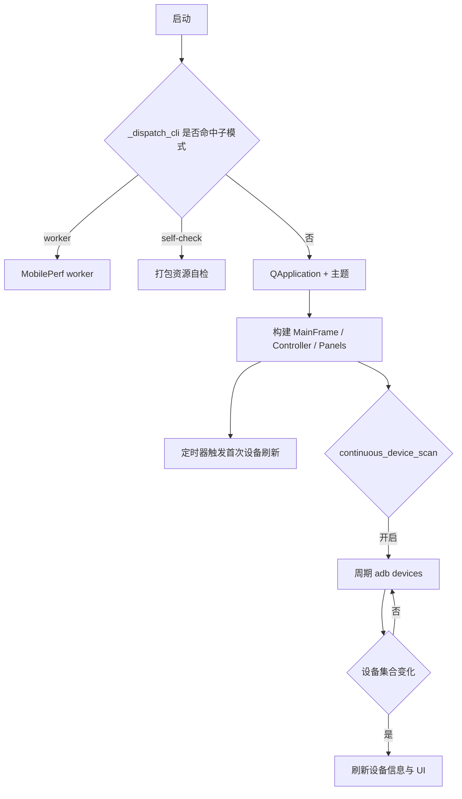
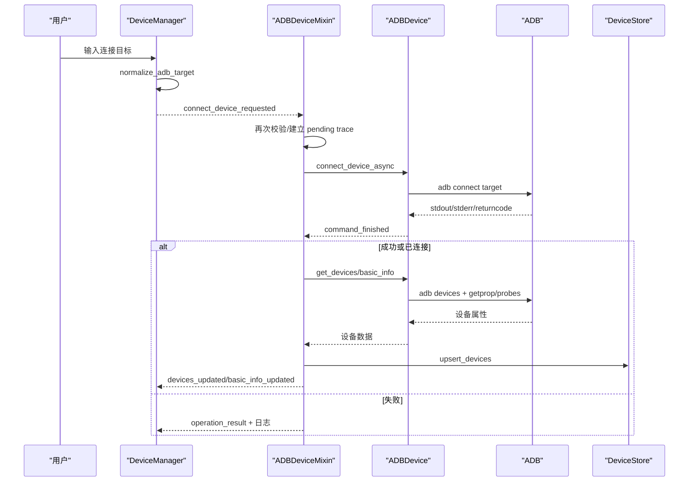
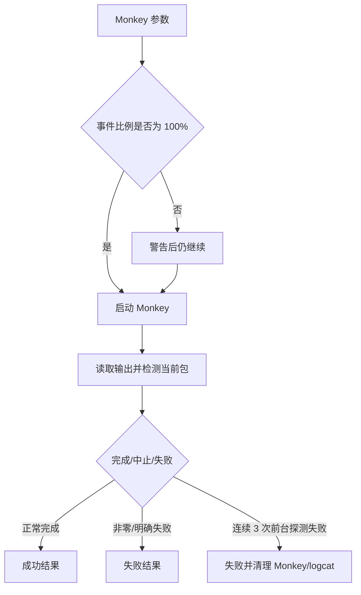
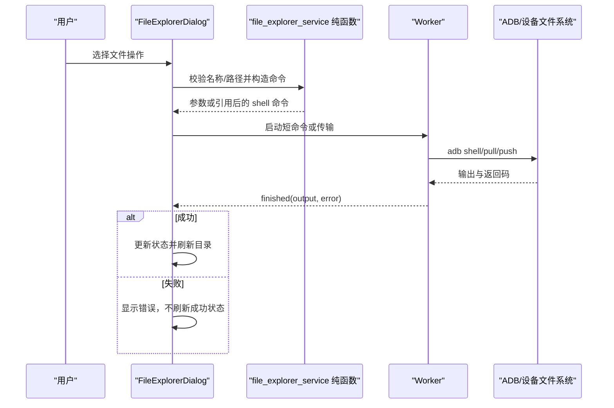
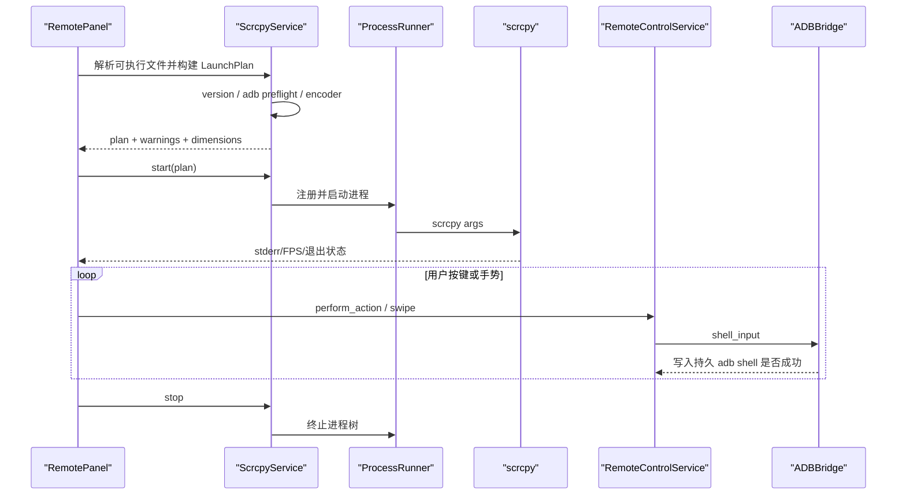

# 主要业务流程

## 1. 应用启动与设备发现

| 项目 | 内容 |
| --- | --- |
| 触发条件 | 用户运行 `main.py`/ADBLab 可执行文件且未指定 worker/self-check 子命令 |
| 前置条件 | Python 依赖可导入；资源可定位；ADB 可从内置目录或 PATH 解析 |
| 主流程 | 创建 QApplication → 读取设置和主题 → 创建 MainFrame/Controller/Models → 构建界面和信号 → 延后首次刷新 → 可选启动持续扫描 |
| 异常流程 | 资源或 Qt 导入失败会在启动阶段退出；ADB 不可用时设备刷新返回失败并写日志；关闭时取消尚未触发的刷新和扫描 |
| 涉及模块 | `main.py`、`gui/main_frame.py`、`core/settings_manager.py`、`controllers/`、`models/adb_device.py` |
| 涉及数据 | AppSettings、设备列表、窗口尺寸/分栏、日志 |
| 代码位置 | `main.py::_run_gui`、`MainFrame.__init__/_start_device_discovery/closeEvent`、`_ScanThread.run` |

## 2. 连接设备并读取信息

| 项目 | 内容 |
| --- | --- |
| 触发条件 | 用户输入 `ip:port`/`[IPv6]:port` 并点击连接，或请求刷新 |
| 前置条件 | 目标通过 `normalize_adb_target()`；ADB server 可用；设备允许调试 |
| 主流程 | UI 校验 → Controller 调用 `connect_device_async` → `adb connect` → 解析返回 → 刷新设备列表 → 并行/批量读取 getprop 和探测信息 → DeviceStore upsert → 更新 UI |
| 异常流程 | 地址不完整在 UI/Controller 拒绝；ADB 超时/返回非零形成失败结果；已连接文本仍会触发刷新；离线/未授权设备信息不完整 |
| 涉及模块 | `gui/panels/device_manager.py`、`controllers/_device.py`、`models/adb_device.py`、`models/device_store.py` |
| 涉及数据 | 设备标识、型号、Android 版本、分辨率、电池/网络等展示信息 |
| 代码位置 | `DeviceManager` 连接槽、`ADBDeviceMixin.connect_device/_process_connect_device_result/publish_detected_devices`、`ADBDevice` |

## 3. 应用管理与批量操作

| 项目 | 内容 |
| --- | --- |
| 触发条件 | 用户在 Apps 面板或 App Manager 选择安装、卸载、启停、清数据、权限、备份/恢复等操作 |
| 前置条件 | 已选择设备；包名/APK/备份文件存在且相关系统工具可用 |
| 主流程 | 已知危险动作先经统一策略和 `confirm_dangerous_ops` 确认；简单操作再走 SidePanel signal → ADBController → ADBApp/Advanced/System model；复杂列表/详情/备份走 AppManagerWorker QThread → ADB → signal 更新对话框 |
| 异常流程 | 用户拒绝确认时不调用 Controller/worker；Model 和 AppManagerWorker 都传播命令失败，备份使用 staging 后原子替换，恢复 install 失败不会报告成功；aapt 缺失导致 APK 解析失败 |
| 涉及模块 | `gui/panels/app_panel.py`、`gui/dialogs/app_manager.py`、`controllers/_app.py`、`models/adb_app.py`、`models/app_manager_worker.py` |
| 涉及数据 | 包名、APK 路径、权限、应用详情、预设 JSON、备份 ZIP |
| 代码位置 | `ADBAppMixin`、`ADBApp`、`AppManagerWorker.run` 及 `_backup_app/_restore_apps/_modify_permission` 路径 |

批量操作使用 `BatchOperationTracker` 聚合完成数；当前 tracker 按操作名存储，重叠同类批次会覆盖状态。App Panel 的“Disable for User”按钮实际发出与普通 Disable 相同的信号，最终调用 `pm disable`，没有实现名称所暗示的 `disable-user`。

## 4. Monkey 稳定性测试

| 项目 | 内容 |
| --- | --- |
| 触发条件 | 用户配置包名、事件比例、事件数/throttle/flags 后启动 Monkey |
| 前置条件 | 设备在线、目标包已安装、事件参数可被 Android Monkey 接受 |
| 主流程 | AppPanel → Controller → `ADBTesting.run_monkey_test_async` → 检测当前包 → 启动并跟踪 Monkey 进程 → 同步 logcat/恢复目标包 → 输出日志和结果 |
| 异常流程 | 非零退出返回失败；用户中止会停止进程；前台探测超时、失败或空结果均按失败处理，连续 3 次失败后终止任务并进入清理，不再把未知状态当作前台正常 |
| 涉及模块 | `gui/panels/app_panel.py`、`controllers/_app.py`、`models/adb_testing.py`、`models/base/focus_detector.py` |
| 涉及数据 | Monkey 参数、随机种子、当前包名、logcat 和执行日志 |
| 代码位置 | `ADBTesting.run_monkey_test_async`、`detect_current_package`、Controller Monkey handlers |

## 5. 截图、录屏与诊断

| 项目 | 内容 |
| --- | --- |
| 触发条件 | 用户选择一个或多个设备执行截图、录屏、bugreport、ANR、日志导出 |
| 前置条件 | 设备在线；保存目录可写；录屏/bugreport 相关设备命令可用；可选 Java 已安装 |
| 主流程 | Screenshot 为一次请求创建 parent operation 和每设备 task metadata → model 执行 exec-out/pull → Controller 校验目标、预期路径与 PNG artifact → fan-out 汇总 → 逐项发 `screenshot_captured` 且每批最多打开一次 viewer；录屏/诊断继续走原 Controller/model 路径 |
| 异常流程 | 截图 exec-out 非 PNG 时回退设备临时文件；缺失/无效/路径不符 artifact 视为失败；部分失败终态为 PARTIAL 且兼容 success=False；重复/晚到 callback 丢弃；bugreport ZIP 路径逃逸被拒绝；视频 pull 成功但远端清理失败时当前实现会整体报告失败 |
| 涉及模块 | `controllers/_media.py`、`controllers/_app.py`、`models/adb_advanced.py`、`models/adb_testing.py`、`utils/archive.py`、`gui/dialogs/screenshot_viewer.py` |
| 涉及数据 | PNG、MP4、ZIP、txt、ANR、bugreport 转换目录 |
| 代码位置 | `take_screenshot_async`、`start/stop_screen_record_async`、`capture_bugreport_async`、`safe_extract_zip` |

Screenshot Gate A 已删除 Controller 共享路径/剩余计数，重叠批次按 operation/task id 隔离；
录屏和其他 Controller 批次仍需后续迁移。

## 6. 设备文件浏览与传输

| 项目 | 内容 |
| --- | --- |
| 触发条件 | 用户打开 File Explorer，浏览目录或执行 pull/push/edit/copy/move/delete/chmod/install/execute |
| 前置条件 | 已选择设备；路径和文件名可被服务层接受；本地目标目录可写 |
| 主流程 | Dialog 构造规范化设备路径 → `models.file_explorer_service` 模块级纯函数安全引用/构造命令 → 短操作由 `ADBWorker`/CommandRunner 执行，传输由 `TransferWorker`/ProcessRunner 执行 → 成功后刷新列表 |
| 异常流程 | 非法文件名拒绝；失败结果显示错误且不刷新；删除前确认；关闭对话框时中止 worker；root 包装或设备权限不足会失败 |
| 涉及模块 | `gui/dialogs/file_explorer.py`、`models/file_explorer_service.py`、`models/file_explorer_worker.py` |
| 涉及数据 | 目录项、文件内容、临时设备/本地文件、权限模式 |
| 代码位置 | `models/file_explorer_service.py` 的 `safe_name/shell_quote/parse_ls_output/*_command`、`FileExplorerDialog._navigate/_pull_file/_delete_selected/_paste_items/closeEvent` |

## 7. Remote 投屏与输入

| 项目 | 内容 |
| --- | --- |
| 触发条件 | 用户在 Remote 页选择设备和 scrcpy 参数并启动 |
| 前置条件 | scrcpy 可解析；ADB 设备可达；预检可获得必要信息或允许带警告继续 |
| 主流程 | RemotePanel 将启动选择绑定为 `_active_device` → 创建 launch worker → ScrcpyService 检查版本/设备/编码器并生成 LaunchPlan → ProcessRunner 启动 scrcpy → stderr/FPS reader 和 watchdog 更新状态 → 输入只向活动会话设备发送 |
| 异常流程 | 未运行活动会话时拒绝输入；多选启动只绑定首个选择并警告；预检或启动失败恢复按钮状态并清空活动设备；关闭页签停止 scrcpy、worker、executor 和 input session；非 Windows 找不到系统 scrcpy 则无法启动 |
| 涉及模块 | `gui/panels/remote_panel.py`、`models/remote/*`、`core/adb_bridge.py` |
| 涉及数据 | `ScrcpyConfig`、`PreflightResult`、`ScrcpyLaunchPlan`、设备尺寸缓存、FPS 文本 |
| 代码位置 | `ScrcpyService.build_launch_plan/start/stop`、`RemoteControlService.perform_action`、`RemotePanel.shutdown` |

## 8. MobilePerf 性能采集

| 项目 | 内容 |
| --- | --- |
| 触发条件 | 用户选择设备/包名，配置采样与 Monkey 后在 Performance Launcher 启动 |
| 前置条件 | 设备在线、目标包已安装、保存目录可写、MobilePerf 模块可导入 |
| 主流程 | 表单生成 `MobilePerfRunConfig` → Runner 记录运行前结果/报告签名并创建运行代次上下文 → 写临时配置 → 根据开发/冻结状态启动 module 或 `--mobileperf-worker` → StartUp 验证设备/包并采集 → stdout/stderr reader 分别排空且共同收口后通知完成 → GUI 只定位本次新建或变化的非空报告；退出码 0 且有当前报告才显示 Completed/100 |
| 异常流程 | 启动异常立即恢复 UI；停止先写 stop 文件并等待报告，超时后强制终止；非零退出、缺少当前报告或只有旧报告均显示 Failed/Warning 且进度低于 100；内核仍可能最终 `os._exit` |
| 涉及模块 | `gui/dialogs/performance_launcher.py`、`models/mobileperf/runner.py`、`mobileperf/android/startup.py` 与各 monitor |
| 涉及数据 | 临时 config、指标 CSV、XLSX、设备信息、logcat、heapdump、外部设备日志 |
| 代码位置 | `PerformanceLauncherDialog.start_mobileperf/stop_mobileperf`、`MobilePerfRunner.start/stop`、`StartUp.run/stop` |

## 9. 临时邮箱与验证码

| 项目 | 内容 |
| --- | --- |
| 触发条件 | Controller 启动随机邮箱任务 |
| 前置条件 | 用户配置目录 `mail.yaml`（或显式环境注入）启用且包含签名材料；外部 API 可达 |
| 主流程 | QRunnable 创建 EmailService → 请求随机账号 → 仅在内存更新账号/指纹 → 轮询列表 → 获取详情 → 正则提取验证码 → Qt signal 返回 UI |
| 异常流程 | 缺配置/禁用时明确失败；所有 HTTP 请求使用 connect/read timeout；网络与解析错误只记录端点和异常类型，不记录账号、正文、验证码、请求/响应或签名 |
| 涉及模块 | `controllers/_base.py`、`core/mail/email_task.py`、`core/mail/email_service.py` |
| 涉及数据 | 请求材料、账号、邮件元数据/正文、验证码；全部按敏感数据处理 |
| 代码位置 | `_ADBControllerBase.start_email_task`、`GetRandomEmailTask.run`、`EmailService.fetch_and_process_email` |

## 10. 应用关闭

MainFrame 打开的设备对话框、Performance Launcher 以及 Controller 打开的 ScreenshotViewer
都以 MainFrame 为 parent。用户关闭任一二级窗口只清理该窗口资源，不进入 MainFrame
应用级关闭状态机。源码运行时会向开发控制台输出窗口创建、复用、关闭请求和关闭完成等
DEBUG 诊断；运行中 LiveLogcat 还会输出隐藏等待、资源停止和最终销毁阶段。

MainFrame 关闭时停止扫描、保存分栏和设置、关闭对话框、shutdown 已加载面板、停止 Controller 的
testing/advanced model、全局 tracked process 和 executor，并显式调用 `LogService.shutdown()`。
LiveLogcat 对话框已将 worker/process 注册到 MainFrame 注入的 TaskSupervisor：Stop 只广播
后台清理；运行中关闭窗口时先隐藏并断开数据界面信号，保留 `finished` 槽作为线程屏障。
`owner_stopped` 仅表示停止流程已返回，对话框还会复核工作对象与 owner residual；只有两者
全部清零才销毁窗口。graceful/forced/timeout 分离，超时资源继续保留 residual snapshot，
隐藏窗口也继续持有 QObject，避免仍运行的 QThread 被提前析构；LiveLogcat 显式关闭
`WA_QuitOnClose`，不会参与应用的最后窗口退出判定。若线程完成信号先于超时结果到达，
关闭复核定时器会继续观察晚退出的受跟踪进程，并在实际清零后完成销毁。
但 MainFrame 自身仍同步等待扫描、Remote 和 Controller 进程；Gate B2 的异步关闭状态机尚未完成，
因此应用整体关闭仍是 No-Go，不能由 LiveLogcat B1 推导全局资源归零。
