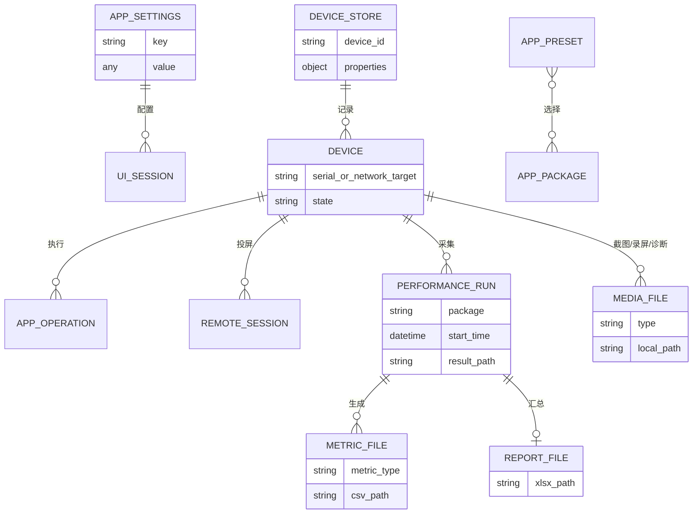

# 数据库与持久化地图

## 数据库结论

当前仓库没有数据库、ORM、迁移工具、SQL/schema 文件、连接池或事务层。没有发现 SQLite、PostgreSQL、MySQL、Redis、MongoDB、消息队列或缓存服务依赖。因此“表、索引、外键、数据库事务”均不适用。

应用使用 JSON、YAML 和普通文件持久化。下表是等价的数据存储地图。

## 文件型存储

| 存储 | 类型/位置 | 数据结构 | 主要读写入口 | 一致性机制 | 风险 |
| --- | --- | --- | --- | --- | --- |
| 应用设置 | JSON；用户配置目录 `app_settings.json` | `core.settings_manager.DEFAULTS` 白名单键，以及当前进程动态写入的其他键 | `AppSettings._load/_save_atomic/get/set/update/set_many/reset` | RLock 保护数据、计时器和快照；写锁串行保存并在锁后取最新快照；批量更新只安排一次 500ms 防抖保存；独立临时文件 + `os.replace` | 无 schema/version；跨进程没有文件锁；不在 DEFAULTS 的动态键虽可写盘，但重启加载时会被忽略；`get()` 不复制嵌套可变值 |
| 旧应用设置 | `resources/app_settings.json` | 历史默认/用户值 | AppSettings 首次迁移 | 只在用户文件不存在时迁移 | 资源文件可能含本机路径，作为默认种子可移植性差 |
| 设备元数据 | YAML；用户配置目录 `connected_devices.yaml` | device id → 属性字典 | `DeviceStore.load/save/upsert_devices` | 同一 RLock 内读写；临时文件 + fsync + `os.replace`；损坏文件备份 | 设备标识属敏感元数据；无 schema/version |
| 旧设备元数据 | `resources/connected_devices.yaml` | 同上 | DeviceStore 首次迁移 | 无用户文件时复制/加载 | 仓库跟踪文件含历史设备标识，合规性待确认 |
| App Manager 预设 | 用户选择的 JSON | name/author/description/selected_packages | `AppManagerDialog._create_preset/_load_preset` | 直接 open/json dump | 无 schema、编码未显式指定、异常处理不足 |
| MobilePerf 临时配置 | 临时目录 `config.conf` | INI sections/values | `MobilePerfRunConfig.write_config`、`StartUp.parse_data_from_config` | 每次运行独立临时目录 | 子进程异常时依赖适配层清理；包含设备/包/路径 |
| MobilePerf 结果 | 用户结果目录 | CSV/XLSX/txt/log/heapdump | 各 monitor、`Report`、`StartUp.pull_*` | 各文件独立写入，无事务 | 可能包含设备和业务敏感数据；无保留/加密策略 |
| 截图/视频/诊断 | 用户保存目录 | PNG/MP4/ZIP/txt/目录 | ADBTesting/Advanced、Controller、Dialogs | 单文件/目录操作 | 无统一配额、保留或访问控制 |
| 运行时工具缓存 | 用户数据 `runtime/<version>` | adb/scrcpy bundle | `utils.runtime_tools.bundled_tool_path` | 版本化目录 + 完成标记/复制逻辑 | 完整性/签名只依赖打包来源；清理策略待确认 |

## 逻辑数据关系

这不是数据库 ER 图，而是当前文件型数据的逻辑关系：

## 设置字段

当前 `DEFAULTS` 的核心键包括：

| 分类 | 配置键 | 使用位置 |
| --- | --- | --- |
| 外观 | `theme`、`font_family`、`ui_font_size`、`log_font_size` | TypographyManager、BaseStyles、SettingsDialog、日志/对话框；空字体族表示系统默认，UI 字号限制 8–22，日志字号限制 7–16 |
| 窗口 | `window_width`、`window_height`、`panel_split_ratio`、兼容字段 `left_panel_width`/`right_panel_width`、`always_on_top` | MainFrame、SettingsDialog；默认 1120×640、最小 860×500，左栏比例限制 0.20–0.70 |
| 行为 | `continuous_device_scan`、`device_scan_interval_ms`、`confirm_dangerous_ops` | MainFrame/SettingsDialog；危险确认键由统一策略和 App Manager 入口读取 |
| 日志/性能 | `log_max_lines`、`performance_log_threshold_ms` | Log UI、`core.perf_trace` helpers/Controller |
| 文件 | `save_directory` | 截图、日志、备份、MobilePerf、文件浏览器 |
| Monkey | `monkey_params` | AppPanel/Controller |
| 分栏 | `device_log_split_ratio` | MainFrame 日志区/设备区分栏比例 |
| Remote | `scrcpy_preset`、`scrcpy_maxsize`、`scrcpy_fps`、`scrcpy_codec`、`scrcpy_buffer`、`scrcpy_bitrate`、`scrcpy_orientation` | RemotePanel；这些键由 `SCRCPY_SETTING_DEFAULTS` 白名单纳入 `DEFAULTS`，运行时可写且重启可载入 |

最后一项来自代码交叉检查：`core/settings_manager.py` 的 `SCRCPY_SETTING_DEFAULTS` 把 Remote 的
七个 `scrcpy_*` 键作为白名单并入 `DEFAULTS`，`_normalise_setting` 对它们做字符串归一化
（空值/非标量回退默认值、截断到 128 字符），因此旧版本已写入 JSON 的同名键无需迁移即可在
下次启动时恢复；`test_settings_persistence.py` 验证正式键在应用重建后的持久化与旧 JSON 兼容性。

字体和布局设置的写入粒度如下：

- Settings 修改字体族与 UI 字号时通过一次 `update()` 更新两个键，日志字号单独更新；随后
  `BaseStyles.reload_from_settings()` 读取同一份已校验快照并发送字体信号。
- MainFrame 保存普通窗口尺寸时一次批量写入 `window_width/window_height`；拖动分隔条时一次批量
  写入左右像素兼容字段和 `panel_split_ratio`。比例是后续恢复的主值，旧像素字段用于迁移回退。
  旧 JSON 缺少比例键时，`_load()` 会由两个旧像素字段推导比例并立即保存迁移结果。
- `AppSettings.reset()` 使用 `deepcopy(DEFAULTS)` 恢复嵌套默认值，取消等待中的防抖计时器并立即
  原子保存；不会与默认 `monkey_params` 共享嵌套可变对象。

## 事务、索引与并发

- 没有跨文件事务。
- AppSettings 的内存读取、单项/批量更新、重置、计时器引用和写盘快照均受同一 RLock 保护；
  `update()`/`set_many()` 将一组字段作为一次内存更新并只调度一个保存计时器。进程内保存回调
  由独立写锁串行，且在取得写锁后再生成快照，防止旧快照最后覆盖新值；单文件替换具有崩溃
  安全性。但 `get()` 返回的嵌套字典等可变值不是防御性副本，调用方原地修改不受后续锁保护；
  跨进程也没有文件锁，仍不能把它当成数据库事务或多进程一致性协议。
- DeviceStore 在同一 RLock 内读取/生成快照，使用临时文件、`fsync` 和 `os.replace`；
  损坏用户 YAML 会先备份再恢复为空存储。
- App Manager 预设 JSON 仍直接覆盖，没有原子替换。
- 文件型数据没有索引；规模目前小，性能不是主要风险，一致性和隐私更重要。

## 数据风险与建议

1. 邮件服务已整体移除（`core/mail/` 源码、邮件获取入口、信号与 requests/ruamel 依赖均删除），
   不再有任何邮件配置或外部 API 调用；仓库 Git 历史中曾跟踪的邮件配置仍需所有者轮换并审查历史。
2. 为设置/设备/预设增加 `schema_version` 和迁移函数；若未来出现多个写进程，再增加文件锁或
   单写者机制。
3. 明确允许持久化的动态设置键；`scrcpy_*` 已通过白名单修复，其余动态键仍需评估。
4. 为结果文件定义敏感级别、默认保留期、导出提示和清理策略。
