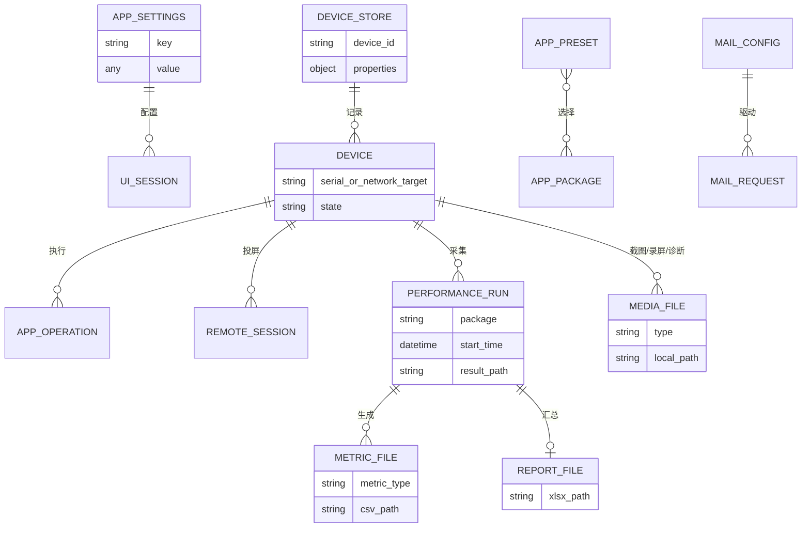

# 数据库与持久化地图

## 数据库结论

当前仓库没有数据库、ORM、迁移工具、SQL/schema 文件、连接池或事务层。没有发现 SQLite、PostgreSQL、MySQL、Redis、MongoDB、消息队列或缓存服务依赖。因此“表、索引、外键、数据库事务”均不适用。

应用使用 JSON、YAML 和普通文件持久化。下表是等价的数据存储地图。

## 文件型存储

| 存储 | 类型/位置 | 数据结构 | 主要读写入口 | 一致性机制 | 风险 |
| --- | --- | --- | --- | --- | --- |
| 应用设置 | JSON；用户配置目录 `app_settings.json` | `core.settings_manager.DEFAULTS` 白名单键 | `AppSettings._load/_save_atomic/get/set/reset` | 临时文件 + `os.replace`；500ms debounce | `_data` 与 Timer 无锁；无 schema/version；嵌套默认浅拷贝 |
| 旧应用设置 | `resources/app_settings.json` | 历史默认/用户值 | AppSettings 首次迁移 | 只在用户文件不存在时迁移 | 资源文件可能含本机路径，作为默认种子可移植性差 |
| 设备元数据 | YAML；用户配置目录 `connected_devices.yaml` | device id → 属性字典 | `DeviceStore.load/save/upsert_devices` | PyYAML safe_load/safe_dump；局部 Lock | 写盘非原子且不在 mutation lock 内；设备标识属敏感元数据 |
| 旧设备元数据 | `resources/connected_devices.yaml` | 同上 | DeviceStore 首次迁移 | 无用户文件时复制/加载 | 仓库跟踪文件含历史设备标识，合规性待确认 |
| 临时邮箱配置 | `core/mail/mail.yaml` | 请求材料、账号/状态类字段 | `email_service._load_yaml/_save_yaml` | ruamel.yaml 保留格式 | 位于源码目录、疑似敏感、非原子、打包未收集、可能不可写 |
| App Manager 预设 | 用户选择的 JSON | name/author/description/selected_packages | `AppManagerDialog._create_preset/_load_preset` | 直接 open/json dump | 无 schema、编码未显式指定、异常处理不足 |
| MobilePerf 临时配置 | 临时目录 `config.conf` | INI sections/values | `MobilePerfRunConfig.write_config`、`StartUp.parse_data_from_config` | 每次运行独立临时目录 | 子进程异常时依赖适配层清理；包含设备/包/路径 |
| MobilePerf 结果 | 用户结果目录 | CSV/XLSX/txt/log/heapdump | 各 monitor、`Report`、`StartUp.pull_*` | 各文件独立写入，无事务 | 可能包含设备和业务敏感数据；无保留/加密策略 |
| 截图/视频/诊断 | 用户保存目录 | PNG/MP4/ZIP/txt/目录 | ADBTesting/Advanced、Controller、Dialogs | 单文件/目录操作 | 无统一配额、保留或访问控制 |
| 运行时工具缓存 | 用户数据 `runtime/<version>` | adb/scrcpy bundle | `utils.runtime_tools.bundled_tool_path` | 版本化目录 + 完成标记/复制逻辑 | 完整性/签名只依赖打包来源；清理策略待确认 |

## 逻辑数据关系

这不是数据库 ER 图，而是当前文件型数据的逻辑关系：

## 设置字段

当前 `DEFAULTS` 的核心键包括：

| 分类 | 配置键 | 使用位置 |
| --- | --- | --- |
| 外观 | `theme`、`font_family`、`ui_font_size`、`log_font_size` | BaseStyles、SettingsDialog、日志/对话框 |
| 窗口 | `window_width`、`window_height`、`left_panel_width`、`right_panel_width`、`always_on_top` | MainFrame、SettingsDialog |
| 行为 | `continuous_device_scan`、`device_scan_interval_ms`、`confirm_dangerous_ops` | MainFrame/SettingsDialog；危险确认键当前未被操作层使用 |
| 日志/性能 | `log_max_lines`、`performance_log_threshold_ms` | Log UI、`core.perf_trace` helpers/Controller |
| 文件 | `save_directory` | 截图、日志、备份、MobilePerf、文件浏览器 |
| Monkey | `monkey_params` | AppPanel/Controller |
| Remote | 动态 `scrcpy_*`、`scrcpy_preset` | RemotePanel；不在 DEFAULTS 白名单中，运行时可写但重新加载时会被 `_load()` 忽略，这是潜在持久化缺陷，需实际确认 |

最后一项来自代码交叉检查：`RemotePanel` 调用 `AppSettings.set("scrcpy_...")`，但 `AppSettings._load()` 只载入 `DEFAULTS` 中的键；因此 Remote 设置会写入 JSON，却不会在下一次进程启动时载入。该问题应补单测后修复。

## 事务、索引与并发

- 没有跨文件事务。
- AppSettings 单文件替换具有崩溃安全性，但两个 Timer/线程并发保存时缺少锁。
- DeviceStore `upsert_devices()` 在锁内改字典，随后锁外调用 `save()`；并发调用可能交错，且进程崩溃可留下截断 YAML。
- 邮件 YAML 和预设 JSON 直接覆盖，没有原子替换。
- 文件型数据没有索引；规模目前小，性能不是主要风险，一致性和隐私更重要。

## 数据风险与建议

1. 将 mail 配置迁移到用户目录/安全凭据存储，停止跟踪敏感文件并对日志脱敏。
2. DeviceStore 使用锁内快照 + 临时文件 + `os.replace`。
3. 为设置/设备/预设增加 `schema_version` 和迁移函数。
4. 明确允许持久化的动态设置键，修复 `scrcpy_*` 重启丢失。
5. 为结果文件定义敏感级别、默认保留期、导出提示和清理策略。
