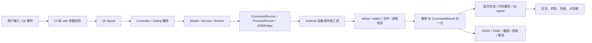
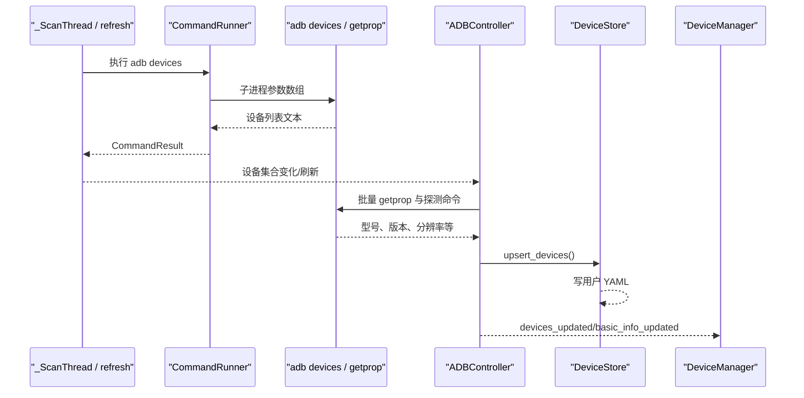
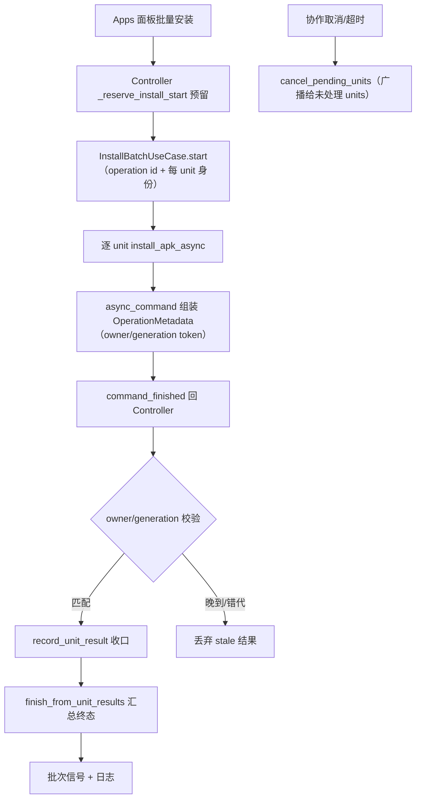
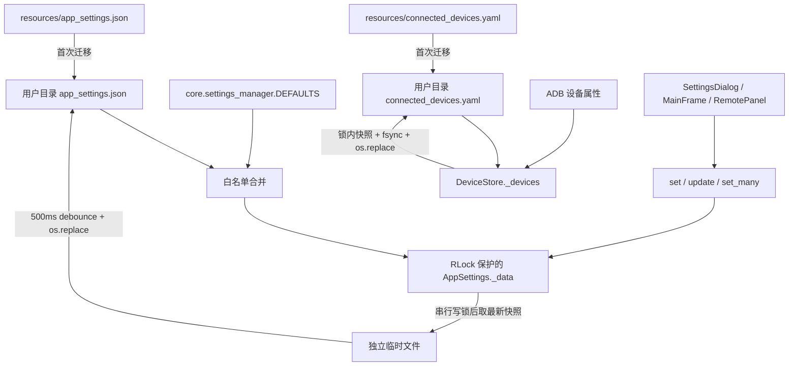
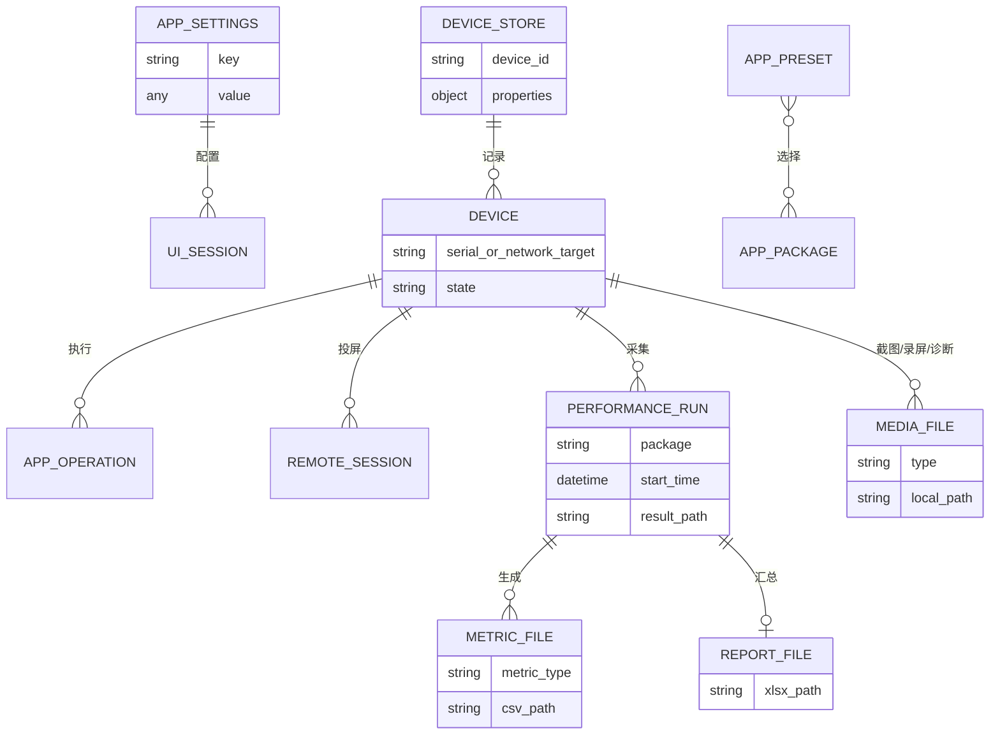
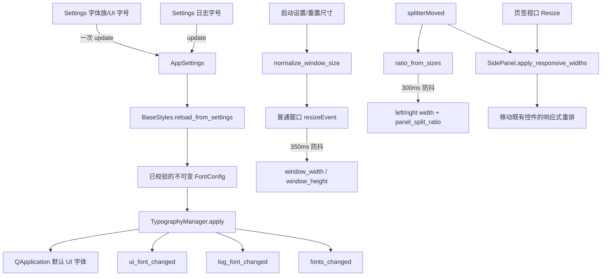
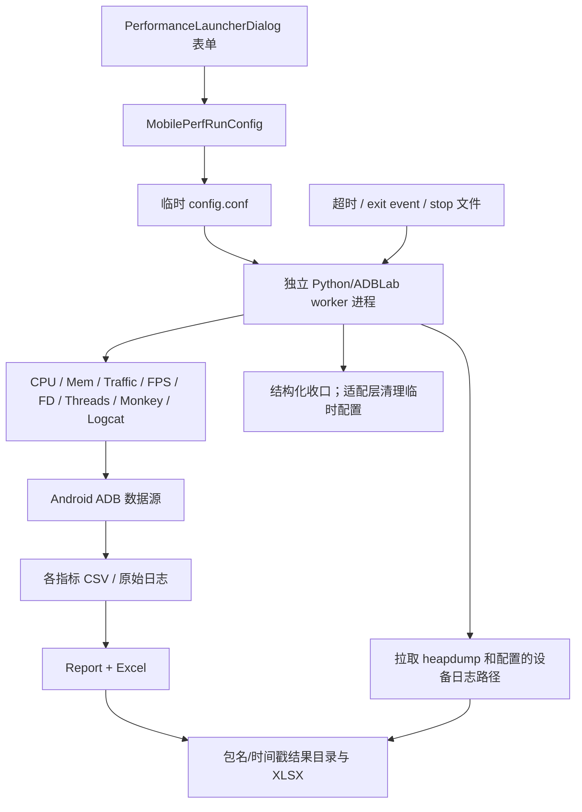

# 数据流

## 核心数据对象

| 数据对象 | 来源 | 转换/处理 | 存储/去向 | 生命周期 |
| --- | --- | --- | --- | --- |
| 设备标识与状态 | `adb devices`、用户输入的 IP:port | `utils.adb_targets` 校验；`ADBDevice` 解析 | DeviceStore、DeviceManager、Qt signals | 扫描周期内刷新；设备元数据跨会话保存 |
| `CommandResult` | subprocess 返回码/stdout/stderr/timeout | CommandRunner 规范化；model 转 dict；Controller handler 分派 | 日志、UI、批次状态 | 单次命令 |
| AppSettings | 默认值、旧 resources JSON、用户设置及运行时 UI 更新 | RLock 内白名单加载/字段校验/单项或批量更新；500ms 防抖；写锁串行保存并在锁后取最新快照；原子替换 | 用户配置 `app_settings.json` | 跨会话；批量更新只调度一次保存 |
| FontConfig | AppSettings 的 `font_family/ui_font_size/log_font_size`、Qt 系统字体数据库 | 字体族可用性解析、字号限制、角色映射 | TypographyManager、QApplication、字体变更信号 | 进程内不可变快照；设置变化时整体替换 |
| 主窗口布局状态 | AppSettings、屏幕可用范围、窗口/分隔条事件 | 尺寸限制、左右宽度与比例换算、350/300ms 防抖 | MainFrame、Settings 摘要、响应式 Panels、AppSettings | 普通窗口会话内实时变化；尺寸与比例跨会话 |
| DeviceStore 字典 | 旧 resources YAML、ADB 属性 | 锁内 upsert/快照、临时文件原子替换 | 用户配置 `connected_devices.yaml` | 跨会话 |
| GUI 操作状态 | 表单、选中设备、当前页签 | Controller/Dialog 编排 | 内存、Qt widgets/signals | 窗口/操作生命周期 |
| 包/权限/进程信息 | pm/dumpsys/ps 等 ADB 输出 | model/worker 文本解析 | 应用管理 UI、日志、预设 JSON | 查询结果通常只在内存；预设跨会话 |
| 截图/录屏 | 设备 screencap/screenrecord | pull、PNG 校验、文件命名 | 用户保存目录、ScreenshotViewer | 文件持续存在直到用户删除 |
| logcat/诊断 | adb logcat、bugreport、ANR | 过滤、批量渲染、安全 ZIP 解压、可选 JAR 转换 | UI 缓冲、txt/zip/目录 | UI 缓冲有上限；导出文件持久化 |
| Remote 状态 | UI scrcpy 参数、预检、设备尺寸 | 生成 launch plan、FPS 解析、坐标映射 | scrcpy 进程、状态标签、尺寸 TTL 缓存 | Remote 会话 |
| MobilePerf 配置 | Performance 对话框 | dataclass 校验/归一化、临时 config | 临时目录、worker 子进程环境 | 进程结束后清理临时配置 |
| MobilePerf 指标 | dumpsys/proc/SurfaceFlinger/流量等 | 多 monitor 采样、CSV、Report 汇总 | 结果目录 CSV/XLSX/设备信息/heapdump | 运行期间累积，结果持久化 |
| `OperationMetadata` | Controller/use case 提交时构造 | `async_command` 组装信封，owner/generation token 校验响应归属与代次 | `command_finished(method, result)` 回 Controller；批次终态经 `InstallBatchUseCase` 汇总 | 单次操作；晚到/错代结果被丢弃 |
| 安装批次状态 | Apps 面板批量安装请求 | `InstallBatchUseCase` 的 start/complete/fail/cancel/retry 状态机按 operation/unit 收口 | 内存 registry（`OperationManager`）、Qt signals、日志 | 批次生命周期；终态原子移除 |
| 运行时工具缓存 | PyInstaller bundle | 版本化复制 | 用户目录 `runtime/<version>` | 跨进程复用，可人工清理 |

## 总体数据流

## 设备发现与元数据流

设备标识可能是 USB serial 或网络地址，属于潜在敏感设备信息；知识库和日志审计不应复制实际值。

## 命令结果状态变化

典型 model 方法的状态为：

`已提交` → `QRunnable 执行` → `CommandResult` → `command_finished` → `Controller handler` → `成功/失败日志与 UI 信号`。

超时由 CommandRunner 转换为失败结果而不是重新抛出 `subprocess.TimeoutExpired`。依赖捕获该异常的上层逻辑不会生效；Monkey 恢复流程通过 `_wait_for_monkey_abort` 短轮询探测中止请求来配合该语义，而不是依赖异常传播。带 operation 的调用（`_operation_id`/owner/generation token）只进入 `OperationMetadata` 信封，Controller handler 先按 owner/generation 校验归属与代次，再决定接受、转发或丢弃结果。

## 安装批次状态流

## 设置与设备存储生命周期

AppSettings 以可重入锁保护读取、更新、计时器引用和写盘快照。`update()`/`set_many()` 将一组字段
合并为一次内存更新并只安排一个防抖保存；进程内保存回调再由独立写锁串行，并在取得写锁后
获取最新快照，避免旧写覆盖新值。跨进程仍没有文件锁，不能视为数据库事务。
DeviceStore 的读取、快照和写入位于同一可重入锁域，并使用临时文件、`fsync` 和 `os.replace`。

## 文件型存储与设置字段

### 数据库结论

当前仓库没有数据库、ORM、迁移工具、SQL/schema 文件、连接池或事务层；没有 SQLite、PostgreSQL、
MySQL、Redis、MongoDB、消息队列或缓存服务依赖，"表、索引、外键、数据库事务"均不适用。应用使用
JSON、YAML 和普通文件持久化，下表是等价的存储地图。

### 文件型存储

| 存储 | 类型/位置 | 数据结构 | 主要读写入口 | 一致性机制 | 风险 |
| --- | --- | --- | --- | --- | --- |
| 应用设置 | JSON；用户配置目录 `app_settings.json` | `core.settings_manager.DEFAULTS` 白名单键，以及当前进程动态写入的其他键 | `AppSettings._load/_save_atomic/get/set/update/set_many/reset` | RLock 保护数据、计时器和快照；写锁串行保存并在锁后取最新快照；批量更新只安排一次 500ms 防抖保存；独立临时文件 + `os.replace` | 无 schema/version；跨进程没有文件锁；不在 DEFAULTS 的动态键虽可写盘，但重启加载时会被忽略；`get()` 不复制嵌套可变值 |
| 旧应用设置 | `resources/app_settings.json` | 历史默认/用户值 | AppSettings 首次迁移 | 只在用户文件不存在时迁移 | 资源文件可能含本机路径，作为默认种子可移植性差 |
| 设备元数据 | YAML；用户配置目录 `connected_devices.yaml` | device id → 属性字典 | `DeviceStore.load/save/upsert_devices` | 同一 RLock 内读写；临时文件 + fsync + `os.replace`；损坏文件备份 | 设备标识属敏感元数据；无 schema/version |
| 旧设备元数据 | `resources/connected_devices.yaml` | 同上 | DeviceStore 首次迁移 | 无用户文件时复制/加载 | 仓库跟踪文件含历史设备标识，合规性待确认 |
| App Manager 预设 | 用户选择的 JSON | name/author/description/selected_packages | `AppManagerDialog._create_preset/_load_preset` | 直接 open/json dump | 无 schema、编码未显式指定、异常处理不足 |
| MobilePerf 临时配置 | 临时目录 `config.conf` | INI sections/values | `MobilePerfRunConfig.write_config`、`StartUp.parse_data_from_config` | 每次运行独立临时目录 | 子进程异常时依赖适配层清理；包含设备/包/路径 |
| MobilePerf 结果 | 用户结果目录 | CSV/XLSX/txt/log/heapdump | 各 monitor、`Report`、`StartUp.pull_*` | 各文件独立写入，无事务 | 可能包含设备和业务敏感数据；无保留/加密策略 |
| 截图/视频/诊断 | 用户保存目录 | PNG/MP4/ZIP/txt/目录 | ADBTesting/Advanced、Controller、Dialogs | 单文件/目录操作 | 无统一配额、保留或访问控制 |
| 运行时工具缓存 | 用户数据 `runtime/<version>` | adb/scrcpy bundle | `utils.runtime_tools.bundled_tool_path` | 版本化目录 + 完成标记/复制逻辑 | 完整性/签名只依赖打包来源；清理策略待确认 |

### 逻辑数据关系

这不是数据库 ER 图，而是当前文件型数据的逻辑关系：

### 设置字段

当前 `DEFAULTS` 的核心键包括：

| 分类 | 配置键 | 使用位置 |
| --- | --- | --- |
| 外观 | `theme`、`font_family`、`ui_font_size`、`log_font_size` | TypographyManager、BaseStyles、SettingsDialog、日志/对话框；空字体族表示系统默认，UI 字号限制 8–22，日志字号限制 7–16 |
| 窗口 | `window_width`、`window_height`、`panel_split_ratio`、兼容字段 `left_panel_width`/`right_panel_width`、`always_on_top` | MainFrame、SettingsDialog；默认 1120×640、最小 860×500，左栏比例限制 0.20–0.70 |
| 行为 | `continuous_device_scan`、`device_scan_interval_ms`、`confirm_dangerous_ops` | MainFrame/SettingsDialog；危险确认键由统一策略和 App Manager 入口读取 |
| 日志/性能 | `log_max_lines`、`performance_log_threshold_ms` | Log UI、`core.perf_trace` helpers/Controller |
| 文件 | `save_directory` | 截图、日志、备份、MobilePerf、文件浏览器 |
| Monkey | `monkey_params` | AppPanel/Controller |
| 分栏 | `device_log_split_ratio` | MainFrame 日志区/设备区分栏比例 |
| Remote | `scrcpy_preset`、`scrcpy_maxsize`、`scrcpy_fps`、`scrcpy_codec`、`scrcpy_buffer`、`scrcpy_bitrate`、`scrcpy_orientation` | RemotePanel；这些键由 `SCRCPY_SETTING_DEFAULTS` 白名单纳入 `DEFAULTS`，运行时可写且重启可载入 |

Remote 行来自代码交叉检查：`core/settings_manager.py` 的 `SCRCPY_SETTING_DEFAULTS` 把 Remote 的
七个 `scrcpy_*` 键作为白名单并入 `DEFAULTS`，`_normalise_setting` 对它们做字符串归一化（空值/
非标量回退默认值、截断到 128 字符），因此旧版本已写入 JSON 的同名键无需迁移即可在下次启动时
恢复；`test_settings_persistence.py` 验证正式键在应用重建后的持久化与旧 JSON 兼容性。

写入粒度补充：

- Settings 修改字体族与 UI 字号时通过一次 `update()` 更新两个键，日志字号单独更新；随后
  `BaseStyles.reload_from_settings()` 读取同一份已校验快照并发送字体信号。
- MainFrame 拖动分隔条时一次批量写入左右像素兼容字段和 `panel_split_ratio`；比例是后续恢复的
  主值，旧像素字段仅用于旧配置迁移回退。
- `AppSettings.reset()` 使用 `deepcopy(DEFAULTS)` 恢复嵌套默认值，取消等待中的防抖计时器并立即
  原子保存；不会与默认 `monkey_params` 共享嵌套可变对象。

### 事务、索引与并发

- 没有跨文件事务。
- AppSettings 与 DeviceStore 的锁、快照和原子替换细节见上文"设置与设备存储生命周期"，此处不重复。
- App Manager 预设 JSON 仍直接覆盖，没有原子替换。
- 文件型数据没有索引；当前规模小，性能不是主要风险，一致性和隐私更重要。

### 数据风险与建议

存储相关的风险条目与治理建议集中在 [RISKS_AND_DEBT.md](RISKS_AND_DEBT.md)（配置
schema/version、动态设置键白名单、结果文件保留期与敏感数据等），本页不复制风险清单。

## 字体与窗口布局状态流

- `font_family` 的空字符串表示跟随 Qt 系统界面字体；指定字体未安装时也回退到系统字体。
  `FontConfig` 将 UI、UI_SMALL、MONO、LOG、TITLE 五类角色投影为 QFont。只有 UI 配置变化发送
  `ui_font_changed`，只有日志/等宽配置变化发送 `log_font_changed`，任一变化再发送 `fonts_changed`；
  主题变化走独立 `theme_changed`。
- MainFrame 启动时将持久化尺寸限制到最小 860×500；屏幕可用范围不小于该最小值时再裁剪到
  可用范围内，最小尺寸优先。左栏比例限制到 0.20–0.70；若没有 `panel_split_ratio`，
  AppSettings 使用旧左右像素宽度推导并立即保存迁移结果。最大化、最小化和全屏尺寸不进入
  普通尺寸保存路径。
- Settings 通过 `window_layout_snapshot()` 读取当前普通尺寸和比例，通过
  `restore_default_window_size()`、`reset_panel_split()` 恢复默认值；Settings 不直接读写
  MainFrame 的 QSplitter。主面板响应式重排和 Settings 自身的字号感知单双列表单只改变布局位置，
  不复制控件、业务状态或信号连接。

## MobilePerf 数据生命周期

结果目录包含设备型号、系统版本、包版本、指标和可能的设备日志/heapdump，可能含个人或业务敏感信息；当前未见加密、自动保留期或访问控制。连续运行配置在 `StartUp` 读取时逐层剥离 Unicode/历史字节序标记（`_CONFIG_BOM_PREFIXES`），并保持输入文件只读。

## 数据保留与删除

- UI 日志内存默认最多保留 5,000 条服务记录；Log Panel/各对话框另有显示缓冲上限，缓冲溢出时
  会丢弃最旧行并累计丢弃计数（`LogService.dropped_count` / LogPanel `_pending_dropped_total`）。
- AppSettings 和 DeviceStore 没有 schema 版本或保留期。
- 截图、视频、bugreport、备份、MobilePerf 报告由用户选择目录，应用不会统一清理。
- MobilePerf 启动时会清理设备 `/data/local/tmp` 中符合包名且超过约 3 天的 heapdump；这一行为在 `StartUp.clear_heapdump()`。
- GitHub Actions 仅保留手动只读 Retention Audit，不自动清理 workflow runs、Release 或 tag。
- 数据分类、隐私声明、默认保留期和安全删除要求均为待确认。
