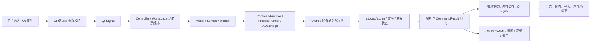
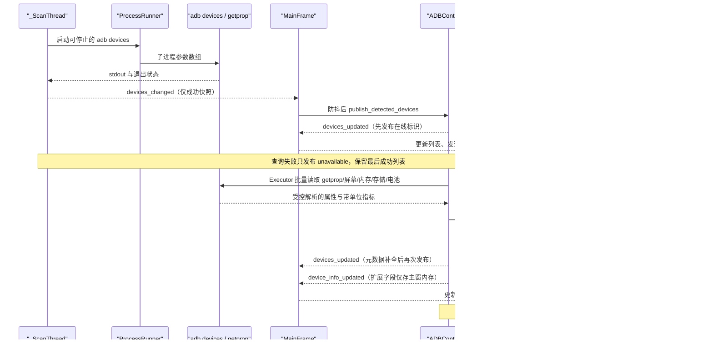
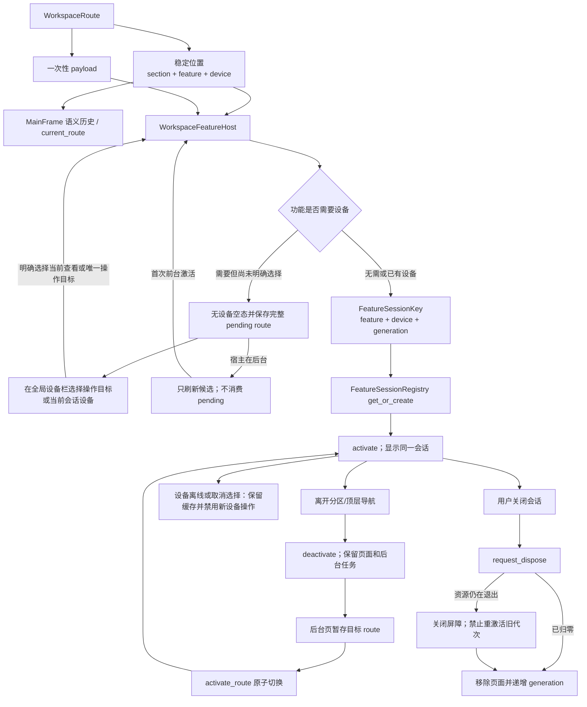
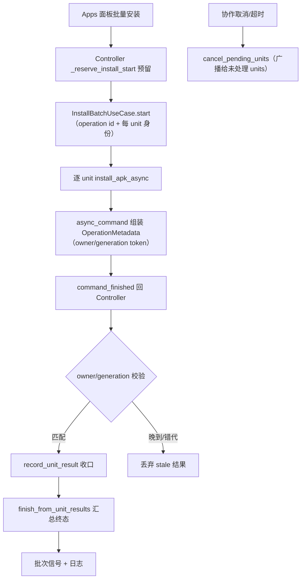
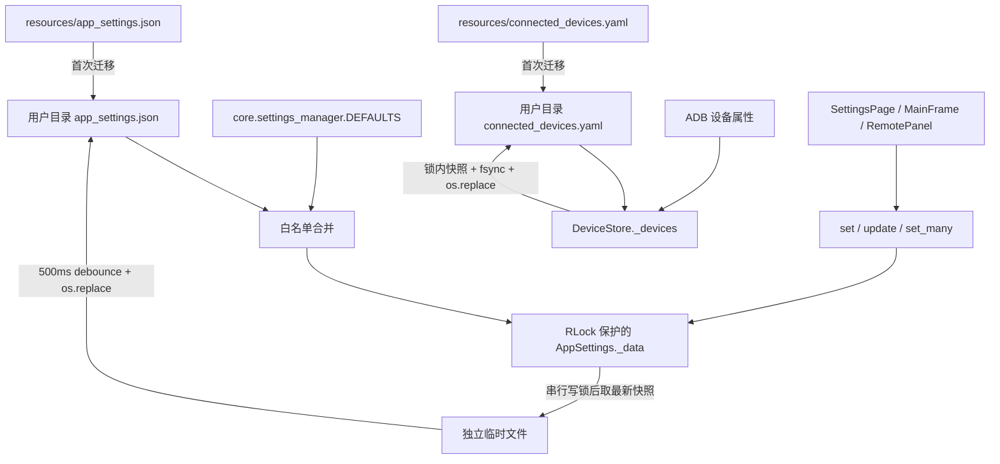
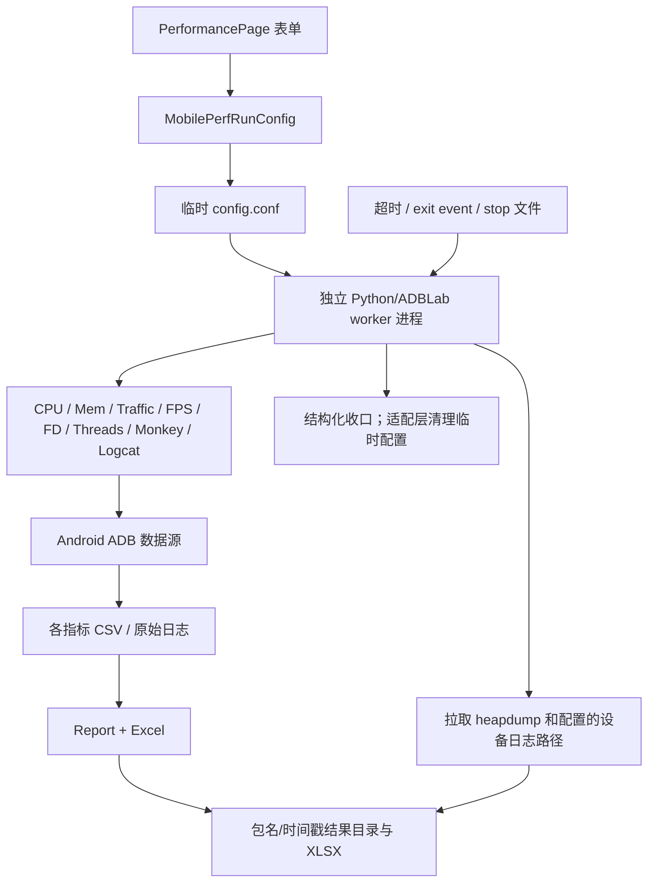

# 数据流

## 核心数据对象

| 数据对象 | 来源 | 转换/处理 | 存储/去向 | 生命周期 |
| --- | --- | --- | --- | --- |
| 设备标识与状态 | `adb devices`、用户输入的 IP:port | `utils.adb_targets` 校验；`ADBDevice` 只解析 `device` 状态行；SidePanel 统一提交 scanning/ready/empty/unavailable | DeviceManager、全局设备栏、设备概览/工作区上下文、Qt signals；属性另存 DeviceStore | 成功扫描才替换在线列表；查询失败保留旧快照；历史元数据跨会话保存 |
| `CommandResult` | subprocess 返回码/stdout/stderr/timeout | CommandRunner 规范化；model 转 dict；Controller handler 分派 | 日志、UI、批次状态 | 单次命令 |
| AppSettings | 默认值、旧 resources JSON、用户设置及运行时 UI 更新 | 加载按白名单合并；加载/更新共用已知字段规范化；RLock 内更新、500ms 防抖、写锁后取最新快照并原子替换 | 用户配置 `app_settings.json` | 跨会话；批量更新只调度一次保存；运行时未知键不等于可跨重启保留的正式键 |
| FontConfig | AppSettings 的 `font_family/ui_font_size/log_font_size`、Qt 系统字体数据库 | 字体族可用性解析、字号限制、角色映射 | TypographyManager、QApplication、字体变更信号 | 进程内不可变快照；设置变化时整体替换 |
| 主窗口布局状态 | AppSettings、屏幕可用范围、窗口事件 | 尺寸限制、350ms 防抖 | MainFrame、SettingsPage、响应式 Panels、AppSettings | 普通窗口会话内实时变化；尺寸跨会话 |
| DeviceStore 字典 | 旧 resources YAML、ADB 属性 | 锁内 upsert/快照、临时文件原子替换 | 用户配置 `connected_devices.yaml` | 跨会话 |
| `WorkspaceRoute` | 首页快捷入口、左侧一级功能导航、设备卡和功能页动作 | section/feature/device 构成稳定语义位置；`payload` 只作为一次性激活参数 | MainFrame 语义历史、WorkspaceAreaPage 当前路由、WorkspaceFeatureHost 待恢复路由 | 稳定位置跨页面切换保留但不含 `payload`；等待设备时 `payload` 保留到首次实际激活后消费 |
| Workspace 功能会话 | 分区/功能路由、选中设备、会话代次 | `WorkspaceRoute` 解析；`FeatureSessionRegistry` 以 feature/device/generation 建键并转发生命周期 | MainFrame 子树中的 QWidget、会话 registry | 显式关闭或应用关闭前跨导航保留；旧代次释放后不可复用 |
| GUI 操作状态 | 表单、选中设备、当前导航页 | Controller/Workspace 功能页编排 | 内存、Qt widgets/signals | 页面会话/操作生命周期 |
| 包/权限/进程信息 | pm/dumpsys/ps 等 ADB 输出 | model/worker 文本解析 | 应用管理 UI、日志、预设 JSON | 查询结果通常只在内存；预设跨会话 |
| 截图/录屏 | 设备 screencap/screenrecord | pull、PNG 校验、文件命名；截图批次后台追加到既有媒体会话 | 用户保存目录、ScreenshotPage | 文件持续存在直到用户删除；页面数据持续到会话关闭 |
| logcat/诊断 | adb logcat、bugreport、ANR | 过滤、批量渲染、安全 ZIP 解压、可选 JAR 转换 | UI 缓冲、txt/zip/目录 | UI 缓冲有上限；导出文件持久化 |
| Remote 状态 | UI scrcpy 参数、预检、设备尺寸 | 生成 launch plan、FPS 解析、坐标映射 | scrcpy 进程、状态标签、尺寸 TTL 缓存 | Remote 会话 |
| MobilePerf 配置 | PerformancePage | dataclass 校验/归一化、临时 config | 临时目录、worker 子进程环境 | 进程结束后清理临时配置 |
| MobilePerf 指标 | dumpsys/proc/SurfaceFlinger/流量等 | 多 monitor 采样、CSV、Report 汇总 | 结果目录 CSV/XLSX/设备信息/heapdump | 运行期间累积，结果持久化 |
| `OperationMetadata` | Controller/use case 提交时构造 | `async_command` 组装信封，owner/generation token 校验响应归属与代次 | `command_finished(method, result)` 回 Controller；批次终态经 `InstallBatchUseCase` 汇总 | 单次操作；晚到/错代结果被丢弃 |
| 任务历史 | MainFrame 当前接收的兼容 `operation_completed` 信号 | `TaskHistoryStore.record_completed` 转换消息并按容量保留最新项；store 也提供终态快照写入接口，但 MainFrame 尚未订阅该来源 | Tasks 页面内存列表 | 仅进程内有界保留；应用重启后清空 |
| 安装批次状态 | Apps 面板批量安装请求 | `InstallBatchUseCase` 的 start/complete/fail/cancel/retry 状态机按 operation/unit 收口 | 内存 registry（`OperationManager`）、Qt signals、日志 | 批次生命周期；终态原子移除 |
| 运行时工具缓存 | PyInstaller onefile bundle | frozen onefile 时按版本检查第一层条目类型和文件大小，失配时覆盖复制 | 平台 cache 目录 `runtime/<version>` | 跨进程复用，可人工清理；开发/onedir 不复制 |

## 总体数据流

## 设备发现与元数据流

手动刷新由 `ADBController.refresh_devices()` 调用异步 `ADBDevice.get_connected_devices_async()`，
经 CommandRunner 返回成功列表后复用同一发布链路；不会把定时扫描已取得的列表再查询一次。
DeviceStore 保存历史元数据，发现列表与批量目标保持进程内状态；隐藏 DeviceManager 的列表复选是
兼容状态源，全局栏提交选择，DeviceHubPage 只显示快照。单设备会话的选择独立于该复选集合。

## Workspace 功能会话状态流

`WorkspaceRoute.payload` 不属于当前页位置，也不写入 MainFrame 返回历史。它只随待激活路由进入
`WorkspaceFeatureHost`：无需设备时在首次会话激活中消费；需要设备但尚未明确选择时随
`pending_route` 保留。设备上下文在宿主后台变化只更新等待态，不能提前消费 payload 或创建目标页。

截图是特殊的无设备功能会话：批次完成信号先通过 `WorkspaceFeatureHost.update_feature()` 后台追加
到 ScreenshotPage；如果用户当前不在截图页，MainFrame 只显示带“查看结果”动作的 InfoBar，不
切换顶层导航、当前分区或尚待恢复的设备路由。

深层功能页将当前内容的最小尺寸交给 `WorkspaceFeatureHost`；宿主在短屏上扩展当前页面并
提供滚动，而不是压缩控件。隐藏会话不参与当前滚动尺寸计算。

设备标识可能是 USB serial 或网络地址，属于潜在敏感设备信息；知识库和日志审计不应复制实际值。

## 命令结果状态变化

典型 model 方法的状态为：

`已提交` → `QRunnable 执行` → `CommandResult` → `command_finished` → `Controller handler` → `成功/失败日志与 UI 信号`。

超时由 CommandRunner 转换为失败结果而不是重新抛出 `subprocess.TimeoutExpired`。依赖捕获该异常的上层逻辑不会生效；Monkey 恢复流程通过 `_wait_for_monkey_abort` 短轮询探测中止请求来配合该语义，而不是依赖异常传播。带 operation 的调用（`_operation_id`/owner/generation token）只进入 `OperationMetadata` 信封，Controller handler 先按 owner/generation 校验归属与代次，再决定接受、转发或丢弃结果。

## 安装批次状态流

## 设置与设备存储生命周期

AppSettings 以可重入锁保护读取、更新、计时器引用和写盘快照。`update()`/`set_many()` 将一组字段
合并为一次内存更新并只安排一个防抖保存；进程内保存回调再由独立写锁串行，并在取得写锁后
获取最新快照，避免旧写覆盖新值。跨进程仍没有文件锁，不能视为数据库事务。
DeviceStore 的读取、快照和写入位于同一可重入锁域，并使用临时文件、`fsync` 和 `os.replace`。
空 YAML 文档与空映射表示空快照；列表、布尔值、数值和字符串根节点属于损坏数据，加载失败时
保留已有内存快照并尝试备份原文件，不能因为值为空或为零而清空设备信息。
读取会重试瞬态 I/O 错误；尾部附加内容可恢复出合法映射文档时采用该快照并尝试规范化回写。
进程首次加载时若没有历史内存快照且文件持续不可读，仍无法凭空恢复其中的元数据；在线设备
发现由独立扫描链路提供。

设置加载和更新使用相同的字段规范化边界：`log_max_lines` 必须是正整数；`save_directory`
必须是字符串，保留合法路径的首尾空白；`monkey_params` 补全已知字段并规范整型/布尔类型，
兼容旧版带 `ms` 后缀的 throttle。无效值回退字段默认值，Monkey 比例合计和执行范围仍在启动时
校验；这些规则不改变配置 schema，也不改变未来版本未知字段的既有保留策略。
`update()` 会接纳未知键，`schema_version` 除外；它不是加载白名单接口。受支持版本在下次加载
时会剔除未知键，因此需要跨重启保留的正式设置必须登记在 `DEFAULTS` 中。

## 文件型存储与设置字段

### 数据库结论

当前仓库没有数据库、ORM、迁移工具、SQL/schema 文件、连接池或事务层；没有 SQLite、PostgreSQL、
MySQL、Redis、MongoDB、消息队列或缓存服务依赖，"表、索引、外键、数据库事务"均不适用。应用使用
JSON、YAML 和普通文件持久化，下表是等价的存储地图。

### 文件型存储

| 存储 | 类型/位置 | 数据结构 | 主要读写入口 | 一致性机制 | 风险 |
| --- | --- | --- | --- | --- | --- |
| 应用设置 | JSON；用户配置目录 `app_settings.json` | `core.settings_manager.DEFAULTS` 白名单键，顶层携带 `schema_version`（当前 3） | `AppSettings._load/_save_atomic/get/set/update/set_many/reset` | RLock 保护数据、计时器和快照；写锁串行保存并在锁后取最新快照；批量更新只安排一次 500ms 防抖保存；独立临时文件 + `os.replace` | 跨进程没有文件锁；`get()` 不复制嵌套可变值；`schema_version` 由加载/保存托管，`update()` 写入被忽略；受支持版本的未知键加载时剔除并记录 WARNING；未来版本在加载时不立即改写，未知字段经 `_future_extra` 在保存时合并回写 |
| 旧应用设置 | `resources/app_settings.json` | 首次安装兼容种子；不含本机保存路径，但仍带字体、主题和窗口尺寸等旧默认值 | AppSettings 首次迁移 | 只在用户文件不存在时读取；已知键经当前规则规范化后原子写入用户目录 | 与 `DEFAULTS` 存在差异，修改默认值时需同步评估首次安装行为 |
| 设备元数据 | YAML；用户配置目录 `connected_devices.yaml` | alias → 含 `ip`、`Brand`、`Model`、`Aversion` 的属性字典；默认 alias 为 `device_<id>` | `DeviceStore.load/save/upsert_devices` | 同一 RLock 内读写；临时文件 + fsync + `os.replace`；损坏文件备份 | 设备标识属敏感元数据；无 schema/version；历史条目不代表当前在线或已选中 |
| 旧设备元数据 | `resources/connected_devices.yaml` | 空映射占位（ADR-0006 清空当前种子文件中的设备标识） | DeviceStore 首次迁移 | 无用户文件时加载；空快照不写用户文件 | 当前种子不含设备记录；这一事实不等于日志、结果文件或 Git 历史已完成隐私审计 |
| App Manager 预设 | 用户选择的 JSON | name/author/description/selected_packages | `AppManagerPage._create_preset/_load_preset` | UTF-8 读写、结构校验和异常提示 | 无 schema；保存为直接覆盖，非原子写 |
| MobilePerf 临时配置 | 临时目录 `config.conf` | INI sections/values | `MobilePerfRunConfig.write_config`、`StartUp.parse_data_from_config` | 每次运行独立临时目录 | 子进程异常时依赖适配层清理；包含设备/包/路径 |
| MobilePerf 结果 | 用户结果目录 | CSV/XLSX/txt/log/heapdump | 各 monitor、`Report`、`StartUp.pull_*` | 各文件独立写入，无事务 | 可能包含设备和业务敏感数据；无保留/加密策略 |
| 截图/视频/诊断 | 用户保存目录 | PNG/MP4/ZIP/txt/目录 | ADBTesting/Advanced、Controller、功能页 | 单文件/目录操作 | 无统一配额、保留或访问控制 |
| 运行时工具缓存 | Windows：`LOCALAPPDATA/<APP>/runtime/<version>`；非 Windows：`XDG_CACHE_HOME` 或 `~/.cache` 下的应用缓存目录 | adb/scrcpy bundle | `utils.runtime_tools.bundled_tool_path` | 仅 frozen onefile 解压场景使用；版本化目录 + 第一层条目类型/文件大小校验，失配时覆盖复制；不复用 `user_data_root()` 的配置目录语义；开发模式和 onedir 直接返回资源路径 | 完整性/签名只依赖打包来源；清理策略待确认 |

### 设置字段

当前 `DEFAULTS` 的核心键包括：

| 分类 | 配置键 | 使用位置 |
| --- | --- | --- |
| 外观 | `theme`、`accent_color`、`mica_enabled`、`font_family`、`ui_font_size`、`log_font_size` | BaseStyles、qfluentwidgets、MainFrame、SettingsPage、日志/功能页/瞬态对话框；主题为 System/Light/Dark，强调色规范化为 `#RRGGBB`，Mica 为布尔值；空字体族表示系统默认，UI 字号限制 8–22，日志字号限制 7–16 |
| 显示缩放 | `ui_scale` | GUI 创建 QApplication 前读取；Auto 保留系统/外部环境，数值接受 1、1.25、1.5、1.75、2，无效值回退 Auto；设置后重启生效，不修改 schema v3 |
| 窗口 | `window_width`、`window_height`、`always_on_top`；旧分栏键兼容读取 | MainFrame、SettingsPage；默认 1250×700、设计最小 860×500；屏幕工作区不足时由 `gui/window_layout.py` 下调实际最小尺寸 |
| 行为 | `continuous_device_scan`、`device_scan_interval_ms`、`confirm_dangerous_ops`（兼容保留，不再驱动弹窗） | MainFrame/SettingsPage |
| 日志/性能 | `log_max_lines`、`performance_log_threshold_ms` | Log UI、`core.perf_trace` helpers/Controller |
| 文件 | `save_directory` | 截图、日志、备份、MobilePerf、文件浏览器 |
| Monkey | `monkey_params` | AppPanel/Controller |
| 旧分栏兼容 | `panel_split_ratio`、`left_panel_width`、`right_panel_width`、`device_log_split_ratio` | 仅为旧配置 schema 兼容保留；新 FluentWindow 运行时不创建 splitter，也不再写入这些键 |
| Remote | `scrcpy_preset`、`scrcpy_maxsize`、`scrcpy_fps`、`scrcpy_codec`、`scrcpy_buffer`、`scrcpy_bitrate`、`scrcpy_orientation` | RemotePanel；这些键由 `SCRCPY_SETTING_DEFAULTS` 白名单纳入 `DEFAULTS`，运行时可写且重启可载入 |

Remote 行来自代码交叉检查：`core/settings_manager.py` 的 `SCRCPY_SETTING_DEFAULTS` 把 Remote 的
七个 `scrcpy_*` 键作为白名单并入 `DEFAULTS`，`_normalise_setting` 对它们做字符串归一化（空值/
非标量回退默认值、截断到 128 字符），因此旧版本已写入 JSON 的同名键无需迁移即可在下次启动时
恢复；`test_settings_persistence.py` 验证正式键在应用重建后的持久化与旧 JSON 兼容性。

写入粒度补充：

- SettingsPage 修改字体族、UI 字号和日志字号时通过一次 `set_many()` 更新；随后
  `BaseStyles.reload_from_settings()` 读取同一份已校验快照并发送字体信号。
- 字体角色使用 Qt 默认 hinting 与 UI 字体回退链，保留有效自定义字体和已有 pt 字号，标题使用
  DemiBold。显示缩放独立保存；GUI 提前加载设置时缓冲完整诊断，并在 LogService 可用后逐条转交，
  避免设置损坏或迁移失败因初始化顺序而丢失。CLI 自检和 worker 不改变 Qt 比例环境。
- SettingsPage 的主题、强调色和 Mica 分别即时写入设置；主题切换同步 qfluentwidgets、应用
  QPalette、FluentWindow 标题栏/导航壳层、已创建但暂时隐藏的 Workspace 功能页，以及瞬态
  FluentDialog/消息提示，避免 Mica 透明层或
  首次进入分区时露出旧主题背景。窗口首次显示后会在 qfluentwidgets 重设 Mica 的下一事件循环
  再同步一次壳层主题；强调色变化会重建项目补充的焦点环和危险按钮样式。选择“跟随系统”后还
  监听 Qt 系统配色变化并即时重新解析主题。
- 旧分栏键只参与旧配置加载与 schema 兼容；当前 MainFrame 不读取或写入运行时分栏状态。
- `AppSettings.reset()` 使用 `deepcopy(DEFAULTS)` 恢复嵌套默认值，取消等待中的防抖计时器并立即
  原子保存；不会与默认 `monkey_params` 共享嵌套可变对象。

### 事务、索引与并发

- 没有跨文件事务。
- AppSettings 与 DeviceStore 的锁、快照和原子替换细节见上文"设置与设备存储生命周期"，此处不重复。
- App Manager 预设 JSON 仍直接覆盖，没有原子替换。
- 文件型数据没有索引；当前规模小，性能不是主要风险，一致性和隐私更重要。

### 数据风险与建议

存储相关的未决事项集中在 [RISKS_AND_DEBT.md](RISKS_AND_DEBT.md)，包括多实例写入策略、备份
完整性、结果文件保留期与敏感数据；已实现的 schema 和字段规范化按上文描述，不再列为未修复项。

## MobilePerf 数据生命周期

结果目录包含设备型号、系统版本、包版本、指标和可能的设备日志/heapdump，可能含个人或业务敏感信息；当前未见加密、自动保留期或访问控制。连续运行配置在 `StartUp` 读取时逐层剥离 Unicode/历史字节序标记（`_CONFIG_BOM_PREFIXES`），并保持输入文件只读。

## 数据保留与删除

- UI 日志内存默认最多保留 5,000 条服务记录；Log Panel/各功能页另有显示缓冲上限，缓冲溢出时
  会丢弃最旧行并累计丢弃计数（`LogService.dropped_count` / LogPanel `_pending_dropped_total`）。
- AppSettings 当前使用 schema v3；DeviceStore 没有 schema/version，两者都没有保留期策略。
- 截图、视频、bugreport、备份、MobilePerf 报告由用户选择目录，应用不会统一清理。
- MobilePerf 启动时会清理设备 `/data/local/tmp` 中符合包名且超过约 3 天的 heapdump；这一行为在 `StartUp.clear_heapdump()`。
- Auto-Clean 工作流仅提供手动只读 Retention Audit，不清理 workflow runs；Build Release job 会在
  发布后保留最新 5 个版本，并删除更旧的 tag 及其 Release。
- 数据分类、隐私声明、默认保留期和安全删除要求均为待确认。
