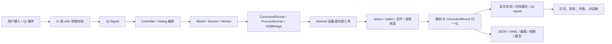
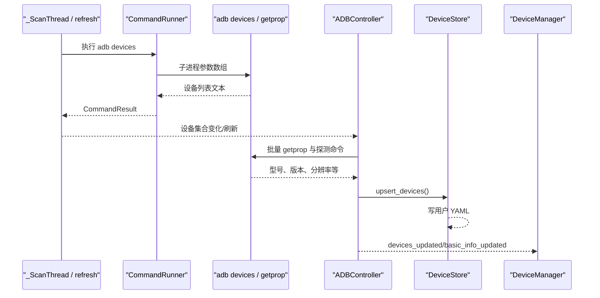
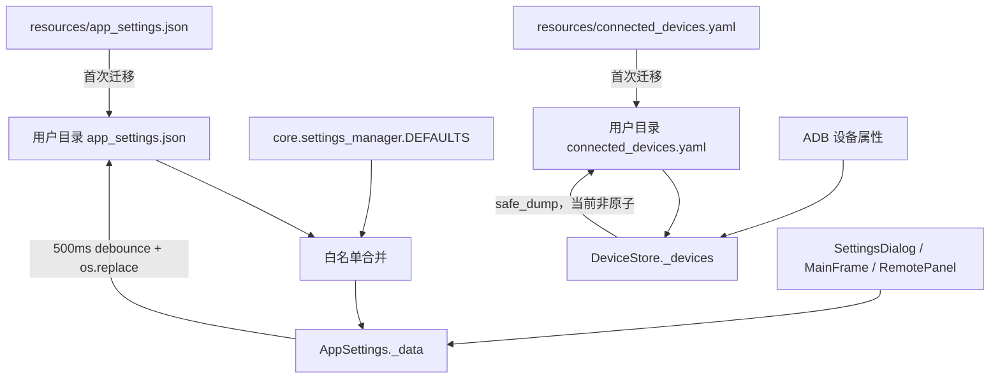
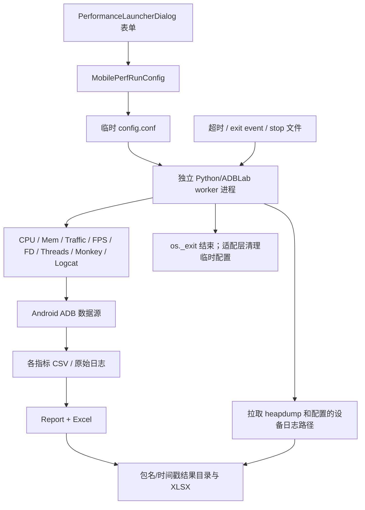
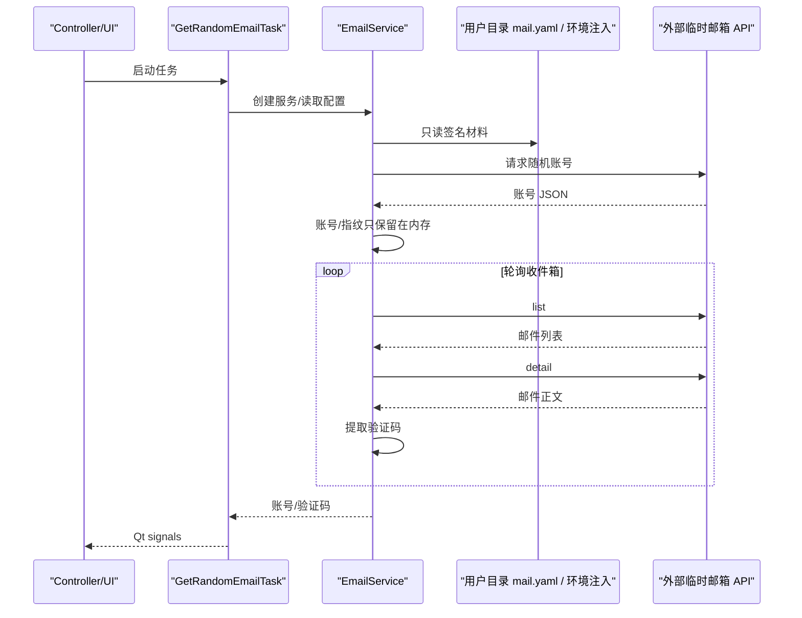

# 数据流

## 核心数据对象

| 数据对象 | 来源 | 转换/处理 | 存储/去向 | 生命周期 |
| --- | --- | --- | --- | --- |
| 设备标识与状态 | `adb devices`、用户输入的 IP:port | `utils.adb_targets` 校验；`ADBDevice` 解析 | DeviceStore、DeviceManager、Qt signals | 扫描周期内刷新；设备元数据跨会话保存 |
| `CommandResult` | subprocess 返回码/stdout/stderr/timeout | CommandRunner 规范化；model 转 dict；Controller handler 分派 | 日志、UI、批次状态 | 单次命令 |
| AppSettings | 默认值、旧 resources JSON、用户设置 | 白名单合并、500ms debounce、原子替换 | 用户配置 `app_settings.json` | 跨会话 |
| DeviceStore 字典 | 旧 resources YAML、ADB 属性 | upsert 合并 | 用户配置 `connected_devices.yaml` | 跨会话；当前非原子写 |
| GUI 操作状态 | 表单、选中设备、当前页签 | Controller/Dialog 编排 | 内存、Qt widgets/signals | 窗口/操作生命周期 |
| 包/权限/进程信息 | pm/dumpsys/ps 等 ADB 输出 | model/worker 文本解析 | 应用管理 UI、日志、预设 JSON | 查询结果通常只在内存；预设跨会话 |
| 截图/录屏 | 设备 screencap/screenrecord | pull、PNG 校验、文件命名 | 用户保存目录、ScreenshotViewer | 文件持续存在直到用户删除 |
| logcat/诊断 | adb logcat、bugreport、ANR | 过滤、批量渲染、安全 ZIP 解压、可选 JAR 转换 | UI 缓冲、txt/zip/目录 | UI 缓冲有上限；导出文件持久化 |
| Remote 状态 | UI scrcpy 参数、预检、设备尺寸 | 生成 launch plan、FPS 解析、坐标映射 | scrcpy 进程、状态标签、尺寸 TTL 缓存 | Remote 会话 |
| MobilePerf 配置 | Performance 对话框 | dataclass 校验/归一化、临时 config | 临时目录、worker 子进程环境 | 进程结束后清理临时配置 |
| MobilePerf 指标 | dumpsys/proc/SurfaceFlinger/流量等 | 多 monitor 采样、CSV、Report 汇总 | 结果目录 CSV/XLSX/设备信息/heapdump | 运行期间累积，结果持久化 |
| 临时邮箱数据 | mail YAML、外部 API JSON | 请求签名/指纹更新、轮询、验证码提取 | Qt signals、日志、mail YAML | 账号/配置跨调用；邮件数据短期内存但可能进入日志 |
| 运行时工具缓存 | PyInstaller bundle | 版本化复制 | 用户目录 `runtime/<version>` | 跨进程复用，可人工清理 |

## 总体数据流

## 设备发现与元数据流

设备标识可能是 USB serial 或网络地址，属于潜在敏感设备信息；知识库和日志审计不应复制实际值。

## 命令结果状态变化

典型 model 方法的状态为：

`已提交` → `QRunnable 执行` → `CommandResult` → `command_finished` → `Controller handler` → `成功/失败日志与 UI 信号`。

超时由 CommandRunner 转换为失败结果而不是重新抛出 `subprocess.TimeoutExpired`。依赖捕获该异常的上层逻辑不会生效；当前 Monkey 恢复流程就是受影响的实例。

## 设置与设备存储生命周期

设置 JSON 有原子替换但没有显式线程锁；DeviceStore 有局部 mutation 锁但写盘不在锁内，也没有临时文件替换。

## MobilePerf 数据生命周期

结果目录包含设备型号、系统版本、包版本、指标和可能的设备日志/heapdump，可能含个人或业务敏感信息；当前未见加密、自动保留期或访问控制。

## 临时邮箱数据流

本知识库故意不记录配置值、账号、邮件正文和验证码。当前实现仅记录端点与异常类型，
账号和验证码经 Qt signals 返回 UI，不写配置或日志；历史源码配置仍属于需要所有者处理的风险。

## 数据保留与删除

- UI 日志内存默认最多保留 5,000 条服务记录；Log Panel/各对话框另有显示缓冲上限。
- AppSettings 和 DeviceStore 没有 schema 版本或保留期。
- 截图、视频、bugreport、备份、MobilePerf 报告由用户选择目录，应用不会统一清理。
- MobilePerf 启动时会清理设备 `/data/local/tmp` 中符合包名且超过约 3 天的 heapdump；这一行为在 `StartUp.clear_heapdump()`。
- GitHub Actions 仅保留手动只读 Retention Audit，不自动清理 workflow runs、Release 或 tag。
- 数据分类、隐私声明、默认保留期和安全删除要求均为待确认。
