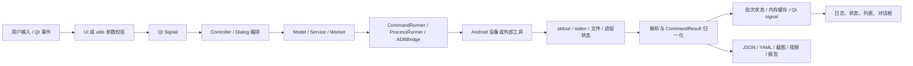
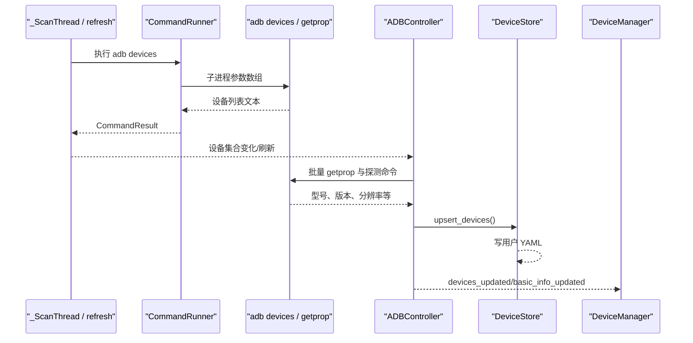
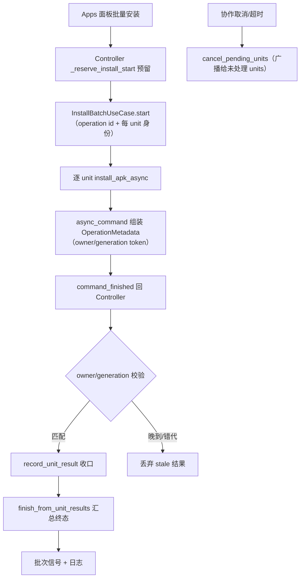
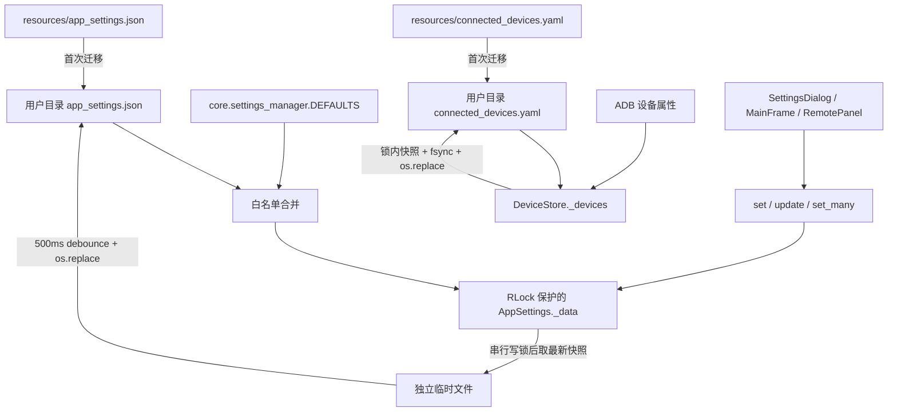
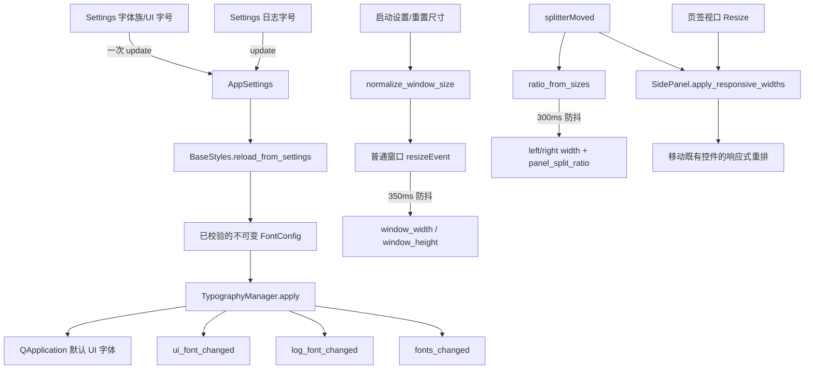
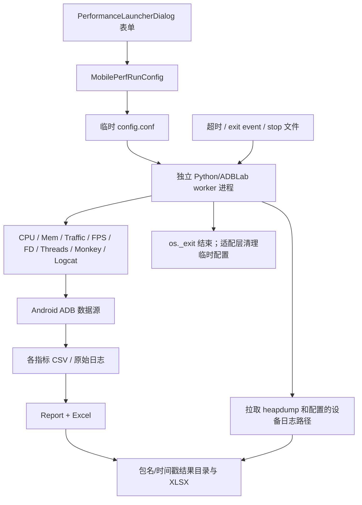

# 数据流

## 核心数据对象

| 数据对象 | 来源 | 转换/处理 | 存储/去向 | 生命周期 |
| --- | --- | --- | --- | --- |
| 设备标识与状态 | `adb devices`、用户输入的 IP:port | `utils.adb_targets` 校验；`ADBDevice` 解析 | DeviceStore、DeviceManager、Qt signals | 扫描周期内刷新；设备元数据跨会话保存 |
| `CommandResult` | subprocess 返回码/stdout/stderr/timeout | CommandRunner 规范化；model 转 dict；Controller handler 分派 | 日志、UI、批次状态 | 单次命令 |
| AppSettings | 默认值、旧 resources JSON、用户设置及运行时 UI 更新 | RLock 内白名单加载/字段校验/单项或批量更新；500ms 防抖；写锁串行保存并在锁后取最新快照；原子替换 | 用户配置 `app_settings.json` | 跨会话；批量更新只调度一次保存 |
| FontConfig | AppSettings 的 `font_family/ui_font_size/log_font_size`、Qt 系统字体数据库 | 字体族可用性解析、字号限制、角色映射 | TypographyManager、QApplication、字体变更信号 | 进程内不可变快照；设置变化时整体替换 |
| 主窗口布局状态 | AppSettings、屏幕可用范围、窗口/分隔条事件 | 尺寸限制、左右宽度与比例换算、350/300ms 防抖 | MainFrame、Settings 摘要、响应式 Panels、AppSettings | 普通窗口会话内实时变化；尺寸与比例跨会话 |
| DeviceStore 字典 | 旧 resources YAML、ADB 属性 | 锁内 upsert/快照、临时文件原子替换 | 用户配置 `connected_devices.yaml` | 跨会话 |
| GUI 操作状态 | 表单、选中设备、当前页签 | Controller/Dialog 编排 | 内存、Qt widgets/signals | 窗口/操作生命周期 |
| 包/权限/进程信息 | pm/dumpsys/ps 等 ADB 输出 | model/worker 文本解析 | 应用管理 UI、日志、预设 JSON | 查询结果通常只在内存；预设跨会话 |
| 截图/录屏 | 设备 screencap/screenrecord | pull、PNG 校验、文件命名 | 用户保存目录、ScreenshotViewer | 文件持续存在直到用户删除 |
| logcat/诊断 | adb logcat、bugreport、ANR | 过滤、批量渲染、安全 ZIP 解压、可选 JAR 转换 | UI 缓冲、txt/zip/目录 | UI 缓冲有上限；导出文件持久化 |
| Remote 状态 | UI scrcpy 参数、预检、设备尺寸 | 生成 launch plan、FPS 解析、坐标映射 | scrcpy 进程、状态标签、尺寸 TTL 缓存 | Remote 会话 |
| MobilePerf 配置 | Performance 对话框 | dataclass 校验/归一化、临时 config | 临时目录、worker 子进程环境 | 进程结束后清理临时配置 |
| MobilePerf 指标 | dumpsys/proc/SurfaceFlinger/流量等 | 多 monitor 采样、CSV、Report 汇总 | 结果目录 CSV/XLSX/设备信息/heapdump | 运行期间累积，结果持久化 |
| `OperationMetadata` | Controller/use case 提交时构造 | `async_command` 组装信封，owner/generation token 校验响应归属与代次 | `command_finished(method, result)` 回 Controller；批次终态经 `InstallBatchUseCase` 汇总 | 单次操作；晚到/错代结果被丢弃 |
| 安装批次状态 | Apps 面板批量安装请求 | `InstallBatchUseCase` 的 start/complete/fail/cancel/retry 状态机按 operation/unit 收口 | 内存 registry（`OperationManager`）、Qt signals、日志 | 批次生命周期；终态原子移除 |
| 运行时工具缓存 | PyInstaller bundle | 版本化复制 | 用户目录 `runtime/<version>` | 跨进程复用，可人工清理 |

## 总体数据流

## 设备发现与元数据流

设备标识可能是 USB serial 或网络地址，属于潜在敏感设备信息；知识库和日志审计不应复制实际值。

## 命令结果状态变化

典型 model 方法的状态为：

`已提交` → `QRunnable 执行` → `CommandResult` → `command_finished` → `Controller handler` → `成功/失败日志与 UI 信号`。

超时由 CommandRunner 转换为失败结果而不是重新抛出 `subprocess.TimeoutExpired`。依赖捕获该异常的上层逻辑不会生效；Monkey 恢复流程通过 `_wait_for_monkey_abort` 短轮询探测中止请求来配合该语义，而不是依赖异常传播。带 operation 的调用（`_operation_id`/owner/generation token）只进入 `OperationMetadata` 信封，Controller handler 先按 owner/generation 校验归属与代次，再决定接受、转发或丢弃结果。

## 安装批次状态流

## 设置与设备存储生命周期

AppSettings 以可重入锁保护读取、更新、计时器引用和写盘快照。`update()`/`set_many()` 将一组字段
合并为一次内存更新并只安排一个防抖保存；进程内保存回调再由独立写锁串行，并在取得写锁后
获取最新快照，避免旧写覆盖新值。跨进程仍没有文件锁，不能视为数据库事务。
DeviceStore 的读取、快照和写入位于同一可重入锁域，并使用临时文件、`fsync` 和 `os.replace`。

## 字体与窗口布局状态流

- `font_family` 的空字符串表示跟随 Qt 系统界面字体；指定字体未安装时也回退到系统字体。
  `FontConfig` 将 UI、UI_SMALL、MONO、LOG、TITLE 五类角色投影为 QFont。只有 UI 配置变化发送
  `ui_font_changed`，只有日志/等宽配置变化发送 `log_font_changed`，任一变化再发送 `fonts_changed`；
  主题变化走独立 `theme_changed`。
- MainFrame 启动时将持久化尺寸限制到最小 860×500；屏幕可用范围不小于该最小值时再裁剪到
  可用范围内，最小尺寸优先。左栏比例限制到 0.20–0.70；若没有 `panel_split_ratio`，
  AppSettings 使用旧左右像素宽度推导并立即保存迁移结果。最大化、最小化和全屏尺寸不进入
  普通尺寸保存路径。
- Settings 通过 `window_layout_snapshot()` 读取当前普通尺寸和比例，通过
  `restore_default_window_size()`、`reset_panel_split()` 恢复默认值；Settings 不直接读写
  MainFrame 的 QSplitter。主面板响应式重排和 Settings 自身的字号感知单双列表单只改变布局位置，
  不复制控件、业务状态或信号连接。

## MobilePerf 数据生命周期

结果目录包含设备型号、系统版本、包版本、指标和可能的设备日志/heapdump，可能含个人或业务敏感信息；当前未见加密、自动保留期或访问控制。连续运行配置在 `StartUp` 读取时逐层剥离 Unicode/历史字节序标记（`_CONFIG_BOM_PREFIXES`），并保持输入文件只读。

## 数据保留与删除

- UI 日志内存默认最多保留 5,000 条服务记录；Log Panel/各对话框另有显示缓冲上限，缓冲溢出时
  会丢弃最旧行并累计丢弃计数（`LogService.dropped_count` / LogPanel `_pending_dropped_total`）。
- AppSettings 和 DeviceStore 没有 schema 版本或保留期。
- 截图、视频、bugreport、备份、MobilePerf 报告由用户选择目录，应用不会统一清理。
- MobilePerf 启动时会清理设备 `/data/local/tmp` 中符合包名且超过约 3 天的 heapdump；这一行为在 `StartUp.clear_heapdump()`。
- GitHub Actions 仅保留手动只读 Retention Audit，不自动清理 workflow runs、Release 或 tag。
- 数据分类、隐私声明、默认保留期和安全删除要求均为待确认。
