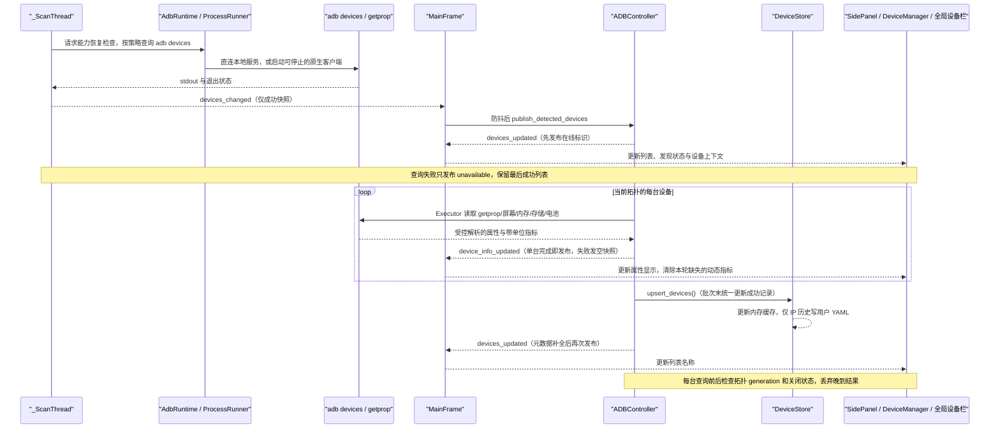
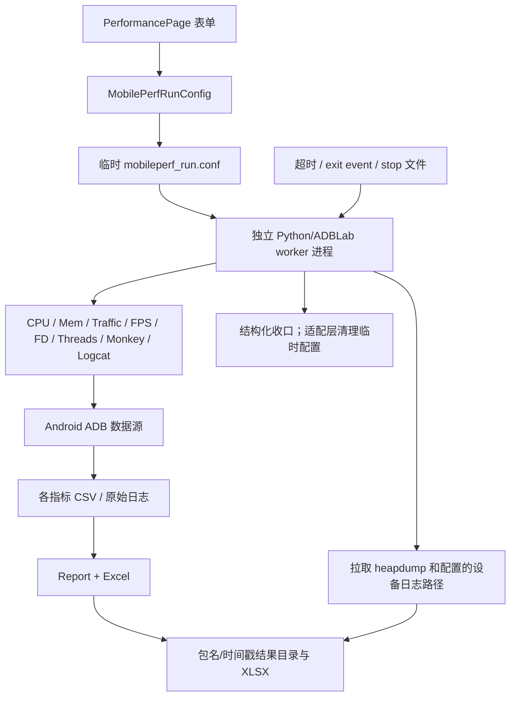

# 数据流

## 核心数据对象

| 数据对象 | 来源 | 转换/处理 | 存储/去向 | 生命周期 |
| --- | --- | --- | --- | --- |
| 设备标识与状态 | `adb devices`、用户输入的 IP:port | `utils.adb_targets` 校验；`ADBDevice` 只解析 `device` 状态行；SidePanel 统一提交 scanning/ready/empty/unavailable | DeviceManager、全局设备栏、设备概览/工作区上下文、Qt signals；属性缓存于 DeviceStore | 成功扫描才替换在线列表；查询失败保留旧快照；仅 IP 连接元数据跨会话保存 |
| `CommandResult` | subprocess 返回码/stdout/stderr/timeout | CommandRunner 规范化；model 转 dict；Controller handler 分派 | 日志、UI、批次状态 | 单次命令 |
| AppSettings | 默认值、旧 resources JSON、用户设置及运行时 UI 更新 | 加载按白名单合并；加载/更新共用已知字段规范化；RLock 内更新、500ms 防抖、写锁后取最新快照并原子替换 | 用户配置 `app_settings.json` | 跨会话；批量更新只调度一次保存；运行时未知键不等于可跨重启保留的正式键 |
| DeviceStore 字典 | 旧 resources YAML、ADB 属性 | 锁内 upsert/快照、筛选 IP 历史后原子写入 | 当前进程缓存与用户配置 `connected_devices.yaml` | IP 历史跨会话，非 IP 属性仅在当前进程 |
| `WorkspaceRoute` | 首页快捷入口、左侧一级功能导航、设备卡和功能页动作 | section/feature/device 构成稳定语义位置；`payload` 只作为一次性激活参数 | MainFrame 语义历史、WorkspaceAreaPage 当前路由、WorkspaceFeatureHost 待恢复路由 | 稳定位置跨页面切换保留但不含 `payload`；等待设备时 `payload` 保留到首次实际激活后消费 |
| Workspace 功能会话 | 分区/功能路由、选中设备、会话代次 | `WorkspaceRoute` 解析；`FeatureSessionRegistry` 以 feature/device/generation 建键并转发生命周期 | MainFrame 子树中的 QWidget、会话 registry | 显式关闭或应用关闭前跨导航保留；旧代次释放后不可复用 |
| 包/权限/进程信息 | pm/dumpsys/ps 等 ADB 输出 | model/worker 文本解析 | 应用管理 UI、日志、预设 JSON | 查询结果通常只在内存；预设跨会话 |
| 应用图标 | 设备端 `app_process` 临时执行内置 DEX helper | service 校验有界 PNG 字节；GUI 线程解码并创建 QIcon；每批最多 12 个 | `AppManagerIcons` 的逐设备页面缓存，最多 512 项 | 只在当前页面会话；列表刷新使缓存及旧 worker 代次失效；远端 helper 按本批次精确路径清理，不写主机图标缓存文件 |
| 截图/录屏 | 设备 screencap/screenrecord | 截图二进制流写同目录临时文件，完整 PNG 解码后原子发布；录屏 pull；截图批次后台追加到既有媒体会话 | 用户保存目录、ScreenshotPage | 文件持续存在直到用户单张或全部删除；删除失败项保留；页面数据持续到会话关闭 |
| logcat/诊断 | adb logcat、bugreport、ANR | 过滤、批量渲染、安全 ZIP 解压、可选 JAR 转换 | UI 缓冲、txt/zip/目录 | UI 缓冲有上限；导出文件持久化 |
| MobilePerf 配置 | PerformancePage | dataclass 校验/归一化、临时 config | 临时目录、worker 子进程环境 | 进程结束后清理临时配置 |
| MobilePerf 指标 | dumpsys/proc/SurfaceFlinger/流量等 | 多 monitor 采样、CSV、Report 汇总 | 结果目录 CSV/XLSX/设备信息/heapdump | 运行期间累积，结果持久化 |
| `OperationMetadata` | Controller/use case 提交时构造 | `async_command` 组装信封，owner/generation token 校验响应归属与代次 | `command_finished(method, result)` 回 Controller；批次终态经 `InstallBatchUseCase` 汇总 | 单次操作；晚到/错代结果被丢弃 |
| 操作结果 | 用户入口、异步命令原始返回、已验证 Operation 单元 | ActionResults 固定请求与目标，完成全部命令后汇总；正文不依赖日志截断 | 任务中心保存快照；Toast 通知终态；报告和诊断呈现专用内容 | 当前会话有界保留，导出才写入用户指定文件 |
| 测试结果与方案 | Monkey 设备终态、性能采集退出快照、用户保存的参数 | `RunRecord` / `RunPreset` 经 `RunLibraryController` 后台串行校验和原子写入；Qt 信号更新页面 | 用户配置 `test_runs.json`、任务中心测试结果、两页方案栏 | 跨重启；索引有界，原始产物由用户保管；不自动绑定或执行历史设备 |
| 运行时工具缓存 | PyInstaller onefile bundle | frozen onefile 时按版本检查第一层条目类型和文件大小，失配时覆盖复制 | 平台 cache 目录 `runtime/<version>` | 跨进程复用，可人工清理；开发/onedir 不复制 |

## 设备发现与元数据流

手动刷新由 `ADBController.refresh_devices()` 调用异步 `ADBDevice.get_connected_devices_async()`，
经 CommandRunner 返回成功列表后复用同一发布链路；不会把定时扫描已取得的列表再查询一次。
同拓扑并发刷新合并为一个活动任务及一次待处理刷新；概览和兼容补查共用截止时间与关闭信号。
概览写盘由仅后台使用的写锁串行，并在锁内重查拓扑代次，防止旧查询晚写覆盖新结果。
DeviceStore 缓存当前设备属性，仅保存 IP 连接历史；发现列表与批量目标保持进程内状态。隐藏 DeviceManager 的列表复选是
兼容状态源，全局栏提交选择，DeviceHubPage 只显示快照。单设备会话的选择独立于该复选集合。
DeviceContextBar 在进程内分配固定显示编号，组合根向概览、Monkey、性能列表及 ActionResults
投影设备名称。操作提交将名称冻结进结果快照；编号映射不持久化，也不参与准入或命令选路。

## 路由与命令状态

页面会话、一次性路由载荷、operation 信封和关闭屏障由
[ARCHITECTURE](ARCHITECTURE.md#功能会话与路由)维护；安装、截图和取消路径见
[BUSINESS_FLOW](BUSINESS_FLOW.md)。这些状态保存在进程内，不从历史配置或测试结果恢复运行。

## 设置与设备存储生命周期

AppSettings 以可重入锁保护读取、更新、计时器引用和写盘快照。`update()`/`set_many()` 将一组字段
合并为一次内存更新并只安排一个防抖保存；进程内保存回调再由独立写锁串行，并在取得写锁后
获取最新快照，避免旧写覆盖新值。跨进程仍没有文件锁，不能视为数据库事务。
DeviceStore 的读取、快照和写入位于同一可重入锁域，并使用临时文件、`fsync` 和 `os.replace`。
连接下拉框和磁盘记录仅保留通过 `normalize_adb_connect_target` 校验的 IPv4:port 或 [IPv6]:port，
合法记录保留品牌、型号等元数据。USB 序列号、模拟器和其他非 IP 标识仅缓存在当前进程，
不写入连接历史；旧文件加载时清理非 IP 条目并原子回写。清理写入失败时保留磁盘原文件，
界面仍过滤无效条目并提示后续保存重试；在线设备属性查询与显示继续使用内存缓存。
空 YAML 文档与空映射表示空快照；列表、布尔值、数值和字符串根节点属于损坏数据，加载失败时
保留已有内存快照并尝试备份原文件，不能因为值为空或为零而清空设备信息。
读取会重试瞬态 I/O 错误；尾部附加内容可恢复出合法映射文档时采用该快照并尝试规范化回写。
进程首次加载时若没有历史内存快照且文件持续不可读，仍无法凭空恢复其中的元数据；在线设备
发现由独立扫描链路提供。

设置加载和更新使用相同的字段规范化边界：`log_max_lines` 必须是正整数；`save_directory`
必须是字符串，保留合法路径的首尾空白；`monkey_params` 补全已知字段并规范整型/布尔类型，
兼容旧版带 `ms` 后缀的 throttle。无效值回退字段默认值，Monkey 比例合计和执行范围仍在启动时
校验；这些规则不改变配置 schema，也不改变未来版本未知字段的既有保留策略。
`update()` 会接纳未知键，`schema_version` 除外；它不是加载白名单接口。受支持版本在下次加载
时会剔除未知键，因此需要跨重启保留的正式设置必须登记在 `DEFAULTS` 中。

## 文件型存储与设置字段

应用使用 JSON、YAML 与结果文件持久化，没有数据库或跨文件事务。

### 文件型存储

| 存储 | 类型/位置 | 数据结构 | 主要读写入口 | 一致性机制 | 风险 |
| --- | --- | --- | --- | --- | --- |
| 应用设置 | JSON；用户配置目录 `app_settings.json` | `core.settings_manager.DEFAULTS` 白名单键，顶层携带 `schema_version`（当前 3） | `AppSettings._load/_save_atomic/get/set/update/set_many/reset` | RLock 保护数据、计时器和快照；写锁串行保存并在锁后取最新快照；批量更新只安排一次 500ms 防抖保存；独立临时文件 + `os.replace` | 跨进程没有文件锁；`get()` 不复制嵌套可变值；`schema_version` 由加载/保存托管，`update()` 写入被忽略；受支持版本的未知键加载时剔除并记录 WARNING；未来版本在加载时不立即改写，未知字段经 `_future_extra` 在保存时合并回写 |
| 旧应用设置 | `resources/app_settings.json` | 首次安装兼容种子；不含本机保存路径，但仍带字体、主题和窗口尺寸等旧默认值 | AppSettings 首次迁移 | 只在用户文件不存在时读取；已知键经当前规则规范化后原子写入用户目录 | 与 `DEFAULTS` 存在差异，修改默认值时需同步评估首次安装行为 |
| IP 连接历史 | YAML；用户配置目录 `connected_devices.yaml` | alias → 含 `ip`、`Brand`、`Model`、`Aversion` 的属性字典；默认 alias 为 `device_<id>` | `DeviceStore.load/save/upsert_devices` | 同一 RLock 内读写；临时文件 + fsync + `os.replace`；损坏文件备份 | 地址属敏感元数据；无 schema/version；历史条目不代表当前在线或已选中 |
| 旧设备元数据 | `resources/connected_devices.yaml` | 空映射占位（ADR-0006 清空当前种子文件中的设备标识） | DeviceStore 首次迁移 | 无用户文件时加载；空快照不写用户文件 | 当前种子不含设备记录；这一事实不等于日志、结果文件或 Git 历史已完成隐私审计 |
| App Manager 预设 | 用户选择的 JSON | name/author/description/selected_packages | `AppManagerPage._create_preset/_load_preset` | UTF-8 读写、结构校验和异常提示 | 无 schema；保存为直接覆盖，非原子写 |
| 测试结果与命名方案 | JSON；用户配置目录 `test_runs.json` | version=1、runs、presets；结果包含类型、包、可用版本与型号、起止时间、终态、参数和显式本地附件路径 | `services/run_library.py`、`gui/run_library.py` | 单进程后台串行；临时文件 + fsync + os.replace，成功后发布快照 | 最近 200 条结果、50 个方案、单文件 4 MiB、参数 16 KiB；损坏或未来版本只读保护；多实例没有合并协议；淘汰索引不删除产物 |
| MobilePerf 临时配置 | 临时目录 `mobileperf_run.conf`，同目录 `mobileperf.stop` | INI sections/values；停止文件只作退出信号 | `MobilePerfRunConfig.write_config`、`MobilePerfRunner`、`StartUp.parse_data_from_config` | 每次运行独立临时目录 | 子进程退出及输出 reader 收口后由适配层清理；启动失败也清理；包含设备/包/路径 |
| MobilePerf 结果 | 用户结果目录 | CSV/XLSX/txt/log/heapdump | 各 monitor、`Report`、`StartUp.pull_*` | 各文件独立写入，无事务 | 可能包含设备和业务敏感数据；无保留/加密策略 |
| 截图/视频/诊断 | 用户保存目录 | PNG/MP4/ZIP/txt/目录 | ADBTesting/Advanced、Controller、功能页 | 单文件/目录操作 | 无统一配额、保留或访问控制 |
| 运行时工具缓存 | Windows：`LOCALAPPDATA/<APP>/runtime/<version>`；非 Windows：`XDG_CACHE_HOME` 或 `~/.cache` 下的应用缓存目录 | adb/scrcpy bundle | `utils.runtime_tools.bundled_tool_path` | 仅 frozen onefile 解压场景使用；版本化目录 + 第一层条目类型/文件大小校验，失配时覆盖复制；不复用 `user_data_root()` 的配置目录语义；开发模式和 onedir 直接返回资源路径 | 完整性/签名只依赖打包来源；清理策略待确认 |

### 测试结果与方案

测试方案与旧 `monkey_params` 设置分别维护，不修改 AppSettings schema，也不迁移应用管理的包名预设。
方案同类型同名保存为更新，其他名称另存；方案与历史参数均不携带设备身份、worker 或会话代次。
独立 Monkey 的随机模式在每台设备启动前确定实际种子，历史参数以固定模式保留真实种子和原模式，
从方案重复启动则继续遵守所选随机/固定模式。相同种子不保证不同设备状态下重现相同结果。
性能参数保留基础输出目录，实际设备后缀由当前会话重新生成。记录只收录新运行，不自动扫描旧目录。
记录附件使用本地绝对路径；打开前在后台检查，文件被移动或删除时明确提示，不从消息文本猜测路径。

主窗口的普通操作由 `ActionResults` 保留当次请求；Monkey 和性能结果由 `RunLibrary` 持久化。
`TaskHistoryStore` 仅供未注入 `RunLibrary` 的任务中心兼容分支使用；主窗口虽然仍构造并传入该
对象，`_on_operation_completed()` 已不向其中追加历史，不能将它视为正式跨会话记录链路。

### 设置字段

当前 `DEFAULTS` 的核心键包括：

| 分类 | 配置键 | 使用位置 |
| --- | --- | --- |
| 外观 | `theme`、`accent_color`、`mica_enabled`、`font_family`、`ui_font_size`、`log_font_size` | BaseStyles、qfluentwidgets、MainFrame、SettingsPage、日志/功能页/瞬态对话框；主题为 System/Light/Dark，强调色规范化为 `#RRGGBB`，Mica 为布尔值；空字体族表示系统默认，UI 字号限制 8–22，日志字号限制 7–16 |
| 显示缩放 | `ui_scale` | GUI 创建 QApplication 前读取；Auto 保留系统/外部环境，数值接受 1、1.25、1.5、1.75、2，无效值回退 Auto；设置后重启生效，不修改 schema v3 |
| 界面语言 | `language` | Auto、zh_CN、zh_HK、en_US；无效值回退 Auto。设置页保存后提示重启，恢复默认回填 Auto；启动时按系统中文脚本/地区选择简繁中文，其他系统语言回退英文。只增加正式默认键，沿用 schema v3 |
| 窗口 | `window_width`、`window_height`、`always_on_top`；旧分栏键仅在设置层保留 | MainFrame、SettingsPage；默认 1250×700、设计最小 860×500；屏幕工作区不足时由 `gui/window_layout.py` 下调实际最小尺寸 |
| 行为 | `continuous_device_scan`、`device_scan_interval_ms`、`confirm_dangerous_ops`（兼容保留，不再驱动弹窗） | MainFrame/SettingsPage |
| 日志/性能 | `log_max_lines`、`performance_log_threshold_ms` | 前者由设置页写入并限制性能采集文本缓冲，后者用于 `core.exec`/Controller 的慢操作诊断；通用任务正文容量由 [OPERATION_RESULTS](../guides/OPERATION_RESULTS.md#状态与资源边界) 单独维护 |
| 文件 | `save_directory` | 截图、日志、备份、MobilePerf、文件浏览器 |
| Monkey | `monkey_params` | AppPanel/Controller |
| 旧分栏兼容 | `panel_split_ratio`、`left_panel_width`、`right_panel_width`、`device_log_split_ratio` | 仅为旧配置 schema 兼容保留；新 FluentWindow 运行时不创建 splitter，也不再写入这些键 |
| Remote | `scrcpy_preset`、`scrcpy_maxsize`、`scrcpy_fps`、`scrcpy_codec`、`scrcpy_buffer`、`scrcpy_bitrate`、`scrcpy_orientation` | RemotePanel；这些键由 `SCRCPY_SETTING_DEFAULTS` 白名单纳入 `DEFAULTS`，运行时可写且重启可载入 |

正式配置键及默认值以 `core/settings_manager.py::DEFAULTS` 为准。Remote 键经字符串
规范化后保存；未知运行时键不会因此自动进入加载白名单。`AppSettings.reset()` 深复制默认值，
取消防抖计时器并立即保存，不与默认嵌套对象共享可变状态。

语言只转换显示文案，路由、枚举、设备参数和排序字段仍使用稳定值；设备名称、包名、路径、
用户输入与命令原始输出保留原文。翻译资源及生成命令见
[BUILD_AND_RUN](../guides/BUILD_AND_RUN.md#启动)。

## MobilePerf 数据生命周期

结果目录包含设备型号、系统版本、包版本、指标和可能的设备日志/heapdump，可能含个人或业务敏感信息；当前未见加密、自动保留期或访问控制。连续运行配置在 `StartUp` 读取时逐层剥离 Unicode/历史字节序标记（`_CONFIG_BOM_PREFIXES`），并保持输入文件只读。

## 数据保留与删除

- 通用结果正文、显示预览及应用异常采用独立边界，容量、导出和保存位置见
  [操作结果与应用诊断](../guides/OPERATION_RESULTS.md)。LogService 的技术传输缓冲上限仍为
  5,000 条，溢出累计计数由 `dropped_count` 提供；页面不再依赖全局日志看板。
- AppSettings 当前使用 schema v3；DeviceStore 没有 schema/version，两者都没有保留期策略。
- 截图、视频、bugreport、备份、MobilePerf 报告由用户选择目录，应用不会统一清理。
- MobilePerf 启动时，`StartUp.clear_heapdump()` 列取设备 `/data/local/tmp`，对文件名包含第一个
  目标包名且 `ls -l` 修改时间判定超过 3 天的条目调用删除；时间无法解析时保留。实际筛选不检查
  `.hprof` 后缀或 ADBLab 产物归属，相关边界见 [RISKS_AND_DEBT](RISKS_AND_DEBT.md)。
- CI 制品与版本保留规则见 [BUILD_AND_RUN](../guides/BUILD_AND_RUN.md#cicd)。
- 未决的数据保护与保留要求见 [RISKS_AND_DEBT](RISKS_AND_DEBT.md)。
