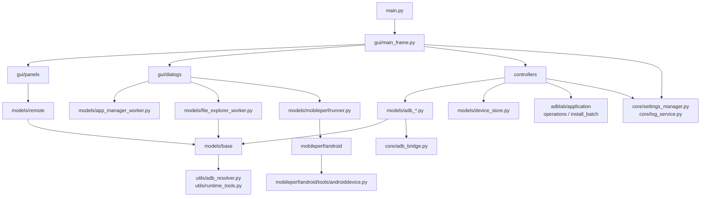
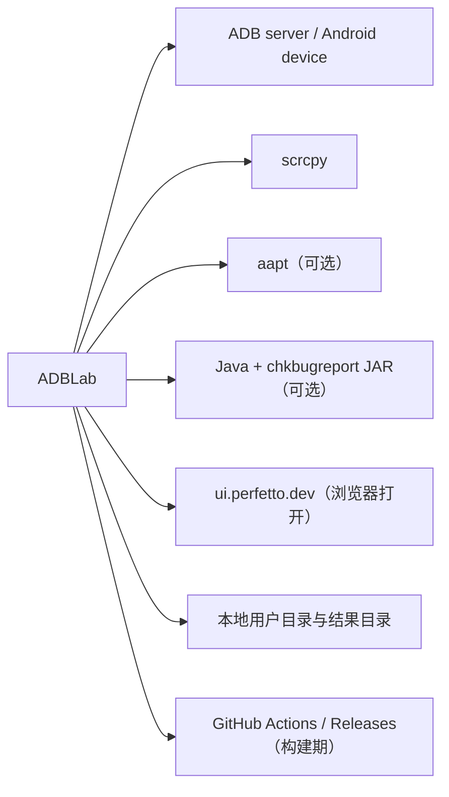

# 依赖地图

## 内部依赖方向

正常主链路的依赖方向为：

`main` → `gui` → `controllers` → `models` → `core/utils` → 操作系统与设备。

复杂对话框是例外：`gui/dialogs` 和 `gui/panels/remote_panel.py` 会直接依赖 `models` service/worker。`core` 也会依赖 Qt 和 `models.base.command_runner` 的能力边界并不完全纯净，因此当前是“务实分层”而非严格 Clean Architecture。

## 主要内部模块依赖

| 上游 | 下游 | 用途 | 方向约束/说明 |
| --- | --- | --- | --- |
| `main.py` | `gui.main_frame`、`core.settings_manager` | GUI 组合根 | 启动层依赖应用层 |
| `gui/main_frame.py` | `controllers`、`gui/panels`、`gui/dialogs` | UI 接线和生命周期 | MainFrame 是最高耦合热点 |
| `controllers/_base.py` | 四个 ADB model、DeviceStore、`adblab.application`（OperationManager/InstallBatchUseCase） | 命令分派和结果聚合 | Controller 不应反向被 model 导入 |
| `models/adb_*.py` | `models/base`、`core.adb_bridge` | 执行 ADB 与长进程 | 常规短命令应走 CommandRunner |
| `gui/dialogs/app_manager.py` | `models/app_manager_worker.py` | 对话框专用异步任务 | 跳过统一 Controller |
| `gui/dialogs/file_explorer.py` | file explorer service/worker | 文件命令构建和传输 | 跳过统一 Controller |
| `gui/panels/remote_panel.py` | `models/remote`、ProcessRunner | scrcpy 与 Remote 输入 | panel 同时承担较多编排状态 |
| `gui/dialogs/performance_launcher.py` | `models/mobileperf.runner` | 性能任务启动、停止和结果 | MobilePerf 内核在独立进程 |
| `core.settings_manager` | `core.log_service`、`utils.user_data` | 设置错误日志与用户路径 | core 内部存在横向依赖 |
| `mobileperf/android/*` | `mobileperf/android/tools/androiddevice.py` | 采集设备指标 | 与主应用执行层重复实现 |

## 第三方 Python 依赖

| 依赖 | 版本状态 | 实际用途 | 证据/备注 |
| --- | --- | --- | --- |
| PySide6 / Addons / Essentials | 6.8.1.1 固定 | GUI、线程、信号槽 | `requirements.txt`、`gui/` |
| PyYAML | 6.0.2 固定 | DeviceStore YAML | `models/device_store.py` |
| PyInstaller | 6.22.2 固定 | 本地/CI 打包 | `requirements.txt`、`ADBLab.spec`、workflow |
| Pillow | 12.3.0 固定 | 当前一方源码未发现导入 | 可能是历史/间接依赖，待确认是否可移除 |
| psutil | 7.2.2 固定 | `core/process_utils.py`：TCP 端口占用查找与进程树终止（ADR-0003 Phase 1 起） | `requirements.txt`、`core/process_utils.py` |
| XlsxWriter 移植副本 | 仓库内 vendored | MobilePerf CSV 转 XLSX | `mobileperf/extlib/xlsxwriter/`、`mobileperf/android/excel.py` |

Requests 与 ruamel.yaml 及其派生依赖已随邮件服务移除，不再出现在 `requirements.txt`；
主应用一方源码也不再导入它们。`mobileperf/setup.py` 仍列出 `requests`，属于随项目携带的
MobilePerf 移植工程自身的遗留 setup 描述，主应用运行不依赖它，是否清理待确认。

pytest 与 Ruff 位于 `requirements-dev.txt`（pytest 9.1.1、ruff 0.16.3），CI 在 Windows 上
先用 `requirements-dev.txt` 安装测试依赖再运行 `ruff check .` 与 pytest；Ruff 门禁配置以
`ruff.toml` 为准（`pyproject.toml` 中的 `[tool.ruff]` 与 Black 配置仍在，但存在两处配置时
ruff.toml 优先）。

## 外部系统与工具依赖

| 外部依赖 | 用途 | 解析/调用位置 | 缺失行为 |
| --- | --- | --- | --- |
| ADB | 几乎所有设备操作 | `utils/adb_resolver.py`、CommandRunner、MobilePerf ADB | 操作失败；自检在 Windows 检查内置文件 |
| scrcpy | 投屏和视频流 | `models/remote/scrcpy_service.py` | Remote 启动失败；非 Windows 要求 PATH 提供 |
| Android device | 命令执行和数据源 | 各 ADB model | 返回 device not found/offline 等错误 |
| aapt | 本地 APK 元数据解析 | `models/adb_app.py` | 解析功能返回失败 |
| Java + `resources/chkbugreport-0.5-215.jar` | bugreport 转换 | `models/adb_testing.py` | 转换失败，但原始 bugreport 可能仍存在 |
| Perfetto 网站 | 手动打开性能分析页面 | `PerformanceLauncherDialog.open_perfetto()` | 只影响跳转，不影响采集 |
| GitHub Actions/API | 构建、制品、Release、清理 | `.github/workflows/` | 只影响 CI/CD |

## 外部边界与命令接口

### 入站 API 结论

当前项目不存在对外提供的 HTTP/REST/WebSocket/RPC API，也没有 Web server、路由表、端口监听器、
消息消费者或鉴权中间件。应用入口只有桌面 GUI 和两个本地 CLI 子模式：

| 类型 | 入口 | 参数 | 输出/作用 | 鉴权 | 测试 |
| --- | --- | --- | --- | --- | --- |
| GUI | `main.py` 无子命令 | Qt/用户输入 | 启动 MainFrame | 依赖本机用户和 ADB 授权 | `test_model_mainframe.py` 部分覆盖 |
| MobilePerf worker | `main.py --mobileperf-worker --config <path>` | config 路径 | 运行采集子进程 | 无应用级鉴权 | runner/startup tests |
| 打包自检 | `main.py --self-check packaging` | 固定 target | 检查导入、资源、工具和用户目录 | 无 | CI + 实际验证 |

因此本节的接口表描述的是**应用调用的外部接口**，不是 ADBLab 对外提供的 API。

### 外部 HTTP API 结论

当前主应用代码中没有出站 HTTP 客户端（`requests`/`urllib` 等不再被任何一方源码导入），也没有
外部 HTTP 服务调用。仅有的 URL 引用是 About 对话框的 GitHub 链接和
`PerformanceLauncherDialog.open_perfetto()` 用 `QDesktopServices.openUrl` 打开
`ui.perfetto.dev`，两者都只是交给系统浏览器打开，不构成 API 调用。历史邮件服务（临时邮箱
HTTP API、`core/mail/`、requests/ruamel 依赖）已随 `70be33e` 移除。

### ADB 命令接口地图

ADB 是项目实际最重要的外部操作 API。参数通常以数组传给 subprocess，设备 shell 内的复合命令由
service/model 构造。

| 能力组 | 主要入口 | 典型外部接口 | 输入 | 输出 | 校验/保护 | 测试 |
| --- | --- | --- | --- | --- | --- | --- |
| 设备发现/连接 | `ADBDevice` | `adb devices/connect/disconnect/pair/reboot` | device/target | 文本、设备列表 | connect target 有 IPv4/IPv6+port 校验 | 有 |
| 设备属性 | `ADBDevice.get_device_info_async` | `getprop`、`dumpsys`、`wm` | device | 属性字典 | 批量 labeled section 解析 | 有 |
| 应用生命周期 | `ADBApp`、`ADBSystemMixin` | `pm`、`am`、`monkey` | package/APK/action | CommandResult | package 校验不统一；批量 worker 有部分校验 | 有，实机缺 |
| 输入控制 | `ADBAdvanced`、`ADBBridge` | `input tap/swipe/text/keyevent` | 坐标、文本、key code | 结果或乐观布尔 | 低延迟持久 shell；设备执行未回读 | 有 |
| 文件与传输 | File Explorer/model | `shell ls/cp/mv/rm/chmod`、`push/pull` | 设备/本地路径 | 列表/文件/状态 | 安全文件名、shell quote；删除确认 | 有 |
| 网络/端口 | `ADBNetworkMixin`、Controller file mixin | `forward/reverse/tcpip/pair/ping/netstat` | host/device port | CommandResult | connect target 校验；其他端口校验不完整 | 部分 |
| 日志与诊断 | `ADBTesting`、LiveLogcat | `logcat`、`bugreport`、ANR pull | package/tag/path | 流、文件、目录 | ZIP 安全解压；诊断参数经 `utils/adb_values.py` 白名单/规范化（包名、dumpsys 服务名、`gfxinfo`/`wakelocks`/`netstats detail`） | 有 |
| 截图/录屏 | `ADBTesting`、`ADBAdvanced` | `exec-out screencap`、`screenrecord`、`pull` | device/path/time/batch_id | PNG/MP4 | PNG 签名检查和回退；录屏 pull 与远端 cleanup 分离报告，结果携带 `batch_id` | 有 |
| 性能采集 | MobilePerf monitor | `top`、`dumpsys meminfo`、SurfaceFlinger、`/proc` | package/device/interval | CSV 采样 | 移植内核校验较弱、命令实现独立 | 部分 |
| 任意 shell/intent | SystemPanel/ADBSystemMixin | `adb shell ...`、`am start/broadcast` | 用户文本 | CommandResult | 已知高影响入口接入统一危险确认；参数校验仍不完整 | 部分 |
| Monkey | `ADBTesting` | `monkey`、`am force-stop` | package/events/throttle/flags | CommandResult | 前台探测 fail-closed；`_wait_for_monkey_abort` 短轮询探测中止 | 有 |

### scrcpy 进程接口

`models/remote/scrcpy_args.py` 将 `ScrcpyConfig` 转为参数数组，`ScrcpyService.build_launch_plan()`
先检查版本、ADB 预检和可选编码器，再由 `ProcessRunner.start()` 启动。stderr 用于状态/FPS 解析。
Windows 使用内置可执行文件，非 Windows 使用 PATH；没有网络服务端暴露。

### 文件与进程接口安全约定

- 主应用短命令优先使用参数数组，不启用宿主 shell。
- 设备 shell 复合命令必须在 service/model 层集中构造并对动态路径使用 quote。
- 外部 ZIP 必须用 `utils.archive.safe_extract_zip()`，防止目录穿越。
- 长进程应注册到 ProcessRunner；带 UI 生命周期的复合 worker/process task 还应注册到
  TaskSupervisor。只有确认退出后才能移除 tracking，timeout 必须保留 residual snapshot。
- MobilePerf 内核仍存在 `shell=True` 和直接 Popen 的遗留例外，详见 [RISKS_AND_DEBT.md](RISKS_AND_DEBT.md)。

## 循环依赖与方向风险

- 未发现明显的 Python import 闭环，但 `core.settings_manager` 在异常路径创建 `LogService`，GUI/Controller 又广泛依赖设置与日志，增加初始化时序耦合。
- GUI 直接依赖 model worker/service 形成多条平行编排路径；新功能若同时在 Controller 和 Dialog 内实现，容易产生行为分叉。
- MobilePerf 保留独立 ADB 层，没有复用 CommandRunner/ProcessRunner；修复超时、编码、日志脱敏时需要同时维护两套实现。
- `README.md` 宣称“所有长进程统一走 ProcessRunner”，但 `ADBInputSession` 和 MobilePerf 内核例外；文档规则需要表述为主应用优先原则。
- `models/base/process_runner.py` 的模块说明也声称全项目 Popen 集中于此，与当前实现不一致，是未来重构或修正文档的信号。

## 依赖治理建议

1. 已锁定运行依赖（PySide6/PyYAML/PyInstaller/Pillow/psutil）与开发依赖（pytest/ruff）；
   psutil 已由 `core/process_utils.py` 使用（Phase 1）；继续确认 Pillow 是否仍被间接使用，
   未使用则从 `requirements.txt` 移除；评估是否清理 `mobileperf/setup.py` 的遗留 `requests` 描述。
2. pytest、Ruff 已进入 `requirements-dev.txt`，CI 已加入无缓存 `ruff check .` 步骤；
   可进一步在 CI 加入 format check 并消除 ruff.toml 与 pyproject.toml 的重复配置。
3. 固定 Auto-Clean 第三方 action 到不可变 commit SHA，并把权限缩小到实际需要。
4. 为 aapt、Java、非 Windows scrcpy 提供启动前能力检查与 UI 提示。
5. 长期将 MobilePerf 的 ADB 执行接口适配到统一抽象，至少统一超时、编码和日志脱敏策略；
   该重构完成后再移除 ruff.toml 中 `mobileperf/**` 的 E402/UP031 豁免。
