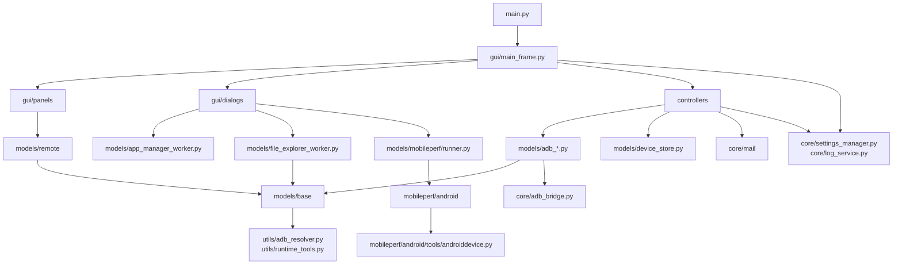
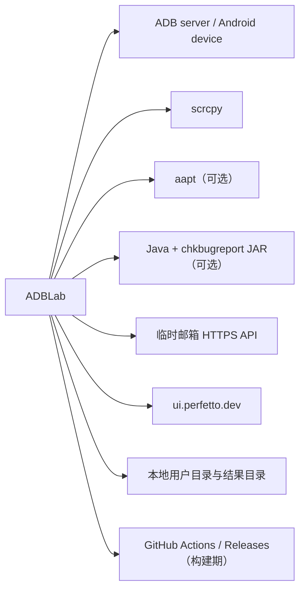

# 依赖地图

## 内部依赖方向

正常主链路的依赖方向为：

`main` → `gui` → `controllers` → `models` → `core/utils` → 操作系统与设备。

复杂对话框是例外：`gui/dialogs` 和 `gui/panels/remote_panel.py` 会直接依赖 `models` service/worker。`core` 也会依赖 Qt 和 `models.base.command_runner` 的能力边界并不完全纯净，因此当前是“务实分层”而非严格 Clean Architecture。

## 主要内部模块依赖

| 上游 | 下游 | 用途 | 方向约束/说明 |
| --- | --- | --- | --- |
| `main.py` | `gui.main_frame`、`core.settings_manager` | GUI 组合根 | 启动层依赖应用层 |
| `gui/main_frame.py` | `controllers`、`gui/panels`、`gui/dialogs` | UI 接线和生命周期 | MainFrame 是最高耦合热点 |
| `controllers/_base.py` | 四个 ADB model、DeviceStore、mail task | 命令分派和结果聚合 | Controller 不应反向被 model 导入 |
| `models/adb_*.py` | `models/base`、`core.adb_bridge` | 执行 ADB 与长进程 | 常规短命令应走 CommandRunner |
| `gui/dialogs/app_manager.py` | `models/app_manager_worker.py` | 对话框专用异步任务 | 跳过统一 Controller |
| `gui/dialogs/file_explorer.py` | file explorer service/worker | 文件命令构建和传输 | 跳过统一 Controller |
| `gui/panels/remote_panel.py` | `models/remote`、ProcessRunner | scrcpy 与 Remote 输入 | panel 同时承担较多编排状态 |
| `gui/dialogs/performance_launcher.py` | `models/mobileperf.runner` | 性能任务启动、停止和结果 | MobilePerf 内核在独立进程 |
| `core.settings_manager` | `core.log_service`、`utils.user_data` | 设置错误日志与用户路径 | core 内部存在横向依赖 |
| `mobileperf/android/*` | `mobileperf/android/tools/androiddevice.py` | 采集设备指标 | 与主应用执行层重复实现 |

## 第三方 Python 依赖

| 依赖 | 版本状态 | 实际用途 | 证据/备注 |
| --- | --- | --- | --- |
| PySide6 / Addons / Essentials | 6.8.1.1 固定 | GUI、线程、信号槽 | `requirements.txt`、`gui/` |
| PyYAML | 6.0.2 固定 | DeviceStore YAML | `models/device_store.py` |
| Requests | 2.32.5 固定 | 临时邮箱 HTTP | `core/mail/` |
| ruamel.base | 1.0.0 固定 | ruamel 依赖集合的一部分 | 代码未直接导入 |
| ruamel.yaml / ruamel.yaml.clib | 未固定 | 保留格式地读写 mail YAML | `core/mail/email_service.py` |
| PyInstaller | 未固定 | 本地/CI 打包 | `ADBLab.spec`、workflow |
| Pillow | 未固定 | 当前一方源码未发现导入 | 可能是历史/间接依赖，待确认是否可移除 |
| psutil | 未固定 | 当前一方源码未发现导入 | 可能是历史依赖，待确认是否可移除 |
| XlsxWriter 移植副本 | 仓库内 vendored | MobilePerf CSV 转 XLSX | `mobileperf/extlib/xlsxwriter/`、`mobileperf/android/excel.py` |

pytest 在 CI 中单独安装，不在 `requirements.txt`；Black/Ruff 只有 `pyproject.toml` 配置，也不在依赖文件或 CI 步骤中。

## 外部系统与工具依赖

| 外部依赖 | 用途 | 解析/调用位置 | 缺失行为 |
| --- | --- | --- | --- |
| ADB | 几乎所有设备操作 | `utils/adb_resolver.py`、CommandRunner、MobilePerf ADB | 操作失败；自检在 Windows 检查内置文件 |
| scrcpy | 投屏和视频流 | `models/remote/scrcpy_service.py` | Remote 启动失败；非 Windows 要求 PATH 提供 |
| Android device | 命令执行和数据源 | 各 ADB model | 返回 device not found/offline 等错误 |
| aapt | 本地 APK 元数据解析 | `models/adb_app.py` | 解析功能返回失败 |
| Java + `resources/chkbugreport-0.5-215.jar` | bugreport 转换 | `models/adb_testing.py` | 转换失败，但原始 bugreport 可能仍存在 |
| 临时邮箱 API | 随机邮箱、列表、详情和验证码 | `core/mail/email_service.py` | 功能失败/轮询无结果；部分调用可能长时间等待 |
| Perfetto 网站 | 手动打开性能分析页面 | `PerformanceLauncherDialog.open_perfetto()` | 只影响跳转，不影响采集 |
| GitHub Actions/API | 构建、制品、Release、清理 | `.github/workflows/` | 只影响 CI/CD |

## 循环依赖与方向风险

- 未发现明显的 Python import 闭环，但 `core.settings_manager` 在异常路径创建 `LogService`，GUI/Controller 又广泛依赖设置与日志，增加初始化时序耦合。
- GUI 直接依赖 model worker/service 形成多条平行编排路径；新功能若同时在 Controller 和 Dialog 内实现，容易产生行为分叉。
- MobilePerf 保留独立 ADB 层，没有复用 CommandRunner/ProcessRunner；修复超时、编码、日志脱敏时需要同时维护两套实现。
- `README.md` 宣称“所有长进程统一走 ProcessRunner”，但 `ADBInputSession` 和 MobilePerf 内核例外；文档规则需要表述为主应用优先原则。
- `models/base/process_runner.py` 的模块说明也声称全项目 Popen 集中于此，与当前实现不一致，是未来重构或修正文档的信号。

## 依赖治理建议

1. 固定 `ruamel.yaml`、`ruamel.yaml.clib`、PyInstaller、Pillow、psutil 版本，或删除确认未使用的依赖。
2. 将 pytest、Ruff、Black 放入明确的开发依赖文件，并在 CI 加入无缓存 lint/format check。
3. 固定 Auto-Clean 第三方 action 到不可变 commit SHA，并把权限缩小到实际需要。
4. 为 aapt、Java、非 Windows scrcpy 提供启动前能力检查与 UI 提示。
5. 长期将 MobilePerf 的 ADB 执行接口适配到统一抽象，至少统一超时、编码和日志脱敏策略。
