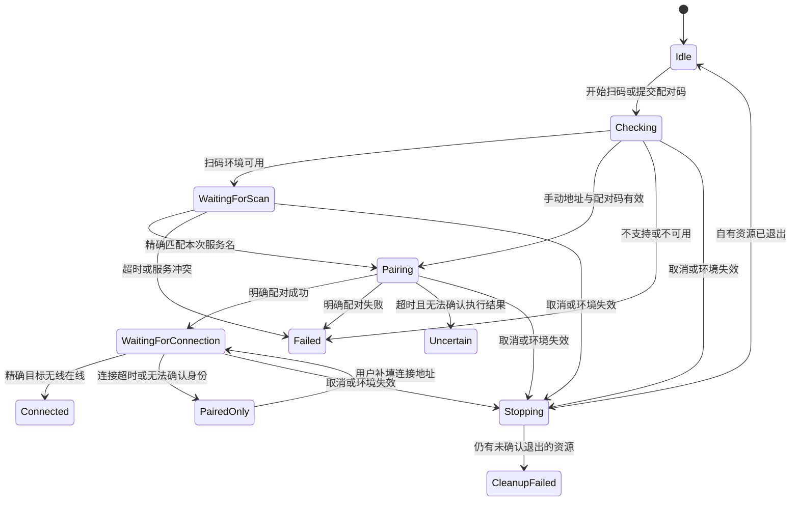

# 无线 ADB 扫码配对实施设计

日期：2026-09-25。状态：方案，尚未实现。代码基线：`11db202a9d7006dee9586c079fb3fd0714b2384c`。

本文回答如何在 ADBLab 中实现 Android 无线调试扫码连接，包括现有代码接入点、协议、生命周期、
依赖和验收范围。它不是当前功能说明，也不表示实机或冻结包已经验证通过。

## 1. 目标与首版边界

用户在设备总览点击“连接设备”，选择“扫码配对”，用手机开发者选项中的无线调试扫描器扫描，
ADBLab 完成配对并确认对应无线设备在线。连接成功后设备进入现有设备列表，保持原有操作目标选择。

首版面向 Android 11 及以上、支持无线调试的手机，优先验证 Windows 桌面与手机处于可互通的局域网。
不需要手机安装配套应用，不需要先用 USB 建立信任。二维码交给系统无线调试扫描器，不能用普通相机
是否识别二维码来判断功能可用。[Android 官方说明](https://developer.android.com/tools/adb)

首版包含扫码配对、手动配对码、配对后补填连接地址，以及原有地址连接/历史记录。
不包含常驻自动重连服务、跨公网连接、ADB 密钥管理、网络配置修改或自行实现配对加密协议。
首版不承诺纯 IPv6 网络的扫码发现；手动输入沿用经过验证的 IPv4/方括号 IPv6 地址规则。

## 2. 代码调查结论

以下是已核实的实现事实；“需要调整”只描述本功能的接入要求，不代表要重构全部旧连接逻辑。

| 现有入口 | 当前行为 | 对扫码实现的影响 |
| --- | --- | --- |
| [MainFrame](../../../gui/main_frame.py) 的 `_show_global_connection` | 设备总览入口调用设备栏连接浮层 | 改为打开一个窗口级单实例连接对话框 |
| [DeviceConnectionForm](../../../gui/widgets/device_context_bar.py) | 地址输入、历史记录、地址校验、发出连接信号 | 原样复用到“地址与历史”页；保留旧组件入口兼容性 |
| [ADBNetwork.pair_device_async](../../../models/adb_network.py) | 固定 15 秒；秘密在 argv；不接受会话取消；动态解析 ADB | 不适合直接承担扫码会话，原方法保持兼容 |
| [ADBDeviceMixin](../../../controllers/_device.py) 的配对结果处理 | 将原始结果送往全局操作提示 | 新会话使用专用结构化状态，不能解析全局提示推进状态机 |
| [连接结果处理](../../../controllers/_device.py) | 以输出包含 connected 等文本判定成功，然后保存历史和刷新 | 新会话必须先确认精确目标处于 `device` 状态，再发布完成事件 |
| [CommandRunner.run](../../../core/exec.py) | 有取消、原生执行和结果分类，无 stdin/env 参数 | 增加兼容的可选参数，沿用现有命令基础设施 |
| [native_capture](../../../core/adb_runtime.py) | stdin 为 DEVNULL；短周期检查取消；有界客户端清理 | 补匿名 stdin、环境快照和会话级进程归属 |
| [QtAdbRuntime](../../../adblab/presentation/qt_adb_runtime.py) | 重检会清解析缓存；状态快照没有客户端会话代次 | 新配对协调器自己维护代次，不能复用运行时内部 generation |
| [TaskSupervisor](../../../adblab/application/supervision.py) 与 [关闭控制器](../../../gui/close_controller.py) | 已有 stop/wait/is_running 与应用异步关闭机制 | 新会话必须显式注册，不能只依赖对话框销毁 |
| [DeviceStore](../../../models/device_store.py) | 历史持久化围绕 IP 地址记录 | 区分无线 transport ID 与连接 IP，不把配对端口存进历史 |

另有两个需要明确处理的边界：

- `restart_adb` 目前仅在重启成功后通知 MainFrame。配对必须在提交重启前失效；即使 kill 成功、start
  失败，也不能继续旧配对。运行通道 auto/fast/native 的改变不等于客户端更换，不因此取消配对。
- `native_capture` 清理抛错时，`CommandRunner` 会归一为失败并减少活动命令计数。因而“命令调用返回”
  或“QThread 已结束”不一定证明异常客户端已退出；新会话需保留这一异常路径的进程归属，见第 7 节。

## 3. 方案选择与参考实现

| 方案 | 优点 | 成本与限制 | 选择 |
| --- | --- | --- | --- |
| ADB 自带 mDNS + Python 二维码库 | 复用所选 ADB 的发现、认证、连接和密钥；新增依赖少 | 需要正确解析不同版本输出、处理发现失败 | 首版推荐 |
| Python zeroconf 自建发现 | 可直接消费服务事件和网卡信息 | 多一套发现线程/socket、网卡策略与清理；还要依赖 ADB 配对 | 首版不选；有真实兼容性证据后再评估 |
| 自己实现 ADB 配对/TLS | 完全掌握协议 | 加密、密钥和版本兼容成本高，与当前需求不匹配 | 不选 |

[ADB Explorer 的 MDNS 实现](https://github.com/Alex4SSB/ADB-Explorer/blob/master/ADB%20Explorer/Services/ADB/MDNS.cs)
可参考随机二维码服务名及发现配对服务的组织方式。仅借鉴流程，C#/WPF 的生命周期不搬到 Qt。
实际协议以 [AOSP 无线调试文档](https://android.googlesource.com/platform/packages/modules/adb/+/refs/heads/main/docs/dev/adb_wifi.md)
及下文对应源码为依据。

新增生产依赖建议锁定 `segno==1.6.6`：纯 Python，BSD-3-Clause，Python 3.11 下无额外运行依赖。
调用 `make_qr()` 强制标准 QR，在内存中输出 PNG，由 GUI 主线程加载；无需增加 Pillow 或 zeroconf。
更新 requirements 和第三方许可说明，实际安装与打包属于后续实施范围。
[Segno 发行信息](https://pypi.org/project/segno/1.6.6/)、
[固定版本依赖](https://github.com/heuer/segno/blob/1.6.6/pyproject.toml)、
[固定版本许可](https://github.com/heuer/segno/blob/1.6.6/LICENSE)

不自动执行 `kill-server`、不强制切换 mDNS 后端、不安装系统服务、不运行时 pip 安装。
ADB 客户端执行自身可能触发服务启动或版本协调；方案只保证 ADBLab 不额外重启服务，不能保证外部
ADB 的所有副作用都被应用控制。

## 4. 交互与状态

沿用设备总览的“连接设备”入口，使用项目 `FluentDialog`，三页分别为：

1. **地址与历史**：默认页，复用已有表单和交互；打开此页不启动扫码发现。
2. **扫码配对**：展示手机操作路径、二维码、当前进度、倒计时、“刷新二维码”和“取消”。
3. **配对码**：输入手机展示的配对地址与 6 位配对码。配对完成后，必要时提示输入无线调试首页的
   连接地址；明确说明它与配对地址的端口不同。

切入扫码页才启动本轮。刷新或切换页时，先使旧请求失效并停止，再启动新请求；等待清理期间禁用
重复启动。重复点击主入口只激活已有窗口，保留已输入的地址。对话框用 `show()`/`open()`，不引入
阻塞的嵌套 `exec()` 事件循环。

单实例只针对仍打开或正在清理的窗口。正常关闭并确认清理完成后，清空 MainFrame 引用并
`deleteLater()`；下次重新创建。现有 FluentDialog 关闭会解除主题订阅，不能把已关闭对象直接
show 回来当作永久缓存。对话框仍在清理时，重复打开只激活它，不另建窗口。



状态展示规则：

- `Connected` 才显示“设备已连接”。
- `PairedOnly` 显示“已配对，尚未确认连接”，保留补填连接地址入口，不重复配对。
- 配对超时不能断言设备未接受信任；显示“未能确认配对结果，请检查手机”。
- 取消只停止本轮等待和自有客户端；手机可能已经接受配对，不宣称撤销信任，也不自动断开已有连接。
- 错误展示固定可操作信息，例如重新生成二维码、检查无线调试或改用配对码。原始命令输出、GUID、
  配对秘密和完整本机路径不进入提示或通用操作日志。

二维码使用黑色模块、白色底、至少 4 个模块静区，不叠加 Logo，不随深色主题反色。按设备像素比
生成整数倍模块图，避免平滑缩放；覆盖 Windows 100%/150%/200% 缩放及键盘关闭。

## 5. 协议与身份关联

### 5.1 生成与发现

每轮生成独立的随机服务名和口令，例如服务名 `studio-` 加随机 ASCII 串，口令采用 `secrets`
生成 24 位字母数字串。服务名不超过 DNS 单标签 63 字节；生成字符不含协议分隔符，减少转义歧义。
24 位是本方案的生成策略，不是 Android 要求的固定长度。

二维码载荷形态：

```text
WIFI:T:ADB;S:<本轮服务名>;P:<本轮随机口令>;;
```

手机扫描后发布配对服务，桌面负责发现它，不在桌面发布 mDNS 服务。扫描器字段约束以
[Android AdbQrCode](https://android.googlesource.com/platform/packages/apps/Settings/+/refs/heads/main/src/com/android/settings/wifi/dpp/AdbQrCode.java)
和 [WifiNetworkConfig](https://android.googlesource.com/platform/packages/apps/Settings/+/refs/heads/main/src/com/android/settings/wifi/dpp/WifiNetworkConfig.java)
为准。

后台执行 `adb mdns check` 与 `adb mdns services`。不能只凭退出码 0 判定发现可用；必须区分正常
空列表、明确 disabled/error 响应、不支持命令、超时和无法识别的响应。正常空列表继续等待；错误
给出配对码入口。手动配对码不以 mDNS 可用作为前置条件。

服务解析只接受已知服务类型、合法实例名及通过现有规则校验的 IP:port。忽略标题、空行和精确
重复行；不要将诊断行解析成服务。只有 `_adb-tls-pairing._tcp` 且实例名精确等于本轮 S 才配对。
同名解析出多个不同端点时报告冲突，不任选一台，也不接受“只发现了一台，所以就用它”的降级。

### 5.2 配对与最终连接

```text
本轮 S 精确匹配配对服务
    → adb pair 配对端点（口令走 stdin）
    → 明确成功正文中的完整 GUID
    → 相同 GUID 的 _adb-tls-connect._tcp 服务
    → 对应无线 transport 在 adb devices 中处于 device 状态
```

`S` 不是设备最终 GUID。AOSP 配对代码取得 GUID 后，直接用它查找连接服务；实例名必须精确比较。
GUID 是完整不透明值，不能剥离 `adb-` 等前缀；协议校验不通过时不能猜测或模糊匹配。
[配对实现](https://android.googlesource.com/platform/packages/modules/adb/+/refs/heads/main/client/adb_wifi.cpp)、
[连接服务查找](https://android.googlesource.com/platform/packages/modules/adb/+/refs/heads/main/client/transport_mdns.cpp)

配对后先查询是否已有 `<guid>._adb-tls-connect._tcp` 在线。已有同一无线 transport 也算成功，
不要求它是列表新增项。若尚未在线且发现精确匹配的 connect 服务，本轮至多主动执行一次
`adb connect <guid>._adb-tls-connect._tcp`，随后继续只读确认。服务名形式的 transport 来自
[AOSP socket_spec](https://android.googlesource.com/platform/packages/modules/adb/+/refs/heads/main/socket_spec.cpp)。

服务完整名仅规范化已知服务后缀、可选 `.local` 和末尾点；不改变 GUID 本体。
服务名命令目标走配对模块内专用校验，**不放宽**现有公开
[normalize_adb_connect_target](../../../utils/adb_targets.py) 的 IP 输入边界。

若设备已按 `IP:port` 连接，只将精确匹配连接端点的 transport 作为候选；通过该 transport 定向
读取 `persist.adb.wifi.guid` 并与本轮 GUID 比较，才能确认同一设备。不同端口的同 IP、USB 在线、
相同型号和设备总数增加都不足以证明成功。

手动补填连接地址也执行一次 connect、核对在线状态和 GUID。旧版 ADB 明确配对成功但未返回 GUID
时保留 `PairedOnly`，可转到普通地址连接；这时不把普通地址连接成功追认成扫码身份已核实。
connect 文本失败或超时后仍可进行有界只读确认，实际目标状态是最终依据；不自动重发写操作。

### 5.3 输出兼容边界

`adb pair` 返回码与业务成功不是所有版本中都等价；成功解析需检查明确成功正文，支持标准输入
提示与成功正文在同一行。失败正文不能因为退出码 0 被当作成功。未知格式保留未确认状态。
[ADB CLI](https://android.googlesource.com/platform/packages/modules/adb/+/refs/heads/main/client/commandline.cpp)、
[旧版配对服务](https://android.googlesource.com/platform/packages/modules/adb/+/refs/tags/r_aml_301500702/services.cpp)

当前核实的 mDNS 列表与自动连接路径侧重 IPv4。不能因为地址校验函数支持 IPv6，就宣称扫码发现
支持纯 IPv6 网络。自定义 ADB server 环境原样保留，发现发生在 server 所在网络；首版不承诺远端
server 的跨网络扫码体验，也不偷偷重定向至本机 5037。

## 6. 模块与接口建议

新增三个职责明确的模块，不另建全局连接框架：

| 拟新增文件 | 职责与拟议接口 |
| --- | --- |
| `services/adb_pairing.py` | 无 Qt：请求/结果类型、QR 载荷与 PNG、mDNS/配对响应解析、单轮状态机；`run_pairing(request, context, cancel_event, on_progress)` |
| `adblab/presentation/qt_adb_pairing.py` | MainFrame 所属 QObject 协调器与单轮 QThread；`start_qr`、`start_code`、`continue_connection`、`cancel`、`invalidate`、监督器资源注册 |
| `gui/dialogs/device_connection.py` | 三页 FluentDialog；显示结构化进度、收集输入；不执行 ADB，不持有进程 |

数据契约在服务模块内定义，避免为少量类型再拆多个包：

- `PairingContext`：所选 ADB 绝对路径、独立环境副本、会话环境代次；环境不进入 repr/日志。
- `PairingRequest`：request_id、模式、配对端点/服务名、私有口令；口令 `repr=False`。
- `PairingProgress`：request_id、固定状态/错误码、剩余时间；不携带原始输出或真实设备标识。
- `PairingOutcome`：`paired`（真/假/未知）、`connected`、原因码，以及内部使用的 GUID、device_id、
  可选连接地址；敏感标识不进入默认 repr。`connected=True` 必须带经过验证的无线 device_id。
- `PairingContinuation`：仅 `PairedOnly` 时由协调器保留的完整 GUID、原 PairingContext 与环境代次。
  不含 QR 口令或手动配对码；缺 GUID 时不创建。续连使用新的 request_id，沿用未失效的环境快照。
  环境失效或窗口关闭清除该对象并禁用续连；重新开始配对才产生新资格。轮次 ID 与环境代次分别
  管理，不能因为续连换 request_id 而误作环境更换。

二维码图像通过独立信号传递，只在当前界面内存中保留；结束、刷新或关闭时清除。不要将载荷写入
全局事件总线、通用操作结果、配置、剪贴板或临时文件。Python 不保证字符串内存安全擦除，文档不作
此承诺。清除引用与减少副本是实现边界。

## 7. 命令执行、取消与关闭

### 7.1 可取消命令的最小扩展

在 `CommandRunner.run` 与 `native_capture` 增加可选 `input_bytes`、`env` 和会话进程归属参数，
默认值保持现有调用语义。带这些参数的调用必须走原生、无 shell 路径，不得让快速通道忽略输入或
环境。首版对此组合拒绝 `shell=True`。新配对全部使用 `native_only=True` 和明确取消回调。

配对 argv 仅为 `[固定ADB绝对路径, "pair", 已验证配对端点]`；口令以 ASCII 加换行送匿名 stdin。
无口令参数时 ADB CLI 从 stdin 读一行，见上文 CLI 源码。`communicate(input=...)` 只在首次调用
发送输入，之后超时轮询不能重复传入。无输入时保留 DEVNULL 语义。

每轮冻结所选客户端路径及环境副本，所有查询、配对、连接、身份确认使用同一份上下文。不修改
`os.environ`；保留用户 server/认证设置，但关闭本轮子进程的 `ADB_TRACE`。不读取或复制密钥文件。
外部已运行 ADB server 的日志策略不受该环境副本控制，不能承诺阻止其记录自身诊断。

服务边界只向上层交付固定结果，原始输出和异常文本不转发。测试必须包含子进程主动回显口令的
情况，验证 UI、日志、repr 和通用结果中均不出现秘密。

### 7.2 异常清理仍保留资源归属

拟在 `core/native_process.py` 增加很小的会话作用域对象，例如 `NativeCommandScope`；只被显式
传入它的调用使用，不新增全局注册表。`native_capture` 创建客户端后立即登记，只有确认客户端
退出才解除登记；清理超时保留句柄，禁止该作用域再启动下一条命令。

作用域先取得“启动中”登记，再执行 popen，最后登记返回的句柄或解除失败的启动登记。取消发生
在 popen 返回之前时，新返回的句柄仍必须被接管并收到停止请求；不能因进程表暂时为空就注销
任务。工作线程已完成、启动中计数为零且自有客户端全部退出，才符合资源停止条件。

协调器的 `is_running/wait/request_stop` 同时覆盖 worker 与该作用域持有的客户端；异常 reader
的所有权继续遵循现有 `close_native_pipes` 的有界转交机制，不为等待独立 server 的 EOF 杀 server。
后台清理失败保持 `CleanupFailed` 并交给监督器报告，不能在 QThread finished 后直接释放全部资源
或显示“已取消”。进程句柄只在受控清理路径访问，作用域的登记/等待需线程安全。

工作线程仍拥有命令时，监督器只设置取消/请求终止并有界等待，不并发调用同一个 Popen 的
communicate。原执行方负责排空；工作线程交还残留句柄后，清理任务才能接管强制停止和收尾。
复用监督器现有 TIMED_OUT 保留任务及 residual 报告，不修改监督器接口。

此处新增的是明确的资源归属，不改写原生 launcher，也不改变既有 CommandResult 的分类契约。
实现阶段需针对句柄残留验证，不能只用“thread.isRunning 为假”的 mock 证明清理完成。

### 7.3 轮次与应用生命周期

协调器限定一个活动 worker。信号携带 request_id，接收时同时校验当前代次、worker 身份和 closing
状态。结果产生后仍须等 QThread 实际结束及自有客户端退出，才开放下一轮、注销任务和 deleteLater。

每轮启动 worker 前注册唯一 task_id；应用关闭只调用幂等的 `ensure_registered()` 补齐遗漏，不能
重复 register 同一 ID。owner/application 停止信号只触发资源状态检查，含超时或 residual 时不
注销、不销毁窗口、不解除下一轮启动限制；监督器与作用域仍保留资源直到退出被确认。

取消采用 `threading.Event`，轮询等待使用可中断的 Event.wait；只用 QTimer 更新界面倒计时，不能
让它不断创建重叠 worker。QObject/控件/图片加载在主线程，网络等待和进程清理在后台。

对话框关闭、Escape、刷新、切页和应用退出共用取消路径。普通窗口关闭复用
[QtTaskSupervisor](../../../adblab/presentation/qt_task_supervisor.py) 的 owner 异步停止；应用关闭
由 `gui/close_controller.py` 显式注册协调器任务并停止准入。应用 shutdown 已开始时 owner stop
可能返回 false，此时跟随 application shutdown，不等待一个不会发出的 owner 完成信号。
worker 等待可复用 [QThreadGroupShutdownTask](../../../gui/dialogs/lifecycle.py)，但还须合并上述
客户端作用域，不能用 QThread.terminate。

`MainFrame.recheck_adb_environment` 使当前配对上下文失效；设置页应用 ADB 客户端前也关闭旧会话
准入。`controllers/_device.py` 的重启入口在提交重启前通知协调器失效，完成回调只负责既有刷新。
普通环境状态更新、设备拓扑变化及 auto/fast/native 性能模式变化不改变配对代次。
失效也适用于 `PairedOnly` 等没有活动 worker 的状态：同时撤销续连快照，不能仅调用 thread.abort。
外部进程重启 ADB 无法保证立即感知，依靠有界命令失败与目标核验收敛，禁止盲目重放。

### 7.4 初始超时与轮询预算

建议以可注入时钟/配置定义下列初值，不在多个类中重复写常量：

| 阶段 | 初始预算 | 说明 |
| --- | --- | --- |
| 环境准备 | 15 秒 | 给冷启动留出空间；命令串行共享预算 |
| 等待扫码服务 | 120 秒 | 从二维码可见开始计时；过期后必须刷新 |
| 配对 | 15 秒 | 单次写操作；超时后不自动重试 |
| 确认连接 | 30 秒 | 包含最多一次 10 秒 connect 及只读确认 |
| 普通查询 | 单次最多 5 秒 | 同时受阶段及总截止时间限制 |
| 发现轮询 | 上轮完成后约 1 秒 | 无重叠，无忙等 |

一次自动轮次总预算最多 180 秒，以 monotonic 的剩余时间限制每条命令；客户端清理另按现有有界
预算处理，不被误计为正常完成。用户补填连接地址是新的 30 秒连接尝试，保留已配对身份，检查原
上下文仍有效；不延长旧扫码口令的有效期。实机验收后可调参数，不以缩短等待掩盖无法连接。

## 8. 设备列表与历史集成

新流程不能直接调用 `_finalize_connected_device(ip)`：mDNS transport ID 可能不是 IP 地址，而
`_save_device_info(ip)` 同时用这个参数查询属性和保存历史，会混淆两者。

增加一个窄的控制器完成入口，如 `accept_wireless_connection(verified_outcome)`：

1. 只接受当前有效轮次的 verified outcome，先触发现有设备刷新，不自动选择操作设备或切换工具会话。
2. `device_id` 是已经确认在线的无线 transport；`connect_target` 是已验证的连接 IP:port，可为空。
3. 首版不为历史额外启动 ADB 查询：在现有控制器后台执行器中读取 DeviceStore 缓存，优先使用该
   `device_id` 的有效属性，缺失字段保留连接地址已有记录的值；新地址缺失时使用现有 Unknown/
   空值默认值。不能用默认值覆盖已有品牌、型号等有效信息，不能把 IP 别名当作查询目标。
4. 有真实连接地址才按原 DeviceStore 格式更新历史，写盘不在 GUI 主线程；保存失败不回退已确认
   的连接状态。在线设备属性继续由已有总览刷新获取，首次历史名称可能暂时为空，不新增后台补全
   服务或作出“历史属性自动同步”的承诺。完成回调和后台写入均检查关闭/代次，丢弃失效结果。
5. 未取得连接地址时只刷新在线列表，不将 mDNS 名称冒充 IP，也不保存配对端口、口令或二维码载荷。

成功提示由一个入口负责，避免对话框与通用 operation_completed 同时重复通知。现有地址连接继续
使用原路径；这次不改变其公共接口或历史 schema。

## 9. 可执行的实施顺序

以下是实现阶段的工作拆分与交付条件；当前只产出设计，不提前修改生产代码。

| 顺序 | 范围 | 完成条件 |
| --- | --- | --- |
| 1 | `core/exec.py`、`core/adb_runtime.py`、`core/native_process.py` 的可选输入/环境/作用域 | stdin 只发送一次；既有调用保持行为；取消、冻结启动和清理失败可验证 |
| 2 | 新建 `services/adb_pairing.py` | 离线测试验证解析、身份链、预算、脱敏及手动补填；所有外部调用可注入 |
| 3 | 新建 Qt 协调器和三页对话框；接 MainFrame、设置/重启失效、关闭控制器 | 重复打开、刷新、切页、取消、关闭没有并行旧轮次或晚到 UI 更新 |
| 4 | 接设备刷新与正确历史记录；增加 Segno 依赖、许可和必要翻译 | 连接成功不改变操作目标；旧地址连接可用；无秘密持久化 |
| 5 | 针对性测试、源码自检、冻结包和实机验收；同步当前功能文档 | 满足下方验收矩阵，再决定发布；本方案不要求改 CI/CD 或提前改版本 |

新增测试建议为 `tests/test_adb_pairing.py`、`tests/test_qt_adb_pairing.py`、
`tests/test_device_connection_dialog.py`。已有测试扩展集中在 `test_command_outcomes.py`、
`test_adb_runtime.py`、`test_native_process.py`、`test_adb_debug.py`、`test_global_device_context.py`、
`test_phase2_mainframe_shutdown_gate.py` 和 `test_model_ci_controller.py`；按实际修改调用链选择，
不默认重复全量测试。

## 10. 验收与待验证项

| 类别 | 必须验证的可观察行为 |
| --- | --- |
| 解析 | 正常/空/禁用 mDNS；旧新版错误正文；stdin 提示同一行；畸形地址；重复与冲突服务；后缀规范化 |
| 身份 | 两台手机、已有无线连接、USB 与无线并存、无关设备上线均不误判；缺 GUID 保留未确认 |
| 配对与连接 | 正常扫码、配对码、已配对但连接失败、手动补填连接端口、offline/unauthorized、连接超时后只读确认 |
| 取消 | 启动前、发现中、pair 中、connect 中取消；刷新与结果同时发生；不重发配对、不撤销手机信任 |
| 生命周期 | Escape/关窗/退出、worker 已出结果未退出、客户端清理超时、重复注册保护、应用与 owner 同时关闭、晚到信号、重开窗口主题同步 |
| 环境 | 自定义 ADB/server 保留；客户端切换、重检、重启失败使旧轮次及 PairedOnly 续连资格失效；性能模式/普通设备更新不误取消 |
| 数据 | 配对秘密回显不外泄；QR/口令不写磁盘；历史只有连接端口；属性查询目标与持久化目标不混用 |
| 界面 | 旧地址输入/历史/校验、单实例、Tab 焦点、忙碌/错误状态、主题、高 DPI、不改变已选操作设备 |
| 包装 | Segno 可被收集；许可完整；源码与冻结程序的 stdin、环境隔离、取消和无残留表现一致 |

实施阶段首先运行新服务的直接测试和底层执行器关联测试；再运行 Qt/全局设备上下文/关闭测试。
由于涉及共享执行接口，对受影响生产模块跑 Ruff/Pyright；同步文档时执行链接、中文注释及 diff
检查。由于涉及生产依赖和冻结原生输入边界，需源码 `main.py --self-check packaging`，并在具备
构建条件且已获构建授权后验证冻结产物。自检不能代替手机扫码。

测试沿用用户确认的本地 Python 3.11，不要求先创建 `.venv`，不在本轮安装依赖。
拟使用既有本地解释器运行 pytest；GUI 测试用已有 QApplication/离屏方式，不新增 pytest-qt。

实机至少覆盖两台 Android 手机（含一个不同 OEM）、已有无线连接、USB 同机、普通 Wi-Fi、多网卡/
VPN 或受限组播网络，以及项目所选的不同 ADB 客户端。纯 IPv6、远端 ADB server、OEM 隐藏扫码入口
明确作为兼容性边界记录；未测试不能标“支持”。

本轮已完成代码和上游源码调查；未运行真实设备命令、未安装 Segno、未验证手机扫描或冻结包。
实现方案可直接据此细化提交批次，实际功能完成以本节可观察验收结果为准。
